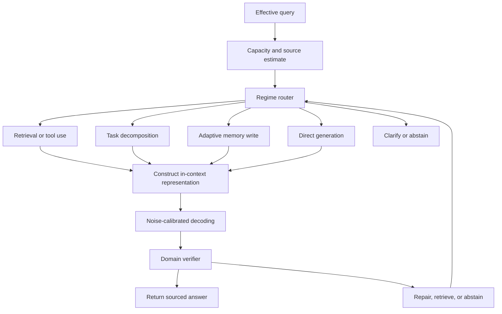

# Hallucinations in Noisy Channels

## An information-theoretic framework for LLM hallucination errors

**Authors**: Oscar Goldman - Shogu Research Group @ Datamutant.ai  
**Date**: November 2025  
**Status**: Working theoretical framework. Research roadmap. Treat conjectures, model claims, and proposed mechanisms as speculative until the relevant experiments or derivations are complete.

This document is a work in progress. Experiments are ongoing, and some related work is now public in the AKIRA repository. The framework may need a year or more of additional experiments, failed tests, revisions, and derivations before it becomes stable. Sections may change as evidence changes.

---

## Abstract

Grounded information in an LLM answer must come from some source signal. In this document, the relevant sources are learned weights, supplied context, retrieved material, and adaptive memory formed during inference. If an answer contains topic information that cannot be traced to one of those sources, then the extra content is a hallucination candidate until a source is identified.

The framework treats inference as a reconstruction and transmission process. Training compresses patterns into weights. During inference, the model matches the effective query to available representations, reconstructs an answer from compressed or supplied information, and transmits that answer through the decoding process. We call this inference-time role *teaching* because the system communicates reconstructed knowledge under channel constraints.

Under this model, hallucinations can arise from six failure modes. A capacity violation occurs when the requested topic information exceeds what the available sources can support. A matching failure occurs when the effective query selects the wrong or composite representation. A decompression failure occurs when the correct information cannot be unfolded within the working context budget. Geometric distortion occurs when small errors compound through sequential transformations. Maximum-entropy prior relaxation occurs when weak content constraints allow generation to relax toward prior-dominated fluent text. The noise paradox appears because some stochasticity can help recover weak available signal, while excessive stochasticity can destroy the same signal.

The working principle is source accounting: grounded output should be explainable from modeled source signal. When output contains more topic information than the estimated source can explain, the excess is evidence that learned priors or untracked signal filled the gap. This principle motivates testable predictions about prompt specificity, retrieval, reasoning traces, context management, capacity estimation, and temperature calibration.

---

## 1. Introduction

### 1.1 The hallucination problem

Large Language Models can generate fluent text that is factually incorrect, logically inconsistent, or misaligned with the supplied context. The problem is operational: fluency can look like grounding even when the output is not supported by the available source signal.

Current explanations focus on:
- Training data quality and coverage
- Model architecture limitations
- Decoding strategy artifacts
- Calibration failures

This document studies a channel question shared by those explanations. Following Shannon (1948), reliable transmission depends on source signal, channel capacity, and noise. One important hallucination mode occurs when the effective query asks the model to transmit more grounded topic information than the available source and channel process can support.

### 1.2 Inference as reconstruction and transmission

The framework uses three working correspondences:

| Information Theory | Machine Learning | Cognition |
|-------------------|------------------|-----------|
| Source coding | Training | Learning |
| Channel coding | Inference | Communication |
| Channel capacity | Model knowledge | Intelligence |

From this perspective:
- Training compresses the world into weights.
- Inference reconstructs and transmits knowledge.
- Hallucinations occur when teaching fails: the model cannot build the correct internal representation to transmit.

During inference, an LLM must reconstruct the relevant information from weights, context, retrieval, or adaptive memory before it can produce a grounded answer. In this document, *teaching* means rate-matched reconstruction and transmission through a noisy channel. Hallucination occurs when this reconstruction-transmission process fails at one or more stages.

**Definition (Operational Intelligence).**  
Within this framework, *operational intelligence* means *teaching capacity*: the maximum rate at which an agent can reliably reconstruct and transmit learned knowledge. This local definition supports measurement and modeling inside HNC.

- Compression as learning: the ability to extract and store structure.
- Decompression and transmission as teaching: the ability to reconstruct and communicate that structure.
- Channel capacity as maximum reliable teaching rate: the amount of grounded information that can be transmitted reliably under the modeled constraints.

Note: this definition is a modeling choice. It makes one part of intelligence measurable through information-theoretic quantities. Other definitions of intelligence may serve other questions.

In this operational sense, intelligence is the rate at which an agent can reliably transmit learned knowledge. The definition measures communicable understanding rather than passive storage, and it remains local to this framework.

### 1.3 Complexity from constraints

The Neuro-Symbolic Homeostat framework (Goldman, 2025) uses the principle that "complexity comes from constraints." In HNC, this principle gives a source-accounting view of hallucination:

- More constraints reduce the number of valid states and increase output structure.
- Fewer constraints increase the number of valid states and make prior-dominated output more likely.

Hallucinations occur when the model generates with insufficient content constraints while retaining strong form constraints. The result can look linguistically correct while lacking grounding in the topic source.

### 1.4 Notation and assumptions

The notation supports source accounting. Each quantity below names either a source of grounded information, a constraint on possible outputs, or a proxy for the cost of reconstruction.

- **Topic $T$**: the subject area held fixed when the framework writes expressions such as $H(A_T(O) \mid S_T, T)$. When $T$ is omitted, the local discussion supplies it.
- **Topic-supporting source $S_T$**: the modeled source signal that can support claims about topic $T$, including topic-relevant support from weights, prompt context, retrieval, tools, and adaptive memory. Section 8.3 states the operational convention.
- **Topic-claim content $A_T(O)$**: the topic-claim content extracted from output $O$: factual claims, relations, citations, numerical answers, code behavior claims, or other task-relevant assertions about topic $T$. Surface wording and paraphrase variation are outside this object.
- **Sampling noise $Z$**: the sampler randomness or random seed used during stochastic decoding. It can add surface variation; it does not by itself add grounded topic support.
- **Kolmogorov complexity $K(x)$**: the shortest-description length of object $x$ in bits, following Kolmogorov (1965). In experiments we use computable compression proxies, so equalities involving $K(\cdot)$ hold up to compressor-dependent constants and monotone rescalings.
- **Representation capacity proxy $K_{\text{rep}}(\text{weights} \mid T)$**: the topic-conditioned source capacity supplied by model weights. In older notation this document sometimes writes $K(\text{weights})$ for this proxy. Section 7.4 estimates it through manifold-alignment and capacity signals such as embedding density $\rho_T$, translation fidelity, and calibrated confidence.
- **Context constraint proxy $K(\text{context})$**: the complexity of source signal supplied by the prompt, retrieval, system prompt, examples, and other in-context scaffolding. It measures usable constraints, not raw token count.
- **Form constraints $\mathcal{F}$**: constraints that make text fluent, grammatical, stylistically plausible, or genre-consistent.
- **Content constraints $\mathcal{C}_T$**: topic-specific constraints that make an output grounded for topic $T$.
- **Topic capacity $C_T$**: a rate in bits, per answer or per token, for reliable topic transmission. A working proxy is $C_T \approx I(\text{Query}; \text{Accurate Answer} \mid T)$. The predictions use relative comparisons rather than absolute units.
- **Latent working capacity $W_{\text{latent}}$**: the effective working-memory, attention, and intermediate-state budget available during reconstruction.
- **Reconstruction workspace $W_{\text{reconstruct}}(r)$**: the working cost of unfolding representation $r$ into an answer. This is a resource proxy, not plain Kolmogorov complexity.
- **Entropy $H(X)$ and mutual information $I(X;Y)$**: Shannon entropy and mutual information in bits, using $\log_2$ unless stated otherwise.
- **Microstate count $\Omega$**: the number of output states satisfying a given constraint set. Thermodynamic entropy is $S = k_B \ln \Omega$ in nats. By default $k_B = 1$; bit-domain comparisons use $S_{\text{bits}} = \log_2 \Omega = S / \ln 2$.
- **Energy proxy $E(x)$ and temperature $T$**: $E(x) = -\log P(\text{correct}\mid x)$ in nats is an output-level proxy for grounding error. Sampling temperature $T$ is an algorithmic analogue of thermodynamic temperature. $Z$ denotes the partition function where the thermodynamic analogy uses one.
- **Units and logs**: $H$ and $I$ use $\log_2$. Thermodynamic $S$ and $E$ use natural logs with $k_B=1$. If $k$ appears without subscript, read it as $k_B$.

### 1.5 Glossary of key terms

**Form prior.** The form prior is the high-entropy distribution over linguistically valid outputs learned from training text. It covers grammar, style, common phrasing, and genre patterns. When content constraints are weak, generation can draw from this distribution and produce text that is fluent but ungrounded. GOAT provides an attention-level analogue: weak content scores can shift attention toward a key-position prior. Berman (2025a, 2025b) also supports treating random-text structure as a null model because Zipf-like statistics can arise from combinatorics and segmentation.

**Universal manifold.** The universal manifold is a hypothesized shared or overlapping geometric structure $\mathcal{M}_{universal}$ that supports task-relevant verifiable representations. This is a conjectural object. Evidence includes unsupervised embedding translation results from Jha et al. (2025), convergence trends from Huh et al. (2024), and domain-specific evidence from Li and Walsh (2026). Counter-evidence from Koepke et al. (2026) and Gröger et al. (2026) cautions against treating it as an established single global manifold across all modalities.

**Kolmogorov garbage.** Kolmogorov garbage is structurally valid but semantically incoherent output produced when decompression room is insufficient. It consists of plausible fragments that fail to cohere into a source-supported whole. Section 4.5 models this as context crowding where $W_{\text{available}} < W_{\text{reconstruct}}(r)$.

**Capacity violation.** A capacity violation occurs when a request asks for topic information at rate $R_T$ exceeding topic capacity $C_T$. Under the channel model used here, if $R_T > C_T$, then reliable source-supported generation exceeds the modeled channel limit. Corollary 1 states this under its assumptions.

**Matching failure.** A matching failure occurs when the effective query selects the wrong internal representation or a composite representation. Section 4.4 uses legacy bracket notation as an intuition aid for a high-synergy distributed belief state. That notation makes no physical claim about quantum mechanics.

**Decompression failure.** A decompression failure occurs when the model matches the correct representation but cannot unfold it within the available context or working-memory budget. Section 4.5 connects this failure to Kolmogorov garbage.

**Thermalization.** Thermalization is prior relaxation under weak content signal. GOAT gives an attention-level mechanism: in $p^{\ast}=\mathrm{softmax}(s/\tau+\log \pi)$, weak content scores $s$ or large $\tau$ relative to score gaps move attention toward prior $\pi$. HNC models the output-level analogue as relaxation toward the form prior when stored or supplied constraints stop controlling generation.

**Information atom.** An information atom is a compressed content pattern learned from training sequences. It acts as a stored knowledge constituent that can be selected and recombined during reconstruction. Output validity requires traceability to selected atoms plus context; content that cannot be derived from those sources is a hallucination candidate.

**Verifiable representation.** A verifiable representation is an internal or in-context representation that can support outputs passing a task-specific check against available sources, logic, tools, execution, retrieval, or experiment. This term avoids treating correctness as directly observable in every setting. The test target is whether a representation preserves enough checkable structure for the task.

**Adaptive resonance.** Adaptive resonance is the principle that matching thresholds and sampling noise should vary with knowledge certainty. Strong knowledge uses strict matching and low noise. Weak but recoverable knowledge may benefit from more permissive matching and exploratory noise. Noise can help recover weak available signal; it cannot create missing topic information.

**Teaching.** Teaching is rate-matched decompression and transmission through a noisy channel. In HNC, hallucination is an inference-time teaching failure that can expose missing stored knowledge, wrong matching, inadequate decompression room, or noisy transmission.

**Test-time atom.** A test-time atom is a compressed content pattern formed during inference through adaptive memory or test-time learning. In the proposed capacity model, it extends static topic capacity as $C_T^{effective} = C_T^{static} + \Delta C_T(context)$.

**Memory hierarchy.** The memory hierarchy has three proposed tiers: long-term memory in weights and atoms, working memory in the context window, and an adaptive layer that connects them. The Titans architecture provides supporting evidence for this direction in Section 11.7.

### 1.6 Foundational intuition: the Bayesian prior

In Bayesian probability, a *prior* is the distribution over possible answers before new evidence arrives. The prior matters for HNC because a language model always has learned expectations about text form before the prompt supplies topic-specific constraints.

```
┌─────────────────────────────────────────────────────────────────────────┐
│                                                                          │
│  The Bayesian prior: default expectations                               │
│                                                                          │
│  Question: "What color is the car?"                                     │
│                                                                          │
│  Without context, the prior controls the answer distribution:           │
│    P(white) ≈ 0.23    most common car color worldwide                  │
│    P(black) ≈ 0.18                                                      │
│    P(silver) ≈ 0.15                                                     │
│    P(purple) ≈ 0.01   rare, so low prior                               │
│                                                                          │
│  With context, evidence updates the distribution:                       │
│    Context: "my grandmother's vintage Cadillac"                         │
│    P(purple | grandmother's Cadillac) might now be higher              │
│                                                                          │
│  For LLMs, the form prior is the learned distribution over plausible    │
│  text form before topic knowledge constrains the answer.                │
│                                                                          │
│  It encodes: grammar, style, common phrases, typical sentence          │
│  structures, genre conventions, and common answer shapes.               │
│                                                                          │
│  When topic-specific knowledge is weak:                                 │
│    Output samples more heavily from the form prior.                     │
│    Result: Fluent text that follows statistical patterns               │
│            but has no grounding in facts about the topic               │
│                                                                          │
└─────────────────────────────────────────────────────────────────────────┘
```

The form prior is structured. It encodes regularities such as sentence starts, common function-word patterns, and genre conventions. This explains why hallucinations can sound confident and fluent: they may satisfy form constraints while lacking content grounding.

Boundary: the Bayesian prior analogy explains how prior expectations interact with evidence. It does not claim that transformer decoding performs explicit Bayesian updating over facts in the simple example above.

---

## 2. Theoretical framework

### 2.1 Source coding: compression as learning

#### 2.1.0 Intuition: compression as understanding

When this document says "learning is compression," it does not mean file compression. It means finding a shorter representation that preserves the structure needed for prediction, recognition, or generation.

```
┌─────────────────────────────────────────────────────────────────────────┐
│                                                                          │
│  Compression as structure preservation                                  │
│                                                                          │
│  Task: Store this sequence                                               │
│  2, 4, 6, 8, 10, 12, 14, 16, 18, 20... (continues for 1000 numbers)    │
│                                                                          │
│  Method A: Rote memorization                                             │
│    Store: [2, 4, 6, 8, 10, ...]                                         │
│    Cost: Stores every number                                             │
│    Generalization: Cannot explain the rule                               │
│                                                                          │
│  Method B: Rule-based compression                                        │
│    Store: "f(n) = 2n"                                                   │
│    Cost: Stores the rule                                                 │
│    Generalization: Can continue the sequence                             │
│                                                                          │
│  HNC use: a model learns useful structure when its weights preserve     │
│  the distinctions needed to reconstruct grounded answers later.          │
│                                                                          │
└─────────────────────────────────────────────────────────────────────────┘
```

Boundary: this analogy explains why rule-preserving compression can support reconstruction. It does not claim that neural weights literally store a single symbolic rule such as `f(n) = 2n`.

Shannon's source coding theorem (Shannon, 1948) establishes a limit on lossless compression by the entropy rate. HNC uses this as the source-coding side of the framework: a model can only reconstruct information that was stored, supplied, retrieved, or formed during inference.

Genewein et al. (2026) give a direct foundation for this reading. They review the prediction-compression equivalence: a sequential predictor can be converted into a lossless compressor through arithmetic coding, and minimizing log-loss improves compression. They also review evidence that pretrained sequence models can act as amortized Bayesian predictors over task distributions. HNC uses this as support for the source-coding side of the theory, with hallucination-specific tests still required. See [Algorithmic compression via pretrained neural networks](documentation/RESEARCH_LEADS_UNDER_REVIEW.md#algorithmic-compression-via-pretrained-neural-networks).

$$
H(X) = -\sum_x p(x) \log p(x) \tag{Def}
$$

Here, $X$ is the source random variable, $x$ ranges over possible source outcomes, and $p(x)$ is the probability of outcome $x$. $H(X)$ measures the expected information content of the source. The equation defines entropy; it does not by itself show that a trained model has preserved the useful structure for a later task.

**Definition 1 (Learning as Compression).**  
Within this framework, learning means fitting a representation that compresses training data while preserving task-relevant structure. Model weights act as a compressed source for later reconstruction, but they need not encode the literal shortest description of the data.

$$
\text{Learning} \equiv \text{Compression} \equiv \min_\theta \, L(\theta) \text{ s.t. } D(p_{data} \| p_\theta) < \epsilon \tag{Def}
$$

Here, $\theta$ denotes the model parameters, $L(\theta)$ denotes their description length, $p_{data}$ is the training distribution, $p_\theta$ is the model distribution, $D(\cdot\|\cdot)$ is a divergence measure, and $\epsilon$ is an accepted distortion threshold. The expression states a modeling objective: compress the representation while keeping the modeled distribution close enough to the data distribution for the task.

In the Kolmogorov-Chaitin view, $K(\theta)$ is the length of the shortest program encoding $\theta$ (Kolmogorov, 1965). HNC uses computable proxies because exact Kolmogorov complexity is not computable.

Examples of practical proxies:
- Parameter norm $\|\theta\|$: under the Minimum Description Length principle, smaller norms can correspond to simpler descriptions.
- Parameter count: fewer parameters reduce one part of the description budget.
- Quantization bits: lower precision reduces parameter storage cost.

*Supporting mechanisms under review:* Co-Tok studies token compression rate as an upstream source-coding variable, and Litman and Guo (2026) study a signal-channel/reservoir split during training. Both are relevant to the HNC capacity story, and both need hallucination-specific reproduction before they count as main evidence. See [research leads under review](documentation/RESEARCH_LEADS_UNDER_REVIEW.md#co-tok-compute-optimal-tokenization) and [signal channel and reservoir](documentation/RESEARCH_LEADS_UNDER_REVIEW.md#generalization-theory-signal-channel-and-reservoir).

**Proposition 1.**  
A model that learns a concept for a task has formed a compressed representation that preserves task-relevant distinctions. Higher useful compression can indicate stronger abstraction when the compression preserves those distinctions.

Qualification: compression alone does not imply abstraction. Random projections can reduce dimensionality without preserving the distinctions needed for a task. HNC therefore uses *structure-preserving compression* to mean compression that keeps task-relevant distinctions while discarding irrelevant variation.

Example:
- Storing 10,000 cat images verbatim stores examples but does not by itself supply a compact concept.
- Storing a representation that preserves cat-relevant distinctions plus small residuals can support recognition and generation.
- Random projection to low dimensions compresses the data but may not preserve useful distinctions.

#### 2.1.1 Training for verifiable representations

The training-side claim needs a target that can be measured directly. Correctness matters as the larger scientific goal, but it is not directly measured in every task. HNC therefore uses *verifiable representation* for the operational target: a representation that can support outputs that pass an appropriate check against source material, logic, tools, execution, retrieval, or experiment.

```
┌─────────────────────────────────────────────────────────────────────────┐
│                                                                         │
│  Verifiable representation under perturbation                           │
│                                                                         │
│  Training phase                                                         │
│    Many examples constrain which distinctions must be preserved.        │
│    The learned representation stores more than surface form.            │
│                                                                         │
│  Inference phase                                                        │
│    The effective query activates an in-context representation.          │
│    Context, wording, decoding, and noise perturb that representation.   │
│                                                                         │
│  Desired property                                                       │
│    The perturbed representation still supports checkable output.        │
│    The answer remains tied to source signal and task constraints.       │
│                                                                         │
└─────────────────────────────────────────────────────────────────────────┘
```

Boundary: this section does not claim that training gives a model human-like knowledge. It states a testable condition: after the prompt and context form an in-context representation, that representation should still support outputs that pass the verifier for the task.

Training for prose, composition, logic, and code differs because each domain uses different acceptance tests. Prose training may strengthen register, citation practice, and source support. Composition training may strengthen ordering, dependency management, and topic continuity. Logic training may strengthen entailment control, contradiction checks, and variable binding. Code training may strengthen executable structure, type consistency, state tracking, and test satisfaction.

These domains still share construction primitives. A generated paragraph, proof sketch, and program all depend on references, constraints, ordering, composition, abstraction, and error correction. The surface task differs, but the in-context representation must preserve the relations that the task verifier will later inspect. Style training and logic training can interact because style constrains how statements are expressed, while logic constrains which statement relations can be maintained without contradiction.

**Definition (Verifiable representation).**  
Let $S_T$ be the available source signal for topic $T$, including weights, supplied context, retrieved material, tools, and adaptive memory. Let $d$ be a task domain, and let $V_d(r, S_T)$ be a verifier that returns $1$ when representation $r$ supports an output accepted for domain $d$ under source signal $S_T$. A representation $r$ is verifiable for $(T,d)$ when:

$$
V_d(r, S_T) = 1 \tag{Def}
$$

Here, $r$ is the representation being checked, $S_T$ is the available source signal, $d$ names the domain, and $V_d$ is the domain-specific verification procedure. The verifier may be a citation check, contradiction check, proof checker, unit test suite, static analyzer, retrieval comparison, human rubric, or experiment-specific oracle. The equation defines an operational target; it does not claim that every verifier captures all relevant correctness.

**Conjecture (Training improves verifiable stability).**  
Training that preserves task-relevant distinctions should increase the probability that the in-context representation remains verifiable after perturbation:

$$
P_{\eta}\left[V_d\left(\tilde r_T(q, c, \eta), S_T\right)=1\right] \geq 1 - \delta \tag{Conj}
$$

Here, $\tilde r_T(q, c, \eta)$ is the in-context representation formed for topic $T$ from query $q$, context $c$, and perturbation $\eta$. The perturbation can include paraphrase, distractor context, sampling noise, formatting pressure, or partial retrieval. $P_{\eta}$ is probability over the perturbation process, and $\delta$ is the tolerated failure rate. Better training should lower $\delta$ under a fixed verifier and perturbation distribution.

The mechanism is representation stability. When training preserves the distinctions the task needs, nearby perturbations of the effective query should still select a representation that carries the same checkable relations. When training mainly preserves surface form, the model may produce fluent output while losing the relations the verifier checks. This gives HNC a training-side prediction: hallucination resistance should improve when training increases verifier stability under controlled perturbations, even when the final output style remains similar.

Practical tests can compare domains rather than treating all generation as one behavior:

| Domain | Structure to preserve | Example verifier |
|--------|----------------------|------------------|
| Prose and style | Source support, register, citation discipline, and semantic consistency | Citation check, source comparison, rubric |
| Composition | Argument order, dependency structure, and topic continuity | Outline consistency check, dependency audit |
| Logic and mathematics | Entailment, variable binding, and contradiction control | Proof checker, symbolic check, contradiction test |
| Code | Executable structure, type consistency, and state behavior | Unit tests, static analysis, runtime checks |

### 2.2 Channel coding: inference as teaching

Once knowledge is compressed into weights or supplied through context, inference must reconstruct usable information and transmit it as output. HNC calls this process *teaching* because the model communicates reconstructed knowledge under rate, noise, and codebook constraints.

```
┌─────────────────────────────────────────────────────────────────────────┐
│                                                                          │
│  Inference as reconstruction and transmission                           │
│                                                                          │
│  1. Match the effective query to an available representation.           │
│  2. Reconstruct usable information in the working context.              │
│  3. Transmit the reconstructed information through decoding.            │
│                                                                          │
│  Failure can enter through matching error, missing stored information,  │
│  insufficient reconstruction room, or decoding distortion.              │
│                                                                          │
└─────────────────────────────────────────────────────────────────────────┘
```

**Definition 2 (Inference as multi-stage reconstruction).**

Generating output is a teaching process when the model attempts to transmit reconstructed knowledge through a cascaded noisy channel. Each stage has its own failure mode:

| Stage | Component | Failure mode |
|-------|-----------|--------------|
| Query | Effective query | Ambiguity can select the wrong or composite representation. |
| Storage | Weights and memory | Missing stored information creates a capacity violation. |
| Reconstruction | Context and working budget | Insufficient room can fragment the reconstructed answer. |
| Transmission | Sampling and output | Earlier errors can compound, and temperature changes entropy pressure. |

The codebook has two parts:
1. The static codebook: compressed concepts in weights and long-term memory.
2. The dynamic codebook: the in-context representation built for the effective query.

The model must build a usable dynamic codebook before it can transmit a grounded answer. If that construction fails, then the output may be fluent but weakly tied to the intended source.

#### 2.2.1 Intuition: the teacher's dilemma

The teacher analogy is useful because a teacher also has to reconstruct knowledge into a form that a receiver can understand. The analogy is limited: an LLM does not have intent, self-knowledge, or a social goal. The relevant shared structure is the information constraint.

```
┌─────────────────────────────────────────────────────────────────────────┐
│                                                                          │
│  The teacher's dilemma                                                   │
│                                                                          │
│  Scenario: A student asks "How does a car engine work?"                 │
│                                                                          │
│  Case A: The teacher has usable capacity                                 │
│    Internal state: structured model of an engine                         │
│    Reconstruction: stepwise explanation                                  │
│    Redundancy: examples, checks, and rephrasing                          │
│    Result: grounded teaching                                             │
│                                                                          │
│  Case B: The teacher lacks usable capacity                               │
│    Internal state: vague associations such as cars, gas, and noise       │
│    Constraint: produce an answer anyway                                  │
│    Output: explanation-shaped text without enough content signal         │
│    Result: fluent but ungrounded answer                                  │
│                                                                          │
│  The operational limit:                                                 │
│  You cannot teach what you have not successfully decompressed.          │
│                                                                          │
└─────────────────────────────────────────────────────────────────────────┘
```

Case B describes capacity-driven hallucination. The model is prompted to generate, but it lacks the internal information structure or supplied context needed to fill that request. It substitutes form, the style of an explanation, for content, the grounded knowledge. Other hallucinations can occur even when relevant knowledge exists, if matching, decompression, or transmission fails.

Boundary: the analogy explains a channel constraint. It does not imply that the model knows whether it understands the topic.

#### 2.2.2 Teaching as rate-matched decompression

If learning supplies compressed structure, then teaching uses that structure under channel limits. Teaching is not mere decompression. It is decompression shaped by output rate, receiver context, and noise.

```
┌─────────────────────────────────────────────────────────────────────────┐
│                                                                          │
│  Compression and teaching                                                │
│                                                                          │
│  Learning as compression                                                 │
│    Input: training distribution                                          │
│    Operation: preserve useful structure in weights                       │
│    Constraint: reduce description length without losing task structure   │
│                                                                          │
│  Teaching as decompression and transmission                              │
│    Input: weights, context, retrieval, and adaptive memory               │
│    Operation: reconstruct and encode an answer                           │
│    Constraint: transmit within channel capacity with enough redundancy   │
│                                                                          │
│  Failure modes                                                           │
│    Output rate exceeds capacity                                          │
│    Redundancy is too low for the noise level                             │
│    Dynamic codebook does not match the effective query                   │
│                                                                          │
└─────────────────────────────────────────────────────────────────────────┘
```

**Definition (Teaching).**
Teaching is channel-aware decompression:

$$
\text{Teaching} = \text{Decompression} + \text{Rate Matching} + \text{Redundancy Coding}
$$

Here, decompression means unfolding stored or supplied information into a usable answer representation. Rate matching means keeping the requested information rate within the channel's reliable range. Redundancy coding means adding structure such as examples, checks, or restatements so noise has less effect on the received answer.

The teaching constraint is:

$$
R_{\text{teach}} \leq C_{\text{channel}} \quad \text{with} \quad \text{redundancy} \geq H(\text{noise}) \tag{Def}
$$

Here, $R_{\text{teach}}$ is the rate of grounded information requested from the model, $C_{\text{channel}}$ is the reliable channel capacity under the modeled conditions, and $H(\text{noise})$ is the entropy of the noise process. This expression states a modeling constraint: teaching requires reconstruction at a rate the channel permits, with enough redundancy to tolerate noise.

**Proposition (Hallucination as Teaching Failure).**
Hallucinations can be modeled as inference-time teaching failures. The proximate failure can occur at storage and capacity, matching, decompression, or transmission. When the relevant knowledge exists in weights, the failure is not necessarily a learning failure; it can be a failure to select, reconstruct, and transmit that knowledge at the rate and noise level the channel permits. When the relevant knowledge was never stored or supplied, the same teaching process exposes a capacity violation.

| Teaching Failure Mode | Channel Interpretation |
|-----------------------|------------------------|
| Rate violation | Decompressing faster than $C$ allows |
| Missing redundancy | Single-shot answers with no error correction |
| Codebook mismatch | Using form prior ("teacher's codebook") instead of matching query |

This model explains why the same system can succeed on one query and fail on another about the same topic when the relevant knowledge exists in weights. The stored atoms may be similar, while the teaching conditions differ: effective query, channel capacity, noise, and receiver state.

### 2.3 Channel capacity: the limit of reliable knowledge

Shannon's noisy channel coding theorem (Shannon, 1948) gives the reliable transmission limit for a noisy channel:

$$
C = \max_{p(x)} I(X; Y) \tag{Def}
$$

Here, $C$ is channel capacity, $X$ is the channel input, $Y$ is the channel output, $p(x)$ is the input distribution, and $I(X;Y)$ is the mutual information between input and output. The maximization chooses the input distribution that gives the highest reliable information transfer under the channel model.

**Definition 3 (Knowledge capacity).**  
For a given topic $T$, the model has a topic-specific capacity $C_T$: the maximum rate at which it can reliably generate accurate information about $T$ under the modeled source, query, and decoding conditions.

$$
C_T = \max_{p(q|T)} I(Q; A^{\ast} \mid T) \tag{Def}
$$

Here, $Q$ is a query drawn from $p(q \mid T)$, the distribution over topic-relevant questions. $A^{\ast}$ is the accurate answer defined by an oracle, reference corpus, or experiment-specific ground truth. $I(Q; A^{\ast} \mid T)$ measures how much answer information the model can reliably connect to the query for topic $T$.

In practice, $C_T$ is not directly computable. HNC estimates it through proxies such as held-out probing accuracy, true/false discrimination for topic facts, calibrated confidence, and representation-density measures. These are proxies; they can support comparisons but do not give exact capacity values.

**Corollary 1 (Hallucination Threshold).**  
Let $R_T$ be the rate at which the prompt requests information about topic $T$. Under the modeled channel assumptions, if $R_T > C_T$, then reliable source-supported generation about $T$ exceeds the modeled channel limit regardless of decoding strategy.

This is an application of Shannon's noisy channel coding theorem to the LLM-as-channel setting. A channel cannot reliably transmit beyond its capacity under the modeled assumptions. The correspondence between inference and channel coding motivates the same limit for source-supported generation.

---

## 3. Hallucinations as capacity violations

### 3.1 The two-constraint model

Language generation uses at least two constraint families. The first controls form. The second controls topic content.

Form constraints $\mathcal{F}$ include:
- Syntax, grammar, style
- Coherence, fluency
- Genre conventions
- Learned from all text

Content constraints $\mathcal{C}_T$ include:
- Factual accuracy about topic $T$
- Logical consistency
- Contextual appropriateness
- Learned from text about $T$

**Definition 4 (Hallucination).**  
In this constraint model, a hallucination is an output that satisfies form constraints while violating or exceeding the available content constraints:

$$
\text{Hallucination} = \{y : y \in \mathcal{F}, y \notin \mathcal{C}_T\} \tag{Def}
$$

Here, $y$ is a candidate output, $\mathcal{F}$ is the set of form-valid outputs, and $\mathcal{C}_T$ is the set of topic-grounded outputs for topic $T$. The definition is operational: it classifies outputs by constraint satisfaction, not by model intent.

### 3.2 The mechanism

```
┌─────────────────────────────────────────────────────────────────────────┐
│                                                                          │
│  Within capacity: topic represented by available source signal          │
│                                                                          │
│  Effective query selects form constraints and content constraints.       │
│  The output can be fluent and grounded.                                  │
│                                                                          │
│  The model has learned writing form and topic content.                 │
│                                                                          │
│  Effective query = prompt plus context state.                            │
│                                                                          │
├─────────────────────────────────────────────────────────────────────────┤
│                                                                          │
│  Beyond capacity: topic source signal is weak or absent                 │
│                                                                          │
│  Effective query selects strong form constraints and weak content        │
│  constraints. The output can be fluent but ungrounded.                   │
│                                                                          │
│  The model has writing form without grounded topic content.             │
│  It generates from p(output | form) without p(output | content).        │
│                                                                          │
└─────────────────────────────────────────────────────────────────────────┘
```

#### 3.2.1 The confabulation mechanism

The model does not need intent or awareness to produce a hallucination. It generates under the constraints available at decoding time.

When content constraints are weak because the topic was rarely seen, poorly retrieved, or absent from context, form constraints can dominate. The model may complete the shape of a helpful answer even when the topic signal is missing or inaccessible.

1. The prompt asks for a specific fact, such as "Who invented the glockenspiel?"
2. The available sources do not provide a specific fact.
3. The generation objective completes the answer pattern using the form prior, including the statistical structure of biographical sentences.
4. The output may become a plausible but unsupported claim, such as "The glockenspiel was invented by [German-sounding name] in [plausible 18th-century year]."

This output is locally well-formed but weakly grounded. It is a fluent completion generated when the specific content signal is missing or inaccessible. The model can reduce the surprise of the *syntax* even when it lacks enough signal to reduce the surprise of the *facts*.

### 3.3 Formal characterization

**Proposition 2 (Hallucination as entropy maximization).**  
As mutual information between output and content constraints approaches zero, the modeled output distribution relaxes toward the highest-entropy distribution allowed by form constraints:

$$
\text{As } I(Y; \mathcal{C}_T) \to 0: \quad p(Y) \to \arg\max_{p \in \mathcal{F}} H(p) \tag{Approx}
$$

Here, $Y$ is the output random variable, $\mathcal{C}_T$ is the topic-content constraint set, $\mathcal{F}$ is the form-constraint set, $p(Y)$ is the modeled output distribution, and $H(p)$ is the entropy of distribution $p$. The approximation says that weak content constraints leave form constraints as the dominant control on the output distribution.

Equivalently, output entropy approaches its upper bound inside the form-constrained space:

$$
H(Y) \to H_{\max}(\mathcal{F}) \quad \text{where } H_{\max}(\mathcal{F}) = \max_{p \in \mathcal{F}} H(p) \tag{Approx}
$$

Here, $H_{\max}(\mathcal{F})$ is the maximum entropy among distributions that still satisfy the form constraints. When $I(Y; \mathcal{C}_T)$ is near zero, the model can still produce fluent text because $\mathcal{F}$ remains active. The output becomes weakly grounded because the content constraint no longer supplies enough topic signal. GOAT gives a local attention analogue: weak content scores can make attention relax toward $\pi$.

**Proposition 3 (Confidence-accuracy decoupling).**  
Hallucinations can appear confident when form constraints remain strong. The observed confidence proxy may track form-constraint satisfaction rather than content-constraint satisfaction.

$$
\text{Confidence}(y) \propto p(y | \mathcal{F}), \quad \text{not} \quad p(y | \mathcal{C}_T) \tag{Approx}
$$

Here, $y$ is a candidate output. $p(y \mid \mathcal{F})$ is the probability of the output under form constraints, and $p(y \mid \mathcal{C}_T)$ is the probability under topic-content constraints. The approximation warns that fluent form can inflate confidence-like signals even when topic grounding is weak.

---

## 4. In-context learning as constraint injection

### 4.1 The mechanism of in-context learning

In-context learning (ICL) supplies additional source signal at inference time. Examples, retrieved text, and task instructions can add constraints that were absent or weak in the static weights.

**Definition 5 (In-context learning).**  
ICL injects content constraints at inference time, increasing the effective topic-specific capacity available to the current query:

$$
C_T^{effective} = C_T^{static} + \Delta C(\text{context}) \tag{Def}
$$

Here, $C_T^{effective}$ is the topic capacity available to the current query, $C_T^{static}$ is the capacity supplied by model weights, and $\Delta C(\text{context})$ is the additional usable signal supplied by context. The added signal can come from examples, retrieved passages, system instructions, or other prompt structure. It is useful only to the extent that the model can attend to it and reconstruct from it.

The memory-based meta-learning view reviewed by Genewein et al. (2026) gives a compatible interpretation of ICL. Under idealized meta-training, context lets a frozen model infer the current task within a learned mixture and produce an amortized Bayesian prediction. HNC translates this into source-accounting language: context increases effective capacity when it helps identify a supported task or source, while tasks outside learned support remain capacity risks.

### 4.2 Techniques as error correction

Different prompting techniques map to error-correction strategies:

| Technique | Information-Theoretic Role | Effect |
|-----------|---------------------------|--------|
| Few-shot examples | Error-correction codes | Add content constraints through examples |
| Chain-of-thought | Repetition or redundancy coding | Makes intermediate constraints visible |
| RAG | Effective source expansion | Supplies external source signal |
| System prompts | Prior or codebook specification | Constrains the output space |
| Grounding and citations | Parity checks | Make claims easier to verify |
| Self-consistency | Voting or ensemble | Tests stability across samples |

**Conjecture 1 (In-Context Capacity Scaling).**  
Let $k$ be the number of relevant in-context examples. In the proposed model, effective capacity increases sublinearly with relevant examples:

$$
C_T^{ICL}(k) \approx C_T^{static} + \alpha \log(1 + k) \tag{Conj}
$$

Here, $C_T^{ICL}(k)$ is effective capacity with $k$ examples, $C_T^{static}$ is static capacity from weights, and $\alpha$ represents example quality, relevance, and accessibility. The logarithmic form is a conjecture, not a derived law.

If examples were independent and context unlimited, each example could add a roughly constant amount of usable signal. HNC expects diminishing returns because later examples overlap with earlier ones, examples consume context room needed for reconstruction, and attention over many examples can dilute focus.

This conjecture needs formal derivation and hallucination-specific experiments before it should be treated as evidence.

### 4.3 Why few-shot works

Few-shot prompting can help when it supplies content constraints that the model lacks from static weights or cannot access reliably from the effective query:

```
Without few-shot:
  Query about rare topic T
  Model has weak C_T
  Generation relies mainly on p(output | form)
  Hallucination risk rises

With few-shot (k examples of T):
  Query about rare topic T + k examples
  Model has C_T_static + ΔC(examples)
  Generation can condition on form and examples
  Hallucination risk can fall
```

The examples act as a temporary codebook for the specific topic. This codebook can improve matching and reconstruction, but it also consumes context budget. Section 4.5 treats that trade-off directly.

### 4.4 Hallucinations as reconstruction failures

Beyond channel capacity limits, hallucinations can also emerge from mismatch between the effective query and the internal representation needed for a grounded answer. This is a complementary mechanism to capacity violation. The relevant knowledge may exist in weights, but the model may fail to select and reconstruct it.

#### 4.4.0 Intuition: the effective query (context + prompt)

It is a simplification to treat the prompt and context as separate objects. A transformer processes a single causal sequence. The explicit prompt is the newest perturbation to the accumulated context state.

```
┌─────────────────────────────────────────────────────────────────────────┐
│                                                                          │
│  The effective query                                                     │
│                                                                          │
│  Analogy: lens and light                                                 │
│                                                                          │
│  Context: a lens that shapes interpretation                              │
│    Example: detailed discussion of chess strategy                        │
│                                                                          │
│  Prompt: a new light source                                               │
│    Example: "Your move."                                                 │
│                                                                          │
│  Effective query: the prompt after context shapes it                     │
│    Result: analysis of a chess move rather than a generic response       │
│                                                                          │
│  HNC example                                                             │
│                                                                          │
│  Context: detailed discussion of hallucination entropy models            │
│  Prompt: "explain it"                                                    │
│  Effective query: explain the maximum-entropy interpretation of          │
│  hallucination                                                           │
│                                                                          │
└─────────────────────────────────────────────────────────────────────────┘
```

Boundary: the lens analogy explains how context shapes a prompt. It does not claim that attention literally projects light through a lens.

When this document says *matching failure*, it means failure of the effective query to select the intended representation. A vague prompt can succeed when context supplies strong constraints. A specific prompt can fail when the context state is noisy or misleading.

#### 4.4.1 The combined quantity mechanism

For a prompt such as "do it," the model does not process the string in isolation. It processes the prompt under the accumulated context:

$$
\text{Attn}(\text{"do it"} \mid \text{entire history})
$$

The effective query is the accumulated key-value state plus the new tokens, not the surface prompt alone. The matching condition should therefore use the combined state:

$$
\text{State}(\text{context} + \text{prompt}) \text{ matches representation}
$$

HNC writes this as:

$$
Q_{eff} = \text{Attention}(p, S_{ctx})
$$

Here, $Q_{eff}$ is the effective query, $p$ is the explicit prompt, and $S_{ctx}$ is the accumulated context state. The equation is a compact notation for attention-mediated conditioning, not a claim that all transformer internals reduce to one vector.

- If $S_{ctx}$ contains Kolmogorov garbage, then the context component can make $Q_{eff}$ noisy even when the explicit prompt is precise.
- If $S_{ctx}$ is highly structured, then a vague prompt such as "continue" can still produce a precise $Q_{eff}$.

#### 4.4.2 The matching problem

```
┌─────────────────────────────────────────────────────────────────────────┐
│                                                                          │
│  Capacity view                                                           │
│    Problem: the requested information rate exceeds available capacity.   │
│                                                                          │
│  Matching view                                                           │
│    Problem: the effective query selects the wrong representation.        │
│                                                                          │
│  Both views can produce hallucination through different mechanisms.      │
│                                                                          │
└─────────────────────────────────────────────────────────────────────────┘
```

The matching view depends on a balance between compression and discriminability. A useful representation is compressed enough for efficient storage and structured enough for retrieval. Hallucinations can occur when the effective query lacks enough structure to identify the intended compressed representation.

#### 4.4.3 Intuition: distributed belief and coherence selection

This intuition block uses legacy bracket notation as a visual shorthand for a high-synergy distributed belief state. Read it as AKIRA terminology: uncertainty spreads across candidate representations, attention performs coherence selection, collapse converts synergy to redundancy, and successful retrieval selects the target representation and makes it usable for action. In AKIRA terms, the relevant Action Quanta have crystallized, sometimes as a small bonded configuration. This describes model-internal retrieval ambiguity and makes no physical claim about quantum mechanics.

**Terminology note:** In this paper, **information atoms** name stored knowledge constituents in the HNC framework: compressed content units that can be selected and recombined during reconstruction. This local use sits beside the established PID term *partial information atoms*, which Williams and Beer (2010) use for redundancy, unique information, and synergy components in a mutual-information decomposition. In language examples, HNC information atoms can be morpheme-level constituents, entity fragments, relations, facts, or retrieval cues. A morpheme is the smallest grammatical unit of speech, such as `re-` or `-ed` in `reappeared` (Britannica, n.d.). **Action Quanta** name AKIRA's actionable post-collapse patterns. They are constructed from selected information atoms plus context and task constraints. Related theories describe nearby objects with their own vocabulary: computational mechanics uses minimal sufficient statistics and causal states; hierarchical reinforcement learning uses temporal abstractions, options, or internal controllers; condensed-matter analogies describe quasiparticle-like collective excitations. These names serve different levels of description for engineering and proof. See AKIRA's foundations on [terminology](https://github.com/Gman-Superfly/AKIRA/blob/main/foundations/TERMINOLOGY.md), [computational mechanics equivalence](https://github.com/Gman-Superfly/AKIRA/blob/main/foundations/parallels/COMPUTATIONAL_MECHANICS_EQUIVALENCE.md), [internal RL and temporal abstraction](https://github.com/Gman-Superfly/AKIRA/blob/main/foundations/parallels/INTERNAL_RL_TEMPORAL_ABSTRACTION.md), and [Action Quanta](https://github.com/Gman-Superfly/AKIRA/blob/main/foundations/terminology_foundations/ACTION_QUANTA.md).

Ambiguous prompts can activate several possible internal concepts at once:

```
┌─────────────────────────────────────────────────────────────────────────┐
│                                                                          │
│  SPECIFIC PROMPT ("Felix the Cat, 1919 silent film character"):        │
│                                                                          │
│    Coherence selection favors Felix                                     │
│    HNC: information atoms for Felix are selected and recombined         │
│    Result: the representation for Felix becomes usable for action       │
│    AKIRA: Action Quanta are constructed from those atoms plus context   │
│                                                                          │
│  AMBIGUOUS PROMPT ("that black cat from the 70s"):                      │
│                                                                          │
│    High-synergy belief remains spread over Felix, Sylvester, Salem,     │
│    and others                                                           │
│    Coherence selection locks onto the wrong candidate or composite      │
│    Result: hallucination risk rises                                      │
│                                                                          │
│  The effective query conditions coherence selection                     │
│  Ambiguous prompts keep candidate representations in high synergy       │
│                                                                          │
└─────────────────────────────────────────────────────────────────────────┘
```

#### 4.4.4 Felix the cat problem

```
┌─────────────────────────────────────────────────────────────────────────┐
│                                                                          │
│  INTERNAL REPRESENTATION SPACE                                          │
│                                                                          │
│  Query: "black cat from the 70s"                                        │
│  K(query) ≈ low (few discriminating features)                           │
│                                                                          │
│                     ┌──────────────┐                                    │
│                     │   Felix      │  K(Felix) = medium                 │
│                     │   (1919)     │  Contains: era, studio, style      │
│                     └──────────────┘                                    │
│                           ↑                                              │
│         ┌─────────────────┼─────────────────┐                           │
│         │                 │                 │                            │
│    ┌────┴────┐      ┌────┴────┐      ┌────┴────┐                        │
│    │Sylvester│      │ Ambiguous│      │ Salem   │                        │
│    │ (1945)  │      │  Query   │      │ (1996)  │                        │
│    └─────────┘      │ "black   │      └─────────┘                        │
│                     │ cat 70s" │                                          │
│                     └──────────┘                                          │
│                                                                          │
│  Problem: query complexity is lower than representation complexity       │
│  Multiple representations have similar "distance" to query              │
│  Candidate representations remain active                                 │
│  Coherence selection may choose the wrong candidate or a composite       │
│  Hallucination risk rises                                                │
│                                                                          │
└─────────────────────────────────────────────────────────────────────────┘
```

#### 4.4.5 Formal characterization

**Definition 6 (Representation matching).**
Let $\mathcal{R} = \{r_1, r_2, ..., r_n\}$ be the set of compressed internal representations. The effective query activates representations according to structural similarity:

$$
\text{activation}(r_i \mid Q_{eff}) \propto \exp\left(-\frac{d_{\mathcal{M}}(Q_{eff}, r_i)^2}{2\sigma^2}\right) \tag{Proxy}
$$

Here, $r_i$ is a candidate representation, $Q_{eff}$ is the effective query, $d_{\mathcal{M}}(\cdot, \cdot)$ is distance in the candidate representation space $\mathcal{M}$, and $\sigma$ controls how sharply distance affects activation. This is a proxy for matching behavior, not a claim that all models use a Gaussian kernel internally.

*Note on kernel choice:* The Gaussian kernel is a modeling convenience. Other kernels, including softmax over dot products as in attention, may change quantitative predictions. The needed property is monotonic: activation decreases as distance from the effective query increases.

*Note on operationalization:* The underlying quantity is related to Kolmogorov complexity $K(\cdot)$, which is uncomputable. HNC uses measurable proxies:
1. Translation fidelity: unsupervised embedding translation achieved greater than 0.9 cosine similarity across model architectures in the reported text-embedding setting (Jha et al., 2025).
2. CKA/Procrustes alignment: representational similarity measures across models (Kornblith et al., 2019).
3. Compression proxies: Normalized Compression Distance on decoded text.

**Model 2 (Geometric matching proxy).**
Let $\phi_{\mathcal{M}}(Q_{eff})$ be the projection of the effective query onto the candidate representation geometry, and let $\phi_{\mathcal{M}}(r_i)$ be the projection of internal representation $r_i$. Reconstruction accuracy depends on geometric alignment:

$$
P(\text{correct retrieval}) \propto \frac{\exp(-d_{\mathcal{M}}(\phi_{\mathcal{M}}(Q_{eff}), \phi_{\mathcal{M}}(r_{target})))}{\sum_j \exp(-d_{\mathcal{M}}(\phi_{\mathcal{M}}(Q_{eff}), \phi_{\mathcal{M}}(r_j)))} \tag{Proxy}
$$

Here, $r_{target}$ is the intended representation and the denominator sums over candidate representations. Operationally, the distance can be estimated through translation infidelity or other alignment measures between representation spaces.

**Proposition 4 (Ambiguity-induced hallucination).**
When multiple representations have similar activation levels, the model remains in a high-synergy distributed belief state. If coherence selection does not select the target representation, then decoding may use the wrong candidate or a composite that does not correspond to one ground truth:

$$
\text{output} = \sum_i \text{activation}(r_i \mid Q_{eff}) \cdot \text{decode}(r_i) \tag{Proxy}
$$

Here, $\text{decode}(r_i)$ denotes the output contribution from representation $r_i$. The equation is a mixture proxy. It models composite output risk; it does not claim decoding literally computes this weighted sum.

#### 4.4.6 Kolmogorov sweetspot

Internal representations need to balance compression and discriminability:

**Corollary (The sweetspot).**
Useful internal representations occupy a compression range that preserves discriminating information while avoiding unnecessary storage cost:

$$
K_{optimal} = \arg\min_K \left[ \underbrace{E_{reconstruction}(K)}_{\text{too compressed}} + \underbrace{E_{storage}(K)}_{\text{too sparse}} \right] \tag{Def}
$$

Here, $K$ is the representation complexity, $E_{reconstruction}(K)$ is the reconstruction error caused by excessive compression, and $E_{storage}(K)$ is the storage cost of under-compressed representations. $K_{optimal}$ is the complexity that minimizes the modeled sum of those costs.

- Over-compressed representations can collapse distinctions needed for retrieval.
- Under-compressed representations can preserve detail but fail to provide useful abstraction.
- The sweetspot preserves discriminating structure with a lower description cost.

This connects to Shannon's rate-distortion theory (Shannon, 1959):

$$
R(D) = \min_{p(\hat{x}|x): E[d(x,\hat{x})] \leq D} I(X; \hat{X}) \tag{Def}
$$

Here, $R(D)$ is the minimum rate needed to represent source $X$ with expected distortion no greater than $D$, $\hat{X}$ is the reconstruction, and $d(x,\hat{x})$ measures reconstruction error. When the compression rate is pushed too low, distortion increases. In HNC terms, nearby concepts can merge, and retrieval becomes ambiguous.

#### 4.4.7 Implications for mitigation

The matching view explains why several mitigation techniques can reduce hallucinations in addition to increasing source signal:

| Phenomenon | Channel Capacity View | Matching View |
|------------|----------------------|---------------|
| Specific prompts work better | More "signal" | Better query-key match |
| Similar concepts confused | Capacity spillover | Representation overlap |
| Few-shot helps | Adds capacity | Adds discriminating structure |
| RAG helps | External capacity | External disambiguation |
| CoT helps | Redundancy | Iterative refinement of match |

The matching view is a mechanistic proxy. It maps naturally to attention as soft matching and embeddings as compressed representations, but the exact operational test depends on the model family and available representation probes.

### 4.5 Context window as decompression buffer

Beyond matching, there is a third mechanism: the model needs room to reconstruct the selected representation. Internal representations can be compact, while generation requires unfolding them into a working state that supports a coherent answer.

#### 4.5.1 The asymmetry problem

```
┌─────────────────────────────────────────────────────────────────────────┐
│                                                                          │
│  Internal storage in weights                                             │
│    K(concept) is compact                                                 │
│    Learned abstractions support efficient storage                        │
│                                                                          │
│  Reconstruction during inference                                         │
│    K(decompressed answer) is larger                                      │
│    The model must unfold the selected representation                     │
│                                                                          │
│  ┌──────────────────────────────────────────────────────────────┐       │
│  │  Context and working state                                     │       │
│  │  ┌─────────────┐  ┌─────────────┐  ┌──────────────────────┐  │       │
│  │  │   Query     │  │ Retrieved   │  │  Decompression room  │  │       │
│  │  │   Input     │  │  Context    │  │  (latent working     │  │       │
│  │  │             │  │             │  │   memory for         │  │       │
│  │  │             │  │             │  │   reconstruction)    │  │       │
│  │  └─────────────┘  └─────────────┘  └──────────────────────┘  │       │
│  │                                                               │       │
│  │  If decompression room is too small, reconstruction fragments.│       │
│  └──────────────────────────────────────────────────────────────┘       │
│                                                                          │
└─────────────────────────────────────────────────────────────────────────┘
```

The asymmetry can be expressed as a storage cost and reconstruction cost:

```
Storage:     K(concept) = 100 bits (compressed in weights)
Retrieval:   K(decompressed) = 1000 bits (needs room to unfold)
Context:     C = 500 bits available

Result: reconstruction truncates and fragments
```

The scratch-paper analogy is useful here. A final answer may be short, but the process that produces it may need intermediate working state. Boundary: this analogy explains working-space pressure, not the exact memory layout of a transformer.

#### 4.5.2 Kolmogorov garbage

```
┌─────────────────────────────────────────────────────────────────────────┐
│                                                                          │
│  Classical garbage in, garbage out                                       │
│    Bad input produces bad output through noise propagation.             │
│                                                                          │
│  Kolmogorov garbage                                                      │
│    Insufficient query structure can select the wrong representation.     │
│    Insufficient decompression room can fragment the right one.           │
│                                                                          │
│    Low K(input): weak representation selection                           │
│    Low W(available): incomplete reconstruction                           │
│    Truncated topic claims: plausible fragments without global coherence  │
│                                                                          │
│  The output is not random noise. It is a structural failure:            │
│  plausible fragments that do not cohere.                                │
│                                                                          │
└─────────────────────────────────────────────────────────────────────────┘
```

Kolmogorov garbage is distinct from random noise. It consists of structurally valid fragments that fail to cohere into a source-supported whole. The model may produce pieces that individually look correct while the whole answer is ungrounded or inconsistent.

*Terminological note:* Kolmogorov garbage, a decompression failure, differs from form prior sampling, a thermalization failure discussed in Section 8.5. Kolmogorov garbage occurs when relevant knowledge is present but there is not enough room to reconstruct it. Form prior sampling occurs when the available source signal is absent or too weak, so generation relaxes toward learned priors and produces fluent text with weak content grounding. Both can produce hallucinations, but through different mechanisms.

*Supporting mechanism under review:* Thinking as Compression (Ma et al., 2026) trains a reasoning model to convert long context and a query into a compact thinking trace that a downstream answer model can use without seeing the original context. This gives HNC a direct test surface for dynamic codebooks and decompression budgeting: the trace acts as compressed context, the budget controls working load, and downstream answer quality tests whether the trace preserved usable source signal. The result is relevant to this section and still needs HNC-specific unsupported-claim tests. See [Thinking as Compression: reasoning traces as compressed context](documentation/RESEARCH_LEADS_UNDER_REVIEW.md#thinking-as-compression-reasoning-traces-as-compressed-context).

#### 4.5.3 Bidirectional bandwidth: the context-decompression trade-off

The context window has two roles. It supplies source signal that shapes the effective query, and it also consumes finite working capacity that reconstruction needs.

```
                    ┌─────────────────┐
    Effective       │                 │────────▶ Output
    query Q_eff ───▶│  Latent space   │         (K_out)
                    │  (finite room)  │
                    └────────┬────────┘
                             │
                  Decompression requires
                  working memory space
```

1. Source role: context helps define the effective query. As Section 4.4 states, $Q_{eff}$ comes from prompt tokens interacting with context history. Rich context can narrow the search space toward the intended internal representation.

2. Load role: context occupies attention bandwidth and working capacity. Every additional token can leave less room for the reconstruction process that unfolds the selected representation into an answer.

The trade-off:

Adding context can improve matching and harm reconstruction at the same time. More context supplies source signal, but excessive context can crowd the working state.

- Too little context: the effective query is weak or ambiguous. The model may select the wrong representation or a composite candidate. This produces hallucination through matching failure.

- Too much context: the effective query may be sharp, but the working state has too little room for reconstruction. The model may retrieve the correct representation and still produce a truncated or fragmented answer. This produces hallucination through decompression failure.

The usable region:

Reliable teaching requires enough context to constrain the topic and enough free working capacity to reconstruct the answer.

$$
W_{Q_{eff}} + W_{\text{reconstruct}} \leq W_{\text{latent capacity}}
$$

Here, $W_{Q_{eff}}$ is the working cost of representing the effective query, $W_{\text{reconstruct}}$ is the working cost of unfolding the selected representation, and $W_{\text{latent}}$ is the available working capacity under the model and context conditions.

**What would distinguish this account.** A U-shaped quality curve in context length is consistent with several competing explanations, so observing the U-shape alone is weak evidence for the decompression account. Distractor interference predicts degradation because long context adds misleading material. Position bias predicts degradation because models weight middle positions less, as in the lost-in-the-middle results of Liu et al. (2023). Attention dilution predicts degradation because attention mass spreads across more tokens. Each of these accounts can produce the right branch of the U-curve without any claim about reconstruction workspace.

The decompression account makes two claims that the alternatives do not make. First, the optimal context length should shift with answer complexity: if $W_{\text{reconstruct}}(r)$ grows, then the usable region shrinks and the optimum moves toward shorter context, even when every context token is relevant. Second, decompression failure should occur at matched routing success: when an independent check confirms that the model attends to and can quote the relevant span, generation of a complex answer should still degrade as relevant filler grows, while generation of a simple answer from the same span should degrade less. A pure distraction or position account predicts no such interaction with answer complexity once routing success is held fixed.

This yields a discriminating protocol. Hold the supporting span and its position fixed, verify routing success directly, for example by asking the model to quote the span before answering, then vary two factors: the amount of relevant, non-misleading filler, and the reconstruction complexity of the requested answer. The decompression account predicts an interaction between filler volume and answer complexity at matched routing success. Prediction 18 states the resulting U-curve and its complexity shift; Prediction 5 covers the crowding branch, and Prediction 6 covers the complexity dependence. Section 9.3 lists the corresponding experiments.

Boundary: the protocol separates decompression from distraction and position accounts under the assumption that quoting the span is a valid routing check. If quoting succeeds through a shallow copy path that does not reflect the attention state used during answer generation, then the check is weaker and the experiment needs an internal attention or probing measurement instead.

#### 4.5.4 Formal characterization

**Definition 7 (Decompression room).**
Let $W_{latent}$ be the effective capacity of the latent working state, constrained by context window and attention bandwidth. Let $W_{query}$ be the working cost of representing the explicit query, $W_{context}$ be the working cost of maintaining provided context, and $W_{reconstruct}(r)$ be the workspace required to reconstruct representation $r$.

Successful reconstruction requires:

$$
W_{query} + W_{context} + W_{reconstruct}(r) \leq W_{latent} \tag{Def}
$$

Here, the left side is an upper-bound proxy for the working capacity consumed by query, context, and reconstruction. The inequality states that successful reconstruction requires the combined demand to fit inside the available latent capacity.

*Note on resource cost:* The $W$ terms are workspace, attention, and intermediate-state proxies. They are separate from plain Kolmogorov complexity. A short description can require substantial time or workspace to execute, as in decompression, proof search, or program execution. If this working-cost proxy exceeds available capacity, then reconstruction failure is expected under the model.

**Proposition 5 (Context crowding).**
As query and context consume more working capacity, available decompression room decreases:

$$
W_{available} = W_{latent} - W_{query} - W_{context} \tag{Def}
$$

Here, $W_{available}$ is the remaining working capacity after the query and context are represented. If $W_{available} < W_{reconstruct}(r)$, then reconstruction can truncate or fragment. This can produce structurally coherent local fragments that fail to form a grounded answer.

**Proposition 6 (Decompression-compression asymmetry).**
For most concepts, reconstruction workspace exceeds storage description length:

$$
W_{reconstruct}(r) > K_{storage}(r) \tag{Approx}
$$

Here, $K_{storage}(r)$ is the description-length proxy for storing representation $r$, and $W_{reconstruct}(r)$ is the working capacity needed to unfold it into an answer. The approximation states that execution usually needs more workspace than storage. It does not claim that plain Kolmogorov complexity increases during decompression.

The asymmetry appears in ordinary computation: a program file can be small while running it requires stack, heap, and intermediate state. A compressed archive can be small while decompression needs buffer space. In HNC terms, the concept "French Revolution" may be stored compactly, but generating a coherent explanation requires unfolding dates, figures, causes, and consequences into an active working state.

This asymmetry means context management should account for working capacity during generation as well as source tokens supplied to the model.

#### 4.5.5 Implications

The decompression view gives a possible explanation for several observed phenomena:

| Phenomenon | Decompression View |
|------------|-------------------|
| Long context degrades quality | Less available room for reconstruction |
| "Lost in the middle" effect (Liu et al., 2023) | Middle context crowds decompression space |
| Simple prompts work better on complex topics | More room for complex reconstruction |
| RAG can hurt when over-filled | Context crowds out working memory |
| Chain-of-thought helps | Distributes decompression across steps |
| Query-conditioned thinking traces may help | Compress source signal into a smaller dynamic codebook |

The last table row carries a condition that the next subsection develops. A compressed trace can improve the downstream answer score while losing the content that supports a specific claim, and answer-level metrics cannot detect that loss on their own.

#### 4.5.6 Routing versus payload

Any pipeline that moves source signal toward an answer involves two separable success conditions. The pipeline must find the right part of the source, and it must carry the supporting content through to the step that writes the answer. These conditions can fail independently, so HNC gives each one a name.

*Routing success* means the selection step identifies the relevant source region. The selection step can be the effective query, a retrieval call, an attention pattern, or a compressed trace. *Payload preservation* means the claim supporting content itself survives compression and transport and remains available to the answerer. The distinction matters because a trace can route correctly and still lose the payload. A summary that says "the report states the third-quarter revenue figure" routes to the right region while dropping the figure itself. The reverse failure also occurs: a trace can quote exact content from the wrong region.

Standard end-to-end metrics conflate the two conditions. Exact match, F1, and answer-level scores measure only whether the final answer is correct. When a trace drops the payload, the answering model can fill the gap from its own weights, and the score stays high. Under source accounting this substitution is a problem even when the answer happens to be correct, because the answer is no longer supported by the audited source path. The claim now rests on untracked weight knowledge, which is the situation Prediction 28 treats as a warning sign. A trace evaluation that reports only answer scores therefore cannot certify that the trace preserves source signal.

The measurement is a claim-level audit. For each generated claim, the audit identifies the source span that should support it, then records three separate outcomes: whether the selection step chose or summarized that span (routing), whether the supporting content survived inside the trace (payload), and whether the answer used the surviving content accurately (use). The `CompressedContextTrace` object in the experiment scaffold carries the corresponding fields, including trace utility, trace faithfulness, payload retention, routing payload mismatch, and an answer leakage flag. The routing versus payload audit in Section 9.4 lists the experiment design.

*Supporting mechanism under review:* TCC/Crow records the same split as a QK/V design concern: a shared context path can help decide which constraints matter, while direct payload paths carry the content being denoised, completed, scored, or ranked. HNC should treat this as an internal design lead, not confirmed LLM evidence. The relevant HNC test is whether compressed traces preserve claim supporting payload, not only whether they improve downstream answer score. See [TCC context and payload separation](documentation/RESEARCH_LEADS_UNDER_REVIEW.md#tcc-context-and-payload-separation).

Boundary: routing and payload form a measurement distinction, not a claim about separate internal modules. Both can fail at once, and a single mechanism can cause both failures. The audit only requires that the two outcomes be recorded separately so that a high answer score cannot hide a payload loss.

#### 4.5.7 Three hallucination mechanisms

At this point, HNC has three complementary source-reconstruction mechanisms. Later sections add three transmission and relaxation mechanisms: geometric distortion (Section 8.4), maximum-entropy prior relaxation (Section 8.5), and noise failure or controlled-noise correction (Section 8.6). Together they form the six failure modes listed in the abstract.

```
┌─────────────────────────────────────────────────────────────────────────┐
│                                                                          │
│  Three hallucination mechanisms                                          │
│                                                                          │
│  1. Capacity violation, Section 3                                       │
│     Required topic information is not available from source signal.      │
│     Generation can relax toward prior-dominated fluent output.           │
│                                                                          │
│  2. Matching failure, Section 4.4                                       │
│     Relevant knowledge may exist, but the effective query is ambiguous.  │
│     The model can select the wrong representation or a composite.        │
│                                                                          │
│  3. Decompression failure, Section 4.5                                  │
│     Relevant knowledge exists and may be matched, but reconstruction     │
│     room is insufficient. The output can become fragmented.              │
│                                                                          │
│  All three can produce fluent output that is weakly grounded.            │
│                                                                          │
└─────────────────────────────────────────────────────────────────────────┘
```

### 4.6 Attention sinks and anchoring

The decompression model also needs an attention allocation account. The graph diffusion view of attention sinks from Pappone (2025) gives one candidate mechanism: some positions can accumulate attention mass and reduce access to later source signal. Queipo-de-Llano et al. (2025) give a second mechanism lead: beginning of sequence massive activations can coincide with attention sinks and middle layer compression valleys in decoder only transformers. In HNC, this makes context crowding partly an allocation and representation compression problem, alongside the token count problem.

*Supporting mechanism under review:* GOAT (Litman and Guo, 2026) frames attention as entropic optimal transport with an explicit prior. This gives a candidate attention-level mechanism for prior relaxation and sink formation. The result is relevant to this section and still needs HNC-specific hallucination tests. See [GOAT: trainable attention priors](documentation/RESEARCH_LEADS_UNDER_REVIEW.md#goat-trainable-attention-priors).

*Supporting mechanism under review:* Queipo-de-Llano et al. (2025) connect attention sinks and compression valleys to massive residual stream activations. The paper studies internal mechanics and downstream performance. HNC should treat it as a mechanism lead for sink-limited capacity and decompression, with hallucination specific tests still required. See [attention sinks and compression valleys](documentation/RESEARCH_LEADS_UNDER_REVIEW.md#attention-sinks-and-compression-valleys-massive-activations).

*Supporting mechanism under review:* TCC/Crow adds a design caution for attention style systems: routing and payload transport can fail separately. A QK like path can select the right region or constraint while a V like path loses the source content needed for the final claim. HNC should test this as routing payload mismatch before treating attention allocation or compressed traces as sufficient evidence of grounding. See [TCC context and payload separation](documentation/RESEARCH_LEADS_UNDER_REVIEW.md#tcc-context-and-payload-separation).

#### 4.6.1 The mechanism of sinks

Causal attention can be represented as a directed acyclic graph. Repeated composition can push probability mass toward early tokens. HNC calls these positions *attention sinks* when they accumulate disproportionate attention independent of their semantic value.

When hidden states are available, attention mass should be measured together with residual stream geometry. Queipo-de-Llano et al. (2025) measure beginning of sequence norm dominance, matrix based entropy, anisotropy, mixing score, column sum concentration, and sink versus identity structure. They report that massive activations and sink formation can emerge together in middle layers. HNC can use these quantities as architecture specific probes for whether a sink is also a compression event.

**Definition 8 (Sink severity).**
The sink severity $s(L)$ is the fraction of total attention mass concentrated in the first $k$ tokens (the prefix) across all heads and layers $L$:

$$
s(L) = \frac{1}{H \cdot L} \sum_{h, \ell} \frac{\sum_{i>k, j \le k} A^{(\ell, h)}_{i \to j}}{\sum_{i>k, j} A^{(\ell, h)}_{i \to j}} \tag{Def}
$$

Here, $H$ is the number of heads, $L$ is the number of layers included in the measurement, $h$ indexes heads, $\ell$ indexes layers, $i$ indexes query positions after the prefix, and $j$ indexes attended positions. $A^{(\ell,h)}_{i \to j}$ is the attention weight from position $i$ to position $j$ in layer $\ell$ and head $h$. Rows of $A$ are normalized after softmax so $\sum_j A_{i \to j} = 1$ for each query position $i$.

For open weight decoder only models, this attention only metric should be paired with hidden state compression metrics:

$$
c_{\text{BOS}}^{(\ell)} = \frac{\lVert x_{\text{BOS}}^{(\ell)} \rVert^2}{\sum_{i \ne \text{BOS}} \lVert x_i^{(\ell)} \rVert^2},
\qquad
H(X^{(\ell)}) = -\sum_j p_j^{(\ell)} \log p_j^{(\ell)}
\tag{Proxy}
$$

Here, $c_{\text{BOS}}^{(\ell)}$ is the beginning of sequence norm ratio at layer $\ell$, $x_i^{(\ell)}$ is the residual stream representation for token $i$, $X^{(\ell)}$ is the token by feature representation matrix, and $p_j^{(\ell)}$ is the normalized squared singular value of $X^{(\ell)}$. Low matrix entropy with high sink severity indicates a candidate sink compression event under this proxy. Mixing score, column sum concentration, and sink versus identity index can further separate broad mixing, sink concentration, and late identity style attention.

#### 4.6.2 Impact on capacity

Sinks can reduce the effective bandwidth available for late context tokens. If attention concentrates on a beginning of sequence token, system prompt, or other prefix anchor, then retrieved context and recent tokens may contribute less to reconstruction. If the sink coincides with middle layer compression, then late evidence can face two constraints at once: reduced attention allocation and reduced representational degrees of freedom.

**Proposition 7 (Sink-limited capacity).**
The effective context capacity $C_{ctx}$ is monotonically decreasing with sink severity $s$:

$$
\frac{\partial C_{ctx}}{\partial s} \le 0 \tag{Approx}
$$

Here, $C_{ctx}$ is the usable capacity supplied by context, and $s$ is sink severity. The approximation states that stronger sink concentration reduces usable context capacity under the model. As $s \to 1$, the channel becomes prefix dominated, so reconstruction can fail even when relevant information appears later in context. With hidden state access, HNC should test whether $C_{ctx}$ also decreases as $c_{\text{BOS}}^{(\ell)}$ rises and $H(X^{(\ell)})$ drops in the layers used for reconstruction.

#### 4.6.3 Prior relaxation consequence

Sinks create strong attention priors at the start of the sequence.

- Aligned sinks: if the sink tokens are semantic anchors, such as entity definitions or strong constraints, the prior can route attention toward grounded states.
- Misaligned sinks: if sinks are generic, such as "The" or a beginning of sequence token, the prior can compete with content scores. Increasing temperature $T$ can increase entropy pressure and move attention or output toward learned priors when content signal is weak.

**Prediction 21 (Position primacy).**
Tasks requiring late context evidence should degrade as sink severity $s$ increases. In open weight decoder only models, the degradation should be stronger when high sink severity coincides with beginning of sequence norm dominance and low matrix entropy. Repeating semantic anchors at intervals should maintain effective capacity better than placing all anchors in the prefix.

### 4.7 Information atoms: grounding the framework

The abstract source-accounting framework, $K(A_T(O)) \leq K(S_T)$, needs an operational traceability proxy. HNC uses *information atoms* for this role: compressed content constituents that may be selected and recombined during inference.

*Terminology guard:* HNC information atoms are stored content constituents. PID partial information atoms are measurement components in a redundancy lattice (Williams & Beer, 2010). Linguistic morphemes provide one concrete analogy for language-level constituents, because a morpheme is the smallest grammatical unit of speech (Britannica, n.d.). HNC atoms can live at several levels: morpheme-level forms, entity fragments, relations, facts, procedures, style templates, or retrieval cues. AKIRA Action Quanta are downstream actionable patterns constructed from selected information atoms plus context and task constraints.

#### 4.7.1 Weights as sequence memory

**Definition 9 (Information atom).**
An information atom $a_i$ is a compressed content pattern learned from training sequence(s) $s_i$:

$$
a_i = \text{compress}(\{s_j : s_j \text{ contains pattern } i\})
$$

Here, $a_i$ is the atom for pattern $i$, and $\{s_j : s_j \text{ contains pattern } i\}$ is the set of training sequences containing that pattern. This definition is a traceability proxy. It does not require that a neural network stores a literal discrete object named $a_i$.

Model weights can then be approximated as a weighted combination of atom-like constituents:

$$
W^{(\ell)} \approx \sum_i \alpha_i \cdot \text{encode}(a_i) \tag{Approx}
$$

Here, $W^{(\ell)}$ is the weight structure at layer $\ell$, $\alpha_i$ reflects frequency and importance weighting from training, and $\text{encode}(a_i)$ is the model-specific encoding of atom $a_i$. This is an interpretive approximation for tracing source support, not an exact decomposition.

```
┌─────────────────────────────────────────────────────────────────────────┐
│                                                                          │
│  Nested learning view: weights as sequence memory                       │
│                                                                          │
│  Training sequences {s₁, s₂, ..., sₙ} contain repeated patterns        │
│  The compressed repeated patterns are information atoms                 │
│                                                                          │
│  Layer ℓ weights W^(ℓ) encode:                                          │
│    W^(ℓ) ≈ ∑ᵢ αᵢ · compress(patterns at level ℓ from sᵢ)              │
│                                                                          │
│  Inference uses pattern matching and decompression:                     │
│    query selects a subset of atoms                                      │
│    reconstruction uses those atoms, context, and task constraints       │
│                                                                          │
│  HNC atom-tracing view:                                                │
│                                                                          │
│  Valid output: derivable from selected atom combinations                │
│    output ∈ span{decompress(aᵢ) : aᵢ selected}                         │
│                                                                          │
│  Hallucination: output contains information not traceable to            │
│  selected atoms plus context                                            │
│    = form prior filling the gap                                         │
│                                                                          │
└─────────────────────────────────────────────────────────────────────────┘
```

#### 4.7.2 Grounding the theorems

This atomic view turns abstract source accounting into a traceability test:

| Abstract claim | Atom-grounded version |
|--------------------|---------------------------|
| "Model has capacity $C_T$ for topic $T$" | Model has $N$ atoms covering $T$ with total information $C_T = \sum_{a_i \text{ covers } T} I(a_i; T)$ |
| "Hallucination = information creation" | Hallucination = output not in span of selected atoms plus context |
| "Matching failure" | Wrong atoms selected by query |
| "Prior relaxation" | No atoms strongly selected, so prior-dominated statistical structure fills the gap |

**Corollary (Atom-grounded conservation).**
*Corollary to Theorem 3.* Topic-claim information cannot exceed the information content of selected atoms plus context:

$$
K(A_T(O)) \leq \sum_{i \in \text{selected}} K(a_i) + K(\text{context}) \tag{Approx}
$$

Here, $K(A_T(O))$ is the topic-claim complexity proxy for output $O$, $K(a_i)$ is the complexity of selected atom $a_i$, and $K(\text{context})$ is the complexity of supplied context. Topic-claim information not traceable to selected atoms plus context is a hallucination candidate under the source-accounting rule.

#### 4.7.3 Atom tracing for hallucination detection

```
┌─────────────────────────────────────────────────────────────────────────┐
│                                                                          │
│  Atom-tracing test for hallucination                                    │
│                                                                          │
│  1. Given output O and query Q:                                         │
│     - Extract selected features/circuits (mechanistic interpretation)   │
│     - These correspond to "atoms" from training                         │
│                                                                          │
│  2. Compute atom coverage:                                              │
│     coverage(O) = max_{atom subset} sim(O, decompress(atoms))          │
│                                                                          │
│  3. Hallucination score:                                                │
│     H_T(O) = K(A_T(O)) - K(A_T(O) | selected atoms, context)           │
│            = topic-claim information unexplained by atoms or context    │
│                                                                          │
│  Prediction: H_T(O) correlates with factual error rate                  │
│                                                                          │
└─────────────────────────────────────────────────────────────────────────┘
```

#### 4.7.4 Connection to universal representations

The Platonic Representation Hypothesis (Huh et al., 2024), discussed in Section 11.5, argues that representations can converge across models trained on similar data. The atom view gives one possible mechanism for this convergence:

Models trained on related distributions may learn overlapping atom-like constituents. Those constituents can support related representation spaces even when the models arrange them differently.

The atom view suggests one possible basis for shared representational geometry. Different models may compress related constituents into different geometric arrangements while preserving enough shared structure for translation. This interpretation is consistent with high-fidelity unsupervised translation between model embedding spaces, but it remains a hypothesis about the underlying basis.

#### 4.7.5 Practical implications

| Method | Atom interpretation |
|--------|---------------------|
| SAE features (Anthropic) | Learned atoms with interpretable semantics |
| Probing classifiers | Testing for presence of specific atoms |
| Activation patching | Identifying which atoms contribute to output |
| Representation engineering | Steering by activating/suppressing atoms |

**Prediction 22 (Atom coverage).**
Hallucination rate should correlate inversely with atom coverage. Outputs supported by fewer selected training-derived atoms should have higher factual error rates, all else equal.

#### 4.7.6 Test-time atom creation

The atom framework as presented assumes atoms are fixed at training time for a standard frozen-weight inference pass; the model can only decompress what it previously compressed, plus what the context supplies directly. Adaptive-memory architectures add another case. In systems with test-time learning, new atom-like compressed patterns can be formed during inference from current context.

**Definition 10 (Test-time atom).**
A test-time atom $a^{test}_j$ is a compressed pattern learned during inference from the current context:

$$
a^{test}_j = \text{compress}(\text{context patterns during inference})
$$

Here, $a^{test}_j$ is an atom-like pattern formed during inference, and the argument to `compress` is the current context pattern available to the adaptive memory system. This definition applies only to systems that update memory or internal state during inference.

The effective atom set becomes:

$$
\mathcal{A}_{effective} = \mathcal{A}_{training} \cup \mathcal{A}_{test-time}(context)
$$

Here, $\mathcal{A}_{training}$ is the set of training-derived atoms, and $\mathcal{A}_{test-time}(context)$ is the set of context-derived atoms formed during inference.

**Extended conservation law.**
With test-time learning, the information conservation bound extends:

$$
K(A_T(O)) \leq \sum_{i \in \text{selected}} K(a_i) + \sum_{j \in \text{test-learned}} K(a^{test}_j) + K(\text{context}) \tag{Approx}
$$

Here, topic-claim complexity is bounded by selected training atoms, selected test-time atoms, and context. Test-time atom creation can extend effective capacity beyond pre-training in architectures that update memory during inference. A model encountering a topic weakly covered in training may form compressed patterns from rich context, reducing the capacity gap that would otherwise raise hallucination risk. Standard RAG supplies source signal through context; it creates test-time atoms only when paired with an adaptive learning mechanism.

```
┌─────────────────────────────────────────────────────────────────────────┐
│                                                                          │
│  Static and dynamic atoms                                                │
│                                                                          │
│  Static atoms, standard frozen-weight inference                         │
│    Created at training time                                             │
│    Fixed static capacity C_T per topic                                  │
│    If R_T exceeds C_T, the system needs external source signal          │
│                                                                          │
│  Dynamic atoms, test-time learning                                      │
│    Created from training and inference context                          │
│    Capacity = C_T(training) + ΔC_T(context)                             │
│    Relevant context can reduce capacity gaps                            │
│                                                                          │
│  RAG supplies source signal. It supports test-time atom creation only   │
│  when paired with a learning or adaptive-memory mechanism.              │
│                                                                          │
└─────────────────────────────────────────────────────────────────────────┘
```

**Proposition 8 (Test-time learning as capacity extension).**
Let $C_T^{static}$ be the pre-training capacity for topic $T$. With test-time learning from context $ctx$:

$$
C_T^{effective} = C_T^{static} + \Delta C_T(ctx)
$$

Here, $C_T^{effective}$ is the effective topic capacity after test-time learning, $C_T^{static}$ is pre-training capacity, and $\Delta C_T(ctx)$ is the context-derived capacity increment. The increment is bounded by the mutual information between context and topic:

$$
\Delta C_T(ctx) \leq I(ctx; T)
$$

Relevant context can support larger extensions. Irrelevant context provides little or no capacity benefit.

This explains two related cases. In standard RAG, retrieved context supplies additional source signal that supplements static atoms. In adaptive-memory systems, retrieved context can also be compressed into topic-specific test-time atoms that supplement or correct the static atoms from training.

---

## 5. Compression-transmission duality

### 5.1 Learning vs. inference

The preceding sections use one repeated structure: training stores source signal, and inference reconstructs and transmits from that stored or supplied signal.

| Phase | Operation | Information Direction | Goal |
|-------|-----------|----------------------|------|
| Training | Compression | World to weights | Preserve useful structure with lower description cost |
| Inference | Reconstruction and transmission | Query to output | Transmit grounded information within channel limits |

This separation matters because a model can compress a pattern during training and still fail to reconstruct or transmit it during inference.

**Proposition 9 (Compression-transmission trade-off).**  
Aggressive compression during training can reduce capacity for out-of-distribution transmission during inference. Under this model, compression efficiency and transmission reliability form a trade-off: reducing storage cost can increase reconstruction or matching error when the query moves outside the well-represented region.

### 5.2 LLMs as teachers

In HNC, calling an LLM a teacher means that inference reconstructs stored or supplied information and communicates it through a noisy channel. This is a local modeling definition, not a claim that the model has intent.

```
┌─────────────────────────────────────────────────────────────────────────┐
│                                                                          │
│  The teaching framework                                                  │
│                                                                          │
│  Learning, training as source coding                                     │
│    Many instances are compressed into weights.                           │
│    The model stores useful structure from the training distribution.     │
│                                                                          │
│  Teaching, inference as channel coding                                   │
│    The query selects or builds a representation.                         │
│    The model reconstructs and transmits an answer.                       │
│                                                                          │
│  Redundancy helps because the channel has noise.                         │
│  Examples, checks, and restatements can reduce error propagation.        │
│                                                                          │
└─────────────────────────────────────────────────────────────────────────┘
```

#### 5.2.1 Building the in-context representation

Before the model can teach in this technical sense, it must retrieve stored knowledge or use supplied context, then reconstruct an answer internally. Several hallucination mechanisms appear in this inference-time step:

```
┌─────────────────────────────────────────────────────────────────────────┐
│                                                                          │
│  The reconstruction requirement                                          │
│                                                                          │
│  Query: "What is the capital of France?"                               │
│                                                                          │
│  Step 1: match query to internal representation or supplied context     │
│    Query structure selects relevant compressed knowledge.                │
│    If matching fails, the wrong representation can be selected.          │
│                                                                          │
│  Step 2: decompress the representation                                  │
│    Compressed knowledge unfolds into working context.                    │
│    If room is insufficient, reconstruction can truncate.                 │
│                                                                          │
│  Step 3: transmit to output                                             │
│    Reconstructed knowledge generates an answer with redundancy.          │
│    If distortion accumulates, the signal can degrade.                    │
│                                                                          │
│  The model must build the correct in-context representation before      │
│  it can transmit a grounded answer.                                     │
│                                                                          │
└─────────────────────────────────────────────────────────────────────────┘
```

#### 5.2.2 Why teachers need redundancy

Teaching usually repeats information through examples, restatements, checks, or intermediate steps. In HNC, this redundancy acts like error-correction coding:

- Chain-of-thought: intermediate constraints expose redundant paths to an answer.
- Examples in context: multiple instances give redundant encoding.
- Self-consistency: multiple samples test whether the answer is stable.

If the source signal is missing, redundancy cannot create the missing topic information. It can only expose, preserve, or test information already available from weights, context, retrieval, tools, or adaptive memory.

#### 5.2.3 Learning-teaching asymmetry

```
┌─────────────────────────────────────────────────────────────────────────┐
│                                                                          │
│  Learning and teaching differ in available correction paths              │
│                                                                          │
│  Learning                                                               │
│    Access to training targets                                            │
│    Iterative correction during optimization                              │
│    Gradual compression over many examples                                │
│                                                                          │
│  Teaching, inference                                                     │
│    No direct access to ground truth during generation                    │
│    Limited opportunity for correction inside a single pass               │
│    Reconstruction occurs under rate and context constraints              │
│                                                                          │
│  Inference can fail even when training stored some relevant structure.   │
│                                                                          │
└─────────────────────────────────────────────────────────────────────────┘
```

In this framework, an LLM doing inference is teaching when it reconstructs and transmits information. It can fail because the source signal is absent, the effective query selects the wrong representation, the working state lacks decompression room, or distortion accumulates during transmission.

### 5.3 Capacity of a mind

As a speculative extension, the same measurement idea can be applied to an agent rather than a model-topic pair:

$$
C_{mind} = \max I(\text{Experience}; \text{Understanding}) \tag{Conj}
$$

Here, $C_{mind}$ is a conjectural capacity measure, `Experience` is the source stream available to the agent, and `Understanding` is the agent's structured internal state as measured by a task-specific proxy. The expression is not a theorem; it marks a possible direction for capacity estimation.

Possible limiting factors include:
- Parameter count or memory width.
- Precision of weights or stored state.
- Interference between concepts.
- Attention bandwidth or other serial bottlenecks.

---

## 6. Hallucination taxonomy

### 6.1 Types of capacity violations

The capacity model separates hallucinations by the missing or weak capacity type. These labels are diagnostic categories, not mutually exclusive causes.

| Hallucination type | Capacity violation | Example |
|--------------------|-------------------|---------|
| Factual | Knowledge capacity for specific facts | "The Eiffel Tower was built in 1920" |
| Logical | Reasoning capacity | Contradictory statements |
| Temporal | Capacity for time-sensitive information | Outdated information presented as current |
| Attribution | Capacity for source tracking | Fabricated citations |
| Contextual | Capacity for context integration | Ignoring conversation history |
| Numerical | Capacity for precise computation | Arithmetic errors |

### 6.2 Severity and detection

**Proposition 10 (Detectability).**  
Hallucinations are detectable to the extent that content constraints can be externally checked. If a claim has no available reference, oracle, tool, or consistency test, then the system may not be able to classify it as hallucinated from output alone.

This suggests three detection regimes:
- Factual claims can be checked against reliable references, retrieval corpora, or tools.
- Logical claims can be checked through formal methods or consistency tests when the domain is formal enough.
- Stylistic claims are harder to verify because the target constraint is often subjective or underspecified.

---

## 7. Mitigation strategies

### 7.1 Capacity enhancement

Mitigations should target the failure mode they are meant to reduce. Some methods add source signal, some improve matching, some preserve reconstruction room, and some add verification.

Strategies that can increase effective capacity:

| Strategy | Mechanism | Capacity effect | Primary failure mode addressed |
|----------|-----------|-----------------|--------------------------------|
| Unambiguous prompts | Improve effective-query matching | Reduces matching noise | Matching failure, Section 4.4 |
| Larger models | Increase representational resources | Can raise base capacity | Capacity violation, Section 3 |
| Better training data | Strengthen content constraints | Can raise topic-specific capacity | Capacity violation, Section 3 |
| RAG | Retrieve external source signal | Adds context-derived capacity | Capacity violation, Section 3 |
| Fine-tuning | Specialize on a topic or domain | Can raise domain capacity | Capacity violation, Section 3 |
| Tool use | Delegate to reliable external procedures | Supplies tool-grounded answers for tool-solvable tasks | Capacity violation, Section 3 |

### 7.2 Constraint injection

Strategies that add constraints at inference time:

| Strategy | Constraints added | Implementation | Primary failure mode addressed |
|----------|-------------------|----------------|--------------------------------|
| Few-shot examples | Content constraints | Examples in prompt | Capacity violation, Section 3 |
| Chain-of-thought | Intermediate reasoning constraints | Ask for intermediate steps where appropriate | Decompression failure, Section 4.5 |
| Self-consistency | Stability constraints | Sample and compare answers | Geometric distortion, Section 8.4 |
| Constitutional AI | Value and policy constraints | Principles in the system prompt | Prior relaxation under weak content signal, Section 8.5 |
| Grounding | Factual constraints | Require cited or retrievable support | Capacity violation, Section 3 |
| Unambiguous prompts | Matching constraints | Use named entities, dates, identifiers, and precise referents | Matching failure, Section 4.4 |

### 7.3 Capacity-aware generation

**Algorithm 1: capacity-aware decoding**

This pseudocode describes a control policy. It should be treated as an implementation target, not as a tested algorithm.

```python
def capacity_aware_generate(query: str, model: object, threshold: float = 0.8) -> str:
    """
    Generate only when estimated capacity exceeds the threshold.
    Otherwise, express uncertainty or retrieve external information.
    """
    capacity_estimate = estimate_capacity(query, model)

    if capacity_estimate < threshold:
        if can_retrieve_external_info(query):
            context = retrieve(query)
            return generate_with_context(query, context, model)

        return express_uncertainty(query, capacity_estimate)

    return generate(query, model)
```

### 7.4 Capacity estimation via the universal manifold

The universal manifold hypothesis gives a possible path to capacity estimation. If topic-relevant representations occupy measurable regions of a representation space, then effective capacity can be estimated from density, alignment, and calibrated confidence. This remains a proxy until tested against hallucination-specific experiments.

**Definition 11 (Manifold-based capacity estimator).**
For a query $q$ about topic $T$, the estimated capacity is:

$$
\hat{C}_T(q) = f\left( \rho_T, \; d_{\mathcal{M}}(\phi(q), \mathcal{M}_T), \; \text{conf}(q) \right) \tag{Proxy}
$$

Here:
- $\hat{C}_T(q)$ is the estimated topic capacity for query $q$.
- $\rho_T$ is embedding density around topic $T$ in the model's representation space.
- $d_{\mathcal{M}}(\phi(q), \mathcal{M}_T)$ is the geometric distance from query embedding $\phi(q)$ to the topic region $\mathcal{M}_T$.
- $\text{conf}(q)$ is calibrated confidence from uncertainty estimates.
- $f$ is a monotone estimator that increases with $\rho_T$ and $\text{conf}(q)$ and decreases with distance.

Operationalization approaches:

| Method | What It Measures | Capacity Proxy |
|--------|------------------|----------------|
| Embedding density | Local density of training representations around query | Higher density suggests higher $C_T$ |
| Translation fidelity | Whether query embeddings translate across model architectures | Higher fidelity suggests the query is closer to shared structure |
| Probing accuracy | Accuracy on held-out facts about $T$ | Higher accuracy suggests higher topic capacity |
| Entropy of next-token distribution | Uncertainty during generation | Lower entropy can suggest stronger constraints |
| Self-consistency variance | Agreement across multiple samples | Lower variance can suggest more stable reconstruction |

**Algorithm 2: manifold-based capacity estimation**

This pseudocode specifies signals to measure. It does not define a tested production estimator.

```python
def estimate_capacity(query: str, model: object, reference_manifold: object) -> float:
    """
    Estimate topic-specific capacity via manifold alignment.

    Returns:
        A capacity score in [0, 1].
    """
    query_embedding = model.encode(query)
    density = compute_local_density(query_embedding, model.embedding_space)
    alignment = measure_manifold_distance(query_embedding, reference_manifold)
    confidence = model.calibrated_confidence(query)

    capacity_score = combine_signals(
        density_score=normalize(density),
        alignment_score=1 - normalize(alignment),
        confidence_score=confidence
    )

    return capacity_score
```

Note: this is a theoretical operationalization. It specifies what to measure. Developing and testing practical estimators at scale remains future work. The universal manifold hypothesis and current embedding-geometry evidence, such as Jha et al. (2025), support testing capacity estimation as a geometric measurement problem.

Primary target: capacity violation, Section 3. Secondary target: geometric distortion, Section 8.4, when low fidelity triggers retrieval, uncertainty, or refusal.

### 7.5 Verification-first and reverse reasoning

Wu and Yao (2025) report that asking LLMs to verify first, even against a random or wrong answer, improved reasoning accuracy in their tested settings. HNC interprets this as a candidate error-correction mechanism:

1. Reverse reasoning can expose geometric distortion. Forward reasoning accumulates error across steps. Verification checks whether a candidate answer maps back to the query and evidence.
2. Verification can require less capacity than generation. It is often a discrimination task rather than a full generation task.
3. Random or wrong candidates may act as controlled perturbations. This is consistent with the optimal noise conjecture when recoverable signal exists, but it does not show that random answers create missing information.

**Algorithm 3: verification-first generation**

```python
def verify_then_generate(query: str, model: object) -> str:
    """
    Generate after a verification pass over a candidate answer.
    """
    candidate = model.generate(query, temperature=1.0) 
    verification = model.generate(
        f"Question: {query}\nProposed Answer: {candidate}\nIs this correct? explain."
    )

    final_answer = model.generate(
        f"Question: {query}\nAnalysis: {verification}\nTherefore, the correct answer is:"
    )
    return final_answer
```

### 7.6 Verifiable-generation regimes and architecture

The mitigation sections above describe useful controls, and this subsection combines them into one operating policy. The policy goal is to route each query into a generation regime where available source signal and verifier strength can support the requested answer rate. This subsection extends the training target in Section 2.1.1, operationalizes capacity-aware generation from Section 7.3, uses noise control from Section 8.6, and includes adaptive memory behavior discussed in Section 11.7.

The proposed controller has five regimes:

1. Direct regime: generate from static weights and current context when source support is high and verification risk is low.
2. Retrieval and tool regime: add source signal through retrieval or tools when static support is weak or the task is source-specific, numerical, or time-sensitive.
3. Decomposition regime: reduce requested rate by splitting the task into smaller claims when one-pass reconstruction would exceed working capacity.
4. Adaptive-memory regime: write context-derived structure into longer-lived memory when the source is present in context but unstable under attention-only reconstruction.
5. Abstention or clarification regime: ask for missing sources, narrow the claim, or return uncertainty when no available source can support the request.

Thinking as Compression (Ma et al., 2026) is a useful implementation lead for the decomposition regime. Its Thinker-Answerer pipeline trains a thinker to turn long context into a compact, query-conditioned trace, then asks a separate answerer to respond from that trace. In HNC terms, this reduces the working load before final generation while preserving source signal through a verifier style utility reward. The result supports testing compressed intermediate states as a verifiable-generation control, with source faithfulness checks still needed for hallucination claims.



The architecture is a control loop, not a one-shot decoder. It first estimates whether the current source budget can support the requested output. If the budget is weak, then it shifts regime before decoding. After decoding, it verifies domain constraints and can re-route for repair.

Training and tuning for this architecture should target verifier stability under perturbation:

- Prompt perturbations: paraphrase, distractor context, formatting pressure, and partial retrieval.
- Decoding perturbations: temperature sweeps and sample-to-sample variance.
- Source perturbations: stale retrieval, conflicting documents, and tool-response noise.

Verifier choice is domain-dependent:

| Domain | Structure to preserve | Verifier examples |
|--------|-----------------------|-------------------|
| Prose and style | Source support, citation discipline, semantic consistency | Source comparison, citation checks, rubric scoring |
| Composition | Dependency order, claim progression, topic continuity | Outline consistency checks, dependency audits |
| Logic and mathematics | Entailment, variable binding, contradiction control | Proof checks, symbolic checks, contradiction tests |
| Code | Executable behavior, type consistency, state transitions | Unit tests, static analysis, runtime assertions |

The architecture remains a proposed control policy. It is not yet a tested production recipe. In this framing, a solution improves when regime selection keeps requested answer rate and source-supported verification in the same operating range.

**Conjecture 3 (Regime-aligned generation).**
Let $R(q)$ be requested answer rate for query $q$, let $C_{eff}(q, g)$ be effective capacity under regime $g$, and let $P_{verify}(q, g)$ be verifier pass probability in that regime. Hallucination risk should decrease when the router selects $g^{\ast}$ such that:

$$
g^{\ast} = \arg\max_g \left[ P_{verify}(q, g) - \lambda \cdot \max(0, R(q) - C_{eff}(q, g)) \right] \tag{Conj}
$$

Here, $\lambda$ is a penalty on rate-capacity mismatch. The expression states an operating objective: prefer regimes that maximize verifiable support and minimize capacity overreach.

---

## 8. Connection to complexity from constraints

### 8.1 Homeostat principle

The Neuro-Symbolic Homeostat framework (Goldman, 2025) uses the following principle:

> "Complexity comes from constraints. Without constraints, you have maximum entropy (noise). With constraints, you get structure."

HNC applies this principle to generation. Content constraints reduce the valid output set. When content constraints are weak, the model can still satisfy form constraints, but the output has less topic grounding.

```
┌─────────────────────────────────────────────────────────────────────────┐
│                                                                         │
│  Complexity from constraints                                             │
│                                                                         │
│  Strong content constraints                                              │
│    The valid output set is small.                                        │
│    The answer can be structured and grounded.                            │
│                                                                         │
│  Weak content constraints                                                │
│    The valid output set is large.                                        │
│    Form constraints can dominate the answer.                             │
│                                                                         │
│  Hallucination risk rises when the output is shaped by form             │
│  more than by topic source signal.                                      │
│                                                                         │
└─────────────────────────────────────────────────────────────────────────┘
```

### 8.2 Form-content asymmetry

LLMs learn form constraints from broad text distributions, while content constraints for a topic depend on topic-specific source signal:

$$
|\mathcal{F}| \gg |\mathcal{C}_T| \quad \text{for rare topics } T \tag{Approx}
$$

Here, $\mathcal{F}$ is the set of form-valid outputs, and $\mathcal{C}_T$ is the set of topic-grounded outputs for topic $T$. For rare topics, the form-valid set is much larger than the content-grounded set.

This asymmetry contributes to hallucination risk:
- Form is broad and reusable across topics.
- Content is local and source-dependent.
- If content constraints weaken, form can still produce fluent completions.

### 8.3 Conservation of information

The data processing inequality states that processing cannot increase mutual information about a source. HNC uses that principle as a source-accounting limit for language generation.

#### 8.3.0 Intuition: the library paradox

If a library contains 1,000 supported facts about a topic, then an answer containing 2,000 independent topic facts needs another source. Without retrieval, tools, context, or stored knowledge for the extra facts, the additional content is unsupported.

```
┌─────────────────────────────────────────────────────────────────────────┐
│                                                                          │
│  Conservation of information                                             │
│                                                                          │
│  Analogy: the library                                                    │
│                                                                          │
│  Source: a library contains 1,000 facts about Roman history.            │
│  Task: write an answer containing 2,000 independent facts.              │
│                                                                          │
│  The extra 1,000 facts need another source.                             │
│                                                                          │
│  Possible sources:                                                       │
│    Stored knowledge, retrieved material, supplied context, tools,        │
│    adaptive memory, or unsupported prior-driven completion.              │
│                                                                          │
│  Source-accounting rule:                                                 │
│  grounded output information should trace to modeled source signal.      │
│                                                                          │
│  If you ask an LLM for "10 citations about X" and it only knows 3,      │
│  it is pushed toward fabricating 7 unless it refuses or retrieves more. │
│                                                                          │
│  Hallucination is one likely result of satisfying a form request        │
│  that exceeds the available content budget.                             │
│                                                                          │
└─────────────────────────────────────────────────────────────────────────┘
```

Under the modeled source assumptions, grounded topic information should be traceable to stored or supplied source signal. Apparent excess content is evidence that learned priors, untracked source signal, or unsupported completion filled the gap.

```
┌─────────────────────────────────────────────────────────────────────────┐
│                                                                          │
│  Information conservation limit                                          │
│                                                                          │
│  Conservation proxy: K(A_T(output)) ≤ K(S_T)                           │
│                                                                          │
│  Output should not contain more grounded topic information than         │
│  the modeled sources can explain.                                       │
│                                                                          │
│  Training:   K(world) is compressed into K(weights).                   │
│  Matching:   K(query) and K(context) select K(retrieved).              │
│  Limit:      K(retrieved) is bounded by weights plus context.          │
│  Inference:  K(retrieved) is reconstructed into supported claims.      │
│                                                                          │
│  CHAIN: K(A_T(output)) ≤ K(retrieved_T) ≤ K(S_T)                       │
│                                                                          │
│  If topic-claim information exceeds modeled source support, then the    │
│  excess requires an unmodeled source or unsupported completion.         │
│                                                                          │
└─────────────────────────────────────────────────────────────────────────┘
```

**Operational convention (proxies).** In all uses of the conservation law here, $S_T$ denotes modeled topic-supporting source signal, including topic-relevant support from weights, prompt context, retrieval, tools, and adaptive memory. $K(S_T)$ abbreviates computable source-support proxies such as $K_{\text{rep}}(\text{weights} \mid T)$, context support, retrieved evidence, and tool outputs. $A_T(O)$ denotes the topic-claim content extracted from output $O$: factual claims, relations, citations, numerical answers, code behavior claims, or other task-relevant assertions about topic $T$. Inequalities using $K(\cdot)$ are proxy statements about topic support, not literal claims about total output string complexity.

**Theorem 3 (Information conservation / data processing limit).**

Let $S_T$ be the modeled topic-supporting information source. Let $A_T(O)$ be the topic-claim content extracted from output $O$. The key quantity is the conditional entropy $H(A_T(O) \mid S_T, T)$, the topic-claim entropy that remains unexplained after conditioning on modeled source support and topic $T$.

For source-supported generation:

$$
H(A_T(O) \mid S_T, T) = 0 \tag{Def}
$$

Here, $O$ is the output, $A_T(O)$ is the topic-claim content in that output, $S_T$ is the modeled topic-supporting source, and $T$ is the topic. The equation states an ideal case: all topic-relevant claims are determined by the modeled source. Surface wording, paraphrase choice, and harmless formatting variation are not hallucination under this definition.

For hallucination:

$$
H(A_T(O) \mid S_T, T) > 0 \tag{Def}
$$

This inequality states that the output contains topic-claim content not explained by the modeled source. In HNC, the unexplained topic-claim component is a hallucination candidate. A detector must still account for proxy error, extraction error, verifier limits, and untracked source signal.

Equivalently, via mutual information:

$$
I(S_T; A_T(O) \mid T) = H(A_T(O) \mid T) - H(A_T(O) \mid S_T, T)
$$

Here, $I(S_T; A_T(O) \mid T)$ is the mutual information between modeled source support and topic-claim content given topic. For source-supported generation in the idealized case, $I(S_T; A_T(O) \mid T) = H(A_T(O) \mid T)$: the source explains all topic-claim entropy. For hallucination, $I(S_T; A_T(O) \mid T) < H(A_T(O) \mid T)$: an explanatory gap remains.

Equivalently, in topic-conditioned complexity-proxy terms:

$$
K(A_T(O)) \;\le\; K(S_T) + O(\log n) \tag{Proxy}
$$

Here, $K(A_T(O))$ estimates topic-claim information in the output, $K(S_T)$ estimates modeled topic support, and $O(\log n)$ accounts for the overhead of combining descriptions (Kolmogorov, 1965). Kolmogorov complexities are not strictly additive:

$$
K(A,B) \le K(A) + K(B) + O(\log(K(A) + K(B))).
$$

For HNC, the simplified bound is a proxy. Its value depends on how topic claims are extracted, how source support is estimated, and what untracked sources the detector misses.

If decoding is stochastic, the literal surface output also depends on sampler noise or a random seed $Z$:

$$
K(O) \le K(S_T) + K(Z) + K(\text{form and formatting controls}) + O(\log n) \tag{Proxy}
$$

This stochastic term can add surface variation and prior-shaped text. It does not by itself add grounded topic support. HNC therefore applies the source-accounting test to $A_T(O)$, the topic-claim content, rather than to every bit of the output string.

**Proof sketch.** Consider the Markov chain $S_T \to R_T \to A_T(O)$, where $S_T$ is the modeled topic-supporting source, $R_T$ is any intermediate reconstruction of topic support, and $A_T(O)$ is the topic-claim content in the output. By the data processing inequality, $I(S_T;A_T(O)) \le I(S_T;R_T)$. In the idealized source-supported case, the topic claims are determined by the modeled source given the topic: $H(A_T(O) \mid S_T, T) = 0$. When the source is insufficient, incorrectly matched, or incorrectly reconstructed, $H(A_T(O) \mid S_T, T) > 0$, meaning the topic-claim content contains entropy unexplained by the modeled source. In LLMs, a plausible source of unsupported topic claims is learned prior structure over fluent text, though practical detectors must account for untracked source signal and proxy error. The gap $H(A_T(O) \mid S_T, T)$ quantifies unsupported topic-claim content under the modeled source assumptions (see Cover and Thomas, 2005, Chapter 2).

**Corollary (Information Accounting).**

The output decomposes as:

$$
K(A_T(O)) = \underbrace{K(\text{from } S_T)}_{\text{grounded topic claims}} + \underbrace{K(\text{unsupported topic residue})}_{\text{hallucination candidate}} \tag{Proxy}
$$

For fully source-supported generation, the second term is zero under the proxy. Any topic-claim contribution from the form prior that is not constrained by content knowledge marks an unsupported-output risk.

#### 8.3.1 Hallucination detector

```
┌─────────────────────────────────────────────────────────────────────────┐
│                                                                          │
│  Hallucination detector, information accounting                         │
│                                                                          │
│  Measure: K(A_T(output)) vs K(S_T)                                      │
│                                                                          │
│  If K(A_T(output)) is less than or equal to K(S_T):                     │
│     The topic claims could have been transmitted.                       │
│     Accuracy still needs a separate check.                              │
│                                                                          │
│  If K(A_T(output)) is greater than K(S_T):                              │
│     The excess needs an unmodeled source or unsupported completion.     │
│     Hallucination risk is high under the source-accounting model.       │
│                                                                          │
│  The detector is conservative: it flags source-accounting gaps.         │
│                                                                          │
└─────────────────────────────────────────────────────────────────────────┘
```

#### 8.3.2 Why this quantity matters

Form constraints are high entropy because they permit many outputs that look linguistically valid. Content constraints reduce entropy because they select the subset of outputs grounded in topic source signal.

When generation occurs without sufficient content constraints because of capacity violation, matching failure, or decompression failure, the model can sample from the high-entropy form distribution. If the resulting topic information is not traceable to modeled source signal, then the excess is a hallucination candidate.

The analogy to energy accounting is limited but useful: a topic-claim budget should not exceed the modeled topic-source budget. Boundary: this analogy supports accounting logic; it does not claim that information complexity and physical energy are the same quantity.

The preserved quantity is topic support under the compression-transmission-decompression cycle. When topic-claim structure exceeds modeled source support, the detector should flag the answer for verification.

#### 8.3.3 Practical implications

This principle suggests:
- Real-time hallucination screening: estimate $K(A_T(O))$ against modeled source support $K(S_T)$.
- Capacity-aware generation: retrieve, use tools, ask for clarification, or refuse when the information budget is not satisfied.
- Formal verification in bounded domains: prove topic claims do not exceed source information bounds where source and output can be formalized.
- Calibrated uncertainty: confidence should decrease when $K(S_T) / K(A_T(O))$ is low.

### 8.4 Geometric distortion accumulation

The conservation law tracks unsupported output. Distortion tracks how grounded signal degrades as it passes through multiple transformations. In this section, each stage preserves only part of the topic-aligned signal, so total fidelity compounds across stages.

#### 8.4.0 Intuition: the telephone game

The telephone game gives a concrete analogy for multi-stage distortion. Each person receives an already-distorted message and adds another small error.

```
┌─────────────────────────────────────────────────────────────────────────┐
│                                                                          │
│  The telephone game: geometric error accumulation                       │
│                                                                          │
│  Original message: "The purple elephant danced at midnight."           │
│                                                                          │
│  Stage 1, compression or training                                       │
│     Error ε₁ = 10% (small detail lost)                                  │
│     Message: "The purple elephant danced at night."                    │
│                                                                          │
│  Stage 2, retrieval or matching                                         │
│     Error ε₂ = 10% (on top of ε₁)                                       │
│     Message: "The purple elephant danced tonight."                     │
│                                                                          │
│  Stage 3, decompression or generation                                   │
│     Error ε₃ = 10% (on top of ε₁ and ε₂)                                │
│     Message: "The purple elephant is dancing tonight."                 │
│                                                                          │
│  Fidelity = 0.9 × 0.9 × 0.9 = 0.729.                                   │
│  With 10 stages at the same error rate, fidelity becomes 0.9¹⁰.        │
│                                                                          │
│  A late prompt cannot recover information lost at an earlier stage      │
│  unless another source reintroduces that information.                   │
│                                                                          │
└─────────────────────────────────────────────────────────────────────────┘
```

Boundary: the telephone analogy explains cumulative loss across stages. It does not imply that reasoning steps literally pass messages between separate people.

#### 8.4.1 Distortion cascade

```
┌─────────────────────────────────────────────────────────────────────────┐
│                                                                          │
│  Distortion cascade                                                      │
│                                                                          │
│  World to weights: compression error ε₁                                │
│  Weights to retrieved representation: matching error ε₂                │
│  Retrieved representation to output: decompression error ε₃            │
│                                                                          │
│  Total fidelity = (1 - ε₁)(1 - ε₂)(1 - ε₃)                             │
│                                                                          │
│  For uniform ε per stage:                                               │
│    n = 3,  ε = 0.1:  (0.9)³  = 73% fidelity                            │
│    n = 5,  ε = 0.1:  (0.9)⁵  = 59% fidelity                            │
│    n = 10, ε = 0.1:  (0.9)¹⁰ = 35% fidelity                            │
│    n = 20, ε = 0.1:  (0.9)²⁰ = 12% fidelity                            │
│                                                                          │
│  Small per-stage errors can produce large total loss over long chains.  │
│                                                                          │
│  If errors are correlated in the same off-manifold direction, fidelity  │
│  can degrade faster than the independent-error product predicts.        │
│                                                                          │
└─────────────────────────────────────────────────────────────────────────┘
```

#### 8.4.2 Verifiable representation geometry

Verifiable representations are modeled as lying near topic-relevant regions of a curved representation geometry. Errors can push representations away from those regions, weakening content constraints and increasing hallucination risk:

```
┌─────────────────────────────────────────────────────────────────────────┐
│                                                                          │
│  Representations on a candidate manifold                                │
│                                                                          │
│            Candidate grounded region                                    │
│                    ╭────────────╮                                       │
│                   ╱              ╲                                      │
│                  ╱    ○ target    ╲                                     │
│                 │                  │                                    │
│                 │      ○ eps1      │  Compression error                 │
│                  ╲       ↘        ╱   moves away from topic region     │
│                   ╲        ○ eps2 ╱    Matching error                   │
│                    ╲         ↘  ╱     increases distance               │
│                     ╲          ○ eps3  Decompression                    │
│                      ╲        ╱       weak topic support               │
│                       ╲      ╱                                          │
│                        ╲    ╱                                           │
│                         ╲  ╱                                            │
│                          ╲╱  Far from topic region = hallucination risk  │
│                                                                          │
│  Errors change direction as well as magnitude                          │
│  As distance from the topic region grows, form-prior terms dominate    │
│                                                                          │
└─────────────────────────────────────────────────────────────────────────┘
```

Boundary: the manifold diagram is a proxy for representational distance. It does not claim that all source-supported knowledge lies on one global manifold.

#### 8.4.3 Formal characterization

**Definition 12 (Distortion operator).**
Each stage of the pipeline applies a distortion operator $D_i$ with error characteristic $\epsilon_i$:

$$
D_{total} = D_3 \circ D_2 \circ D_1 \tag{Def}
$$

Here, $D_i$ is the transformation at stage $i$, $\epsilon_i$ is its distortion rate, and $D_{total}$ is the composed transformation from source signal to output.

**Theorem 4 (Geometric distortion accumulation).**

Let $\epsilon_i$ be the distortion introduced at stage $i$. The total fidelity is multiplicative:

$$
\text{Fidelity} = \prod_i (1 - \epsilon_i) \geq 1 - \sum_i \epsilon_i \tag{Approx}
$$

Here, $\text{Fidelity}$ is the remaining topic-aligned signal after all stages. The term $(1-\epsilon_i)$ is the fraction preserved by stage $i$. The inequality is the union-bound-style lower approximation for small errors. Equality holds exactly when at most one $\epsilon_i$ is non-zero, and approximately when all $\epsilon_i \ll 1$. The gap between the product and the linear approximation is $\sum_{i < j} \epsilon_i \epsilon_j + O(\epsilon^3)$.

When errors are correlated in representation space, distortion can compound faster:

$$
\text{Fidelity}_{correlated} \ll \prod_i (1 - \epsilon_i) \tag{Approx}
$$

**Proof sketch.** Model each stage $i$ as a contraction $T_i$ on the topic-aligned signal subspace with operator norm $\lVert T_i \rVert \le 1-\epsilon_i$. By submultiplicativity, $\lVert T_n \cdots T_1 \rVert \le \prod_i (1-\epsilon_i)$. Under independence and small $\epsilon_i$, expected fidelity follows the product. When distortions are correlated, the effective contraction can be stricter, yielding a smaller bound than the independent-case product (Friis, 1944, by analogy).

**Proposition 11 (Manifold departure).**

Representations lie near a modeled representation manifold $\mathcal{M}$. Each distortion has two components:

$$
\epsilon_i = \underbrace{\epsilon_i^{\parallel}}_{\text{along manifold}} + \underbrace{\epsilon_i^{\perp}}_{\text{off manifold}} \tag{Def}
$$

Here, $\epsilon_i^{\parallel}$ is distortion along the modeled manifold, and $\epsilon_i^{\perp}$ is distortion away from the topic-relevant region. The parallel component may preserve topic validity. The perpendicular component weakens content constraints and can increase hallucination risk.

#### 8.4.4 Chain effect

```
┌─────────────────────────────────────────────────────────────────────────┐
│                                                                          │
│  Why long reasoning chains can fail                                     │
│                                                                          │
│  Step 1: Retrieve fact A         (ε₁ distortion)                       │
│  Step 2: Reason from A to B      (ε₂ distortion on top of ε₁)          │
│  Step 3: Reason from B to C      (ε₃ distortion on top of ε₁∘ε₂)      │
│  ...                                                                    │
│  Step n: Final answer            (∏ᵢ εᵢ accumulated distortion)        │
│                                                                          │
│  Possible effects:                                                       │
│  - Multi-hop reasoning can degrade.                                      │
│  - RAG with multiple retrievals can introduce conflicting evidence.      │
│  - Long reasoning traces can drift when intermediate state degrades.     │
│  - Self-consistency can test whether samples remain stable.              │
│                                                                          │
│  Each step is a lossy transformation on an already-lossy state         │
│                                                                          │
└─────────────────────────────────────────────────────────────────────────┘
```

#### 8.4.5 Friis formula analogy

This parallels noise accumulation in cascaded amplifiers as modeled by the Friis formula (Friis, 1944). The analogy is conceptual:

$$
\text{SNR}_{total} = \frac{\text{SNR}_1}{1 + \frac{1}{G_1 \cdot \text{SNR}_2} + \frac{1}{G_1 G_2 \cdot \text{SNR}_3} + \ldots} \tag{Approx}
$$

Here, $\text{SNR}_{total}$ is total signal-to-noise ratio, $\text{SNR}_i$ is the signal-to-noise ratio at stage $i$, and $G_i$ is gain at stage $i$. The early stages strongly influence the final signal. In HNC terms:
- Compression quality affects all later stages.
- Matching precision is the next bottleneck.
- Decompression cannot recover information already lost unless another source supplies it.

Boundary: this analogy supports the early-stage-error intuition. It does not make LLM generation an amplifier circuit.

#### 8.4.6 Distortion-hallucination relationship

Combining conservation from Section 8.3 with distortion accumulation, and assuming independent per-stage errors:

$$
K(A_T(O)) \approx \underbrace{K(S_T) \cdot \prod_i (1 - \epsilon_i)}_{\text{grounded topic support (degraded)}} + \underbrace{K(\text{unsupported topic residue}) \cdot \left[1 - \prod_i (1 - \epsilon_i)\right]}_{\text{hallucination candidate}} \tag{Approx}
$$

Here, $K(S_T)$ is modeled topic-source support, $K(\text{unsupported topic residue})$ is the topic-claim complexity available from learned priors or untracked sources, and $\prod_i (1 - \epsilon_i)$ is the remaining fidelity. As fidelity drops, learned priors can fill more of the topic-claim content.

$$
K(\text{hallucinated}) \propto 1 - \prod_i (1 - \epsilon_i) = 1 - \text{Fidelity} \tag{Approx}
$$

This approximation assumes independent errors. When errors are correlated, for example when a systematic training bias pushes representations in the same off-manifold direction, degradation can be faster than the product formula predicts.

#### 8.4.7 Implications

| Phenomenon | Geometric distortion explanation |
|------------|----------------------------------|
| Training data quality matters most | First-stage distortion propagates through all subsequent stages |
| Multi-hop reasoning can degrade | Each hop multiplies distortion |
| RAG can hurt on complex queries | Multiple retrievals can introduce compounding conflicts |
| Very long CoT drifts | Accumulated distortion eventually dominates signal |
| Self-consistency helps | Averaging independent samples reduces correlated errors |
| Fine-tuning on domain helps | Reduces first-stage distortion for that domain |
| Smaller models can hallucinate more | Higher per-stage distortion under limited capacity |

### 8.5 Maximum-entropy interpretation: prior relaxation under weak constraints

This section models one endpoint of hallucination: *thermalization*, meaning relaxation toward learned priors when content constraints become weak. The section separates two layers of claim. The exact layer is maximum-entropy structure that holds by identity: temperature-scaled softmax sampling is a Gibbs distribution over negative logits, and the maximum-entropy principle of Jaynes (1957) describes what a distribution does when constraints weaken. The analogical layer borrows thermodynamic vocabulary, thermal bath, thermalization, and free energy, to make the exact layer easier to reason about. The predictions in this section follow from the exact layer; the thermodynamic vocabulary names them and adds no separate claim.

The most concrete mechanism lead is attention-level prior relaxation. GOAT frames attention as entropic optimal transport with solution $p^{\ast}=\mathrm{softmax}(s/\tau+\log \pi)$, where $s$ contains content scores, $\tau$ controls entropy pressure, and $\pi$ is a key-position prior. When content scores carry little discriminating signal, or when score differences are small relative to $\tau$, attention moves toward $\pi$. If the scores are flat, then $p^{\ast}=\pi$ exactly.

This supports the HNC thermalization model at the token-matching level. The output-level form-prior claim still needs direct hallucination experiments.

#### 8.5.0 Intuition: the thermal bath analogy

In thermodynamics, a thermal bath, or heat reservoir, is the environment that a system equilibrates to when constraints are removed. A room can act like a thermal bath for an ice cube: if the freezer constraint disappears, the ice cube melts toward room temperature.

```
┌─────────────────────────────────────────────────────────────────────────┐
│                                                                          │
│  Thermal bath analogy                                                    │
│                                                                          │
│  Physical example:                                                      │
│    Ice cube: ordered, low entropy, constrained.                         │
│    Removed from freezer: melts toward room temperature water.           │
│    Room: thermal bath under this analogy.                               │
│                                                                          │
│  LLM analogy:                                                            │
│                                                                          │
│  Knowledge constraint:                    Form prior:                   │
│    Low entropy.                           Higher entropy.               │
│    Few grounded answers.                  Many fluent completions.       │
│    Requires source signal.                Learned broad text prior.      │
│                                                                          │
│  When content signal is weak:                                           │
│    The output distribution can relax toward learned priors.             │
│    At the attention level, weak content scores move p* toward π.        │
│    At the output level, HNC models the form prior as the analogue.      │
│                                                                          │
└─────────────────────────────────────────────────────────────────────────┘
```

Boundary: the thermal bath analogy explains relaxation under weak constraints. It does not claim that the model has physical temperature or that text generation literally equilibrates as matter does.

Without sufficient content signal, fluent learned priors remain available. Maintaining grounded output requires constraints, context, retrieval, tools, or stored knowledge that keep generation away from fluent but unsupported text.

*Terminological note:* Form prior sampling, or thermalization, differs from Kolmogorov garbage, the decompression failure described in Section 4.5.2. Form prior sampling occurs when knowledge constraints are absent or too weak, so learned priors dominate. Kolmogorov garbage occurs when knowledge is present but inaccessible; insufficient room to unfold the compressed representation produces fragmented output. Both can produce hallucination, but the mechanisms differ.

#### 8.5.1 Constraint-entropy duality

```
┌─────────────────────────────────────────────────────────────────────────┐
│                                                                          │
│  Constraint-entropy duality                                              │
│                                                                          │
│  Low-entropy constraint              High-entropy prior                 │
│  Stored or supplied signal            Learned distribution              │
│  Few valid outputs                    Many fluent possibilities         │
│  Content-constrained                  Form-constrained                  │
│  Grounded when selected               Unsupported when dominant         │
│                                                                          │
└─────────────────────────────────────────────────────────────────────────┘
```

#### 8.5.2 Boltzmann-style entropy accounting

We use Boltzmann entropy accounting for the output space (Boltzmann, 1877):

$$
S = k_B \ln \Omega \tag{Def}
$$

Here, $S$ is entropy, $k_B$ is Boltzmann's constant, and $\Omega$ is the number of outputs in the relevant set of microstates.
- Grounded generation: knowledge constraints produce small $\Omega$ and low $S$.
- Form-prior-dominated generation: form constraints allow larger $\Omega$ and higher $S$.

*Note on microstates:* For current LLMs, a microstate is a distinct token sequence satisfying the given constraints. Two sequences differing by even a single token are different microstates. This framework uses tokens as the base unit here. The same accounting can apply to other discrete representations if microstates are redefined for graphs, structured objects, or other modalities.

The form prior is modeled as the high-entropy output prior. When topic constraints weaken, generation can relax toward this prior. GOAT provides an attention-level analogue: weak content scores make attention relax toward the key-position prior $\pi$.

#### 8.5.3 Gibbs distribution

At the token level, the Gibbs form is an identity rather than an analogy: temperature-scaled softmax sampling is exactly a Gibbs-Boltzmann distribution when negative logits are read as energies (Boltzmann, 1877; Jaynes, 1957). The analogical content of this section enters only through the choice of energy proxy and the sequence-level microstate accounting, both of which are HNC modeling decisions:

$$
P(x) = \frac{1}{Z} e^{-E(x)/kT} \tag{Def}
$$

Here, $P(x)$ is the modeled probability of token, sequence, or candidate output $x$, $E(x)$ is an energy proxy, $T$ is sampling temperature treated as an algorithmic analogue of thermodynamic temperature, $k$ is a scaling constant, and $Z$ is the partition function that normalizes probabilities.

In this paper, the energy proxy is:

$$
E(x) = -\log P(\text{correct} \mid x).
$$

This assigns higher energy to outputs that look less grounded under the correctness model.

Note: In LLMs, sampling temperature is an algorithmic control, not a physical temperature. At the token level, temperature-scaled softmax can be written exactly in Gibbs form by treating negative logits as energies. Correctness energy, grounding energy, and sequence-level microstate counts are HNC proxies and require empirical testing.

```
┌─────────────────────────────────────────────────────────────────────────┐
│                                                                          │
│  Energy diagram                                                          │
│                                                                          │
│  Energy E(x)                                                            │
│    ▲                                                                    │
│    │      ╭─────╮                  ╭───────────────────────╮           │
│    │     ╱       ╲                ╱                         ╲          │
│    │    ╱         ╲              ╱     Prior-dominated basin       ╲    │
│    │   ╱           ╲            ╱     (high entropy, many states)   ╲   │
│    │  ╱ Grounded    ╲          ╱                                      ╲  │
│    │ ╱ region        ╲________╱                                        ╲ │
│    │╱ (low entropy, few states)                                         ╲│
│    └───────────────────────────────────────────────────────────────▶   │
│                              Output space x                            │
│                                                                          │
│  With knowledge constraints, probability mass stays near grounded       │
│  outputs. Without those constraints, mass can relax toward the larger   │
│  prior-dominated region.                                                │
│                                                                          │
└─────────────────────────────────────────────────────────────────────────┘
```

#### 8.5.4 Temperature as entropy-pressure control

The temperature parameter in LLM sampling acts like an entropy-pressure control:

```
┌─────────────────────────────────────────────────────────────────────────┐
│                                                                          │
│  LLM temperature as entropy-pressure control                            │
│                                                                          │
│  T approaches 0, greedy or deterministic sampling:                      │
│    Probability mass concentrates on the lowest model energy state.      │
│    Grounded only if the low-energy state matches content constraints    │
│                                                                          │
│  T = 1, baseline sampling:                                              │
│    P(x) ∝ e^{-E(x)}                                                    │
│    Balanced sampling around model-preferred states                      │
│                                                                          │
│  T approaches infinity, high-temperature limit:                         │
│    The distribution approaches uniform under the simplified model.      │
│    All outputs equally likely                                          │
│    Entropy pressure dominates content scores                           │
│    Attention/output relaxes toward priors when content signal is weak  │
│                                                                          │
│  Increasing T increases entropy pressure relative to content scores    │
│                                                                          │
└─────────────────────────────────────────────────────────────────────────┘
```

#### 8.5.5 Free energy formulation

HNC models generation with a Helmholtz-style free-energy proxy:

$$
F = E - TS = \underbrace{-\log P(\text{correct})}_{\text{energy (groundedness)}} - T \cdot \underbrace{H(\text{output})}_{\text{entropy (diversity)}} \tag{Def}
$$

Here, $F$ is the free-energy proxy, $E$ is the grounding-energy proxy, $T$ is sampling temperature, and $S$ is output entropy. At low $T$, the energy term dominates selection. The result is grounded only when the model-preferred state matches content constraints. At high $T$, the entropy term receives more weight, and prior relaxation risk increases when content signal is weak.

**Maximum-entropy hallucination model (Conjecture 5).**

Let $\Omega_{\text{knowledge}}$ be the number of outputs consistent with stored or supplied knowledge, and $\Omega_{\text{form}}$ be the number of outputs consistent only with form. In the modeled output-level ensemble, the relative pressure toward hallucination follows:

$$
\frac{P(\text{hallucination})}{P(\text{grounded})} \propto e^{S_{\text{form}} - S_{\text{knowledge}}} = \frac{\Omega_{\text{form}}}{\Omega_{\text{knowledge}}} \tag{Approx}
$$

Here, $S_{\text{form}}$ is the entropy of form-valid outputs, $S_{\text{knowledge}}$ is the entropy of knowledge-consistent outputs, $\Omega_{\text{form}}$ is the number of form-valid output microstates, and $\Omega_{\text{knowledge}}$ is the number of knowledge-consistent output microstates. The ratio is an odds or relative-pressure proxy, not a raw probability. Hallucination risk increases with the entropy difference when content signal is too weak to control generation.

**Model sketch.** Under a maximum-entropy (Gibbs) ensemble with weak energy differences across admissible outputs and $k_B=1$, the probability mass assigned to each admissible set is proportional to its microstate count $\Omega$. When constraints weaken, the model shifts from the knowledge-constrained ensemble toward the form-only ensemble; the relative pressure or odds scale as $\Omega_{\text{form}}/\Omega_{\text{knowledge}} = e^{\Delta S}$. If average energies differ non-negligibly between sets, an additional factor depending on those energies appears; we subsume this into temperature-dependent constants in the proportionality (Jaynes, 1957; Boltzmann, 1877). GOAT supplies an attention-level instantiation of the same kind of prior relaxation: as content scores weaken relative to entropy pressure, $p^{\ast}$ moves toward $\pi$.

#### 8.5.6 Entropy picture

```
┌─────────────────────────────────────────────────────────────────────────┐
│                                                                          │
│  Entropy picture of hallucination                                       │
│                                                                          │
│  Stored or supplied knowledge: low-entropy constraint                   │
│    Compressed in weights or supplied through context                    │
│    Constrains output space                                              │
│    Produces few valid outputs, small Ω                                  │
│                                                                          │
│  Form prior: high-entropy learned prior                                │
│    Distributed across fluent text                                       │
│    Produces many fluent but unsupported outputs, large Ω                │
│    Can dominate when content signal is weak                             │
│                                                                          │
│  When constraints fail (capacity, matching, decompression, distortion) │
│  content signal weakens relative to prior and entropy pressure:         │
│                                                                          │
│    Knowledge-constrained distribution relaxes toward form prior.        │
│    Low entropy becomes higher entropy.                                  │
│    Content-constrained generation becomes prior-dominated generation.   │
│                                                                          │
│  GOAT gives the local attention version: weak s relative to τ          │
│  makes p* move toward π. HNC models the output-level analogue.         │
│                                                                          │
└─────────────────────────────────────────────────────────────────────────┘
```

#### 8.5.7 Implications for control

This entropy view suggests control mechanisms:

| Control | Entropy interpretation |
|---------|------------------------------|
| Lower temperature | Favor low model energy states; grounded only when content constraints align |
| More context | Add source signal and content constraints |
| Better training | Improve stored topic signal |
| Constraint injection | Increase content signal against prior relaxation |
| Self-consistency | Reduce variance across sampled completions |

The goal is to keep content constraints strong enough that learned priors support the answer instead of replacing it.

### 8.6 Functional role of noise: error correction requires exploration

Noise can increase hallucination risk, but controlled noise can also support correction when a weak but recoverable signal exists. The HNC claim is conditional: stochasticity helps only when it improves access to source signal more than it increases prior relaxation.

*Supporting mechanisms under review:* GOAT exposes attention temperature $\tau$ as a direct control on entropy pressure in token matching, and the signal-channel/reservoir theory proposes an SNR preconditioner for suppressing low-signal updates during training. These are candidate tools for testing the HNC optimal noise claim. See [GOAT](documentation/RESEARCH_LEADS_UNDER_REVIEW.md#goat-trainable-attention-priors) and [signal channel and reservoir](documentation/RESEARCH_LEADS_UNDER_REVIEW.md#generalization-theory-signal-channel-and-reservoir).

#### 8.6.0 Intuition: the stuck lock

The stuck lock analogy explains why some variation can help. A key pushed straight into a slightly misaligned lock can jam; a small amount of motion can help it pass the obstruction. Too much motion breaks the process.

```
┌─────────────────────────────────────────────────────────────────────────┐
│                                                                          │
│  The stuck lock: stochastic resonance                                   │
│                                                                          │
│  Analogy: opening a jammed door with a key.                             │
│                                                                          │
│  Strategy A: deterministic force, greedy decoding                       │
│    Action: Push the key straight in with maximum force.                 │
│    Result: It can jam on the first misalignment.                        │
│                                                                          │
│  Strategy B: controlled variation, intermediate noise                   │
│    Action: Gently jiggle the key while pushing.                         │
│    Result: The variation can help the key pass the sticking point.      │
│                                                                          │
│  Strategy C: excessive variation, high temperature                      │
│    Action: Shake the key wildly.                                        │
│    Result: The useful alignment is lost.                                │
│                                                                          │
│  For generation, intermediate noise may help explore alternatives       │
│  when the correct path has weak but recoverable support.                │
│                                                                          │
└─────────────────────────────────────────────────────────────────────────┘
```

Boundary: the lock analogy explains exploration around a threshold. It does not show that every task benefits from higher temperature.

#### 8.6.1 Dual role of noise

```
┌─────────────────────────────────────────────────────────────────────────┐
│                                                                          │
│  Noise can cause hallucination and enable correction                    │
│                                                                          │
│  Too little noise, near deterministic decoding:                         │
│    Limited exploration of alternatives                                  │
│    Limited sampling-based correction                                    │
│    Brittle if the first selected path is wrong                          │
│                                                                          │
│  Too much noise:                                                        │
│    Signal can be overwhelmed                                            │
│    Prior relaxation risk increases                                      │
│    Output can become incoherent or unsupported                          │
│                                                                          │
│  Intermediate noise, task-dependent:                                    │
│    Enough variation to explore alternatives                             │
│    Enough stability to preserve signal                                  │
│    Can support correction when source signal exists                     │
│                                                                          │
│  This predicts a task-dependent optimum, not a universal setting.       │
│                                                                          │
└─────────────────────────────────────────────────────────────────────────┘
```

#### 8.6.2 Error correction requires exploration

```
┌─────────────────────────────────────────────────────────────────────────┐
│                                                                          │
│  Error correction requires exploration                                  │
│                                                                          │
│  Without noise:                                                         │
│    Input selects one deterministic path.                                │
│    If that path is wrong, sampling cannot test alternatives.            │
│                                                                          │
│  With controlled noise:                                                 │
│    Input samples nearby alternatives.                                   │
│    If one path is wrong, another supported path may be found.           │
│    Self-consistency and beam search use this search structure.          │
│                                                                          │
│  Simulated annealing analogy:                                           │
│                                                                          │
│  Higher T: explore more widely.                                         │
│  Lower T: exploit the selected region more strongly.                    │
│                                                                          │
│  Boundary: annealing is an analogy for search dynamics, not a claim     │
│  that decoding uses a tested annealing schedule.                        │
│                                                                          │
└─────────────────────────────────────────────────────────────────────────┘
```

#### 8.6.3 Stochastic resonance

In physics, stochastic resonance shows that adding noise to a weak signal can make that signal more detectable under specific conditions. For LLMs, HNC treats this as a hypothesis: intermediate noise can help retrieve weak memories when the correct representation is present but below a deterministic selection threshold.

```
┌─────────────────────────────────────────────────────────────────────────┐
│                                                                          │
│  Stochastic resonance in LLMs                                           │
│                                                                          │
│  Retrieval                                                              │
│  quality                                                                │
│     ▲                                                                   │
│     │           ╭─────╮                                                 │
│     │          ╱       ╲                                                │
│     │         ╱         ╲                                               │
│     │        ╱           ╲                                              │
│     │       ╱             ╲                                             │
│     │      ╱               ╲                                            │
│     │     ╱                 ╲                                           │
│     │────╱                   ╲──────────────────▶                       │
│     │   0        σ*                              Noise σ                │
│     │         candidate optimum                                         │
│     │                                                                   │
│  σ = 0: limited sampling exploration                                    │
│  σ = σ*: candidate balance of exploration and signal preservation       │
│  σ large: noise can overwhelm signal                                    │
│                                                                          │
└─────────────────────────────────────────────────────────────────────────┘
```

#### 8.6.4 Learned noise as regularization

Training-time noise can build redundancy and improve generalization. The mechanisms differ across methods, so the table states each claim separately:

```
┌─────────────────────────────────────────────────────────────────────────┐
│                                                                          │
│  Training-time noise and regularization                                 │
│                                                                          │
│  Dropout:     Random neuron zeroing                                    │
│    Reduces co-adaptation and encourages redundant representations.      │
│                                                                          │
│  Data augmentation:  Noisy variants of inputs                          │
│    Encourages invariance to supported transformations.                  │
│                                                                          │
│  Label smoothing:    Soft targets with uncertainty                     │
│    Reduces overconfidence and can improve calibration.                  │
│                                                                          │
│  Stochastic gradient descent:  Weight noise                            │
│    Can help avoid sharp minima and find flatter regions.                │
│                                                                          │
│  These mechanisms can increase redundancy and robustness.               │
│                                                                          │
│  Analogy to error-correcting codes: redundancy helps correction.        │
│                                                                          │
└─────────────────────────────────────────────────────────────────────────┘
```

#### 8.6.5 Formal characterization

**Conjecture 6 (Optimal noise principle).**

For tasks with weak but recoverable signal, there may exist an optimal noise level $\sigma^{\ast}$ that maximizes the trade-off between exploration benefit and thermalization cost:

$$
\sigma^{\ast} = \arg\max_\sigma \left[ \underbrace{P(\text{correction} | \sigma)}_{\text{exploration benefit}} - \underbrace{P(\text{hallucination} | \sigma)}_{\text{thermalization cost}} \right] \tag{Conj}
$$

Here, $\sigma$ is the noise level, $\sigma^{\ast}$ is the candidate optimal noise level, $P(\text{correction} \mid \sigma)$ is the probability that noise helps recover a supported answer, and $P(\text{hallucination} \mid \sigma)$ is the probability that noise causes prior relaxation or unsupported output.

*Note on objective:* This formulation highlights the two competing effects of noise. Equivalently, $\sigma^{\ast}$ can be defined as the value that maximizes overall accuracy:

$$
\sigma^{\ast} = \arg\max_\sigma P(\text{correct output} \mid \sigma).
$$

The decomposition into correction and hallucination terms explains the hypothesis: intermediate noise can enable error recovery while limiting drift to the form prior.

At $\sigma = 0$, sampling exploration is absent, and sampling-based correction is limited. Deterministic hallucination can still occur if the selected source is wrong or insufficient. At $\sigma \to \infty$, exploration can overwhelm signal, so prior-dominated or incoherent output becomes likely. At $\sigma = \sigma^{\ast}$, the model may balance exploration and signal preservation.

**Physical basis: three ingredients.**
Stochastic resonance is defined physically by three ingredients (Gammaitoni et al., 1998). HNC maps them to generation as follows:

1. An energetic barrier, or threshold: in physics, the potential barrier between bistable states. In LLMs, this maps to the logit threshold or attention score required to select a specific low-probability content token over a high-probability form-prior token.
2. A weak coherent input, or signal: in physics, the periodic force. In LLMs, this maps to weakly stored knowledge or an ambiguous effective query that biases the distribution but may not cross the threshold deterministically.
3. A source of noise: in physics, the heat bath. In LLMs, this maps to sampling temperature or random seed variation.

*Mechanism:* Without sampling noise ($T=0$), a weak signal may fail to cross the threshold, and the system can default to a more probable prior-dominated path. With well-calibrated noise ($T^{\ast}$), fluctuations can combine with the weak signal and make a supported path reachable. With too much noise, the signal is swamped.

Scope note: this conjecture applies when a weak but recoverable signal exists in stored knowledge or supplied context. It does not override Corollary 1. If the effective source lacks the needed information or $R_T > C_T^{effective}$, then noise can only change the form of the failure.

**Proof sketch.** Let $f(\sigma) = P(\text{correction} \mid \sigma) - P(\text{hallucination} \mid \sigma)$. Empirically and in models of stochastic resonance, $f(0)$ is suboptimal due to lack of exploration, and $f(\sigma)\to -\infty$ as $\sigma\to\infty$ due to thermalization. Under continuity and mild unimodality, there exists $\sigma^{\ast}>0$ that maximizes $f$. This mirrors classical stochastic resonance (Gammaitoni et al., 1998) and simulated annealing (Kirkpatrick et al., 1983) arguments where controlled noise enables escape from poor attractors before cooling. Training-time noise mechanisms (dropout, SGLD) similarly improve generalization via noise-induced exploration (Srivastava et al., 2014; Welling & Teh, 2011).

**Corollary (Temperature regimes).**

$$
\begin{aligned}
T = 0: \quad &\text{Deterministic sampling. Limited sampling-based correction.} \\
T = T^{\ast}: \quad &\text{Intermediate noise. Exploration with signal preservation.} \\
T \to \infty: \quad &\text{High noise. Signal loss and prior relaxation risk.}
\end{aligned} \tag{Conj}
$$

Here, $T$ is sampling temperature, and $T^{\ast}$ is the candidate task-dependent temperature that balances exploration against signal preservation.

#### 8.6.6 Prior relaxation and noise control

```
┌─────────────────────────────────────────────────────────────────────────┐
│                                                                         │
│  Prior relaxation and noise control                                     │
│                                                                         │
│  Knowledge: low-entropy content signal                                  │
│    Constrains output, reduces entropy                                   │
│    Provides grounding                                                   │
│                                                                         │
│  Form prior: high-entropy learned prior                                 │
│    Dominates when content signal is weak                                │
│    Supplies fluent unsupported text                                     │
│                                                                         │
│  Sampling noise: temperature-driven exploration                         │
│    Enables error correction                                             │
│    Can help escape poor local choices                                   │
│    Enables self-consistency                                             │
│                                                                         │
│  Balance:                                                               │
│                                                                         │
│  Noise can help with:                                                   │
│    Error correction                                                     │
│    Exploring alternatives                                               │
│    Escaping bad early choices                                           │
│    Self-consistency sampling                                            │
│    Generalization (during training)                                     │
│                                                                         │
│  Too much noise causes:                                                 │
│    Prior relaxation under weak content signal                           │
│    Hallucination                                                        │
│    Signal destruction                                                   │
│                                                                         │
│  The control problem is to set noise based on source strength.          │
│                                                                         │
└─────────────────────────────────────────────────────────────────────────┘
```

#### 8.6.7 Implications

| Phenomenon | Noise interpretation |
|------------|---------------------|
| Self-consistency can help | Multiple samples explore alternatives, and voting tests stability |
| Beam search helps | Parallel exploration of multiple paths |
| Temperature tuning matters | Balancing exploration against signal preservation |
| Dropout improves generalization | Learned redundancy enables error correction |
| Greedy decoding has limited correction | $T=0$ cannot use sampling to correct initial mistakes |
| High temperature can be unreliable | Exploration can dominate grounding |

#### 8.6.8 Adaptive resonance

The stochastic resonance model in Section 8.6.3 suggests a candidate optimal noise level $\sigma^{\ast}$. The optimal noise level should depend on the knowledge state, meaning how strongly the correct representation is activated. This motivates *adaptive resonance*: adjusting noise and matching thresholds based on retrieval confidence.

**Connection to adaptive resonance theory.**
Grossberg's Adaptive Resonance Theory (ART) (Grossberg, 1976) from cognitive neuroscience addresses how biological systems learn new patterns without catastrophic forgetting. The key mechanism is resonance: when input sufficiently matches a stored pattern above a vigilance threshold, a feedback loop stabilizes retrieval. When no match exceeds vigilance, a new category is created.

This maps directly to our framework:

| ART concept | Framework analog |
|-----------------|----------------------|
| Vigilance parameter $\rho$ | Matching threshold (Section 4.4) |
| Resonance state | Successful reconstruction (low $\Delta S$) |
| Mismatch reset | Matching failure and composite activation |
| Adaptive vigilance | Dynamic threshold based on context density |

**Definition 13 (Adaptive resonance condition).**
Resonance occurs when the query-representation match exceeds an adaptive threshold:

$$
\text{Resonance} \iff \frac{K(p \cap r_i)}{K(r_i)} > \rho_{adaptive} \tag{Def}
$$

Here, $K(p \cap r_i)$ is the estimated shared structure between prompt $p$ and representation $r_i$, $K(r_i)$ is the complexity of representation $r_i$, and $\rho_{adaptive}$ is the adaptive vigilance threshold.

The threshold $\rho_{adaptive}$ may adjust based on:
- Context constraint density: higher density supports stricter vigilance.
- Estimated knowledge capacity $C_T$: lower capacity may require more permissive matching.
- Temperature $T$: higher temperature can widen the set of explored candidate matches.

**Conjecture 7 (Adaptive resonance optimality).**
There may exist an optimal vigilance $\rho^{\ast} = f(C_T, T, s)$ that minimizes the sum of false rejections and false acceptances:

$$
\rho^{\ast} = \arg\min_\rho \left[ P(\text{matching failure} \mid \rho) + P(\text{false resonance} \mid \rho) \right] \tag{Conj}
$$

Here, $\rho$ is vigilance, $\rho^{\ast}$ is the candidate optimal vigilance, $P(\text{matching failure} \mid \rho)$ is the probability of rejecting the correct representation, and $P(\text{false resonance} \mid \rho)$ is the probability of accepting an incorrect or composite representation.

At $\rho = 0$, nearly everything can resonate, raising the risk of composite activation. At $\rho = 1$, almost nothing resonates, raising the risk of capacity underuse. At $\rho = \rho^{\ast}$, the model may balance specificity and recoverability.

**Dual control: noise and vigilance.**
The optimal noise $\sigma^{\ast}$ from Conjecture 6 and adaptive vigilance $\rho^{\ast}$ are paired controls that should vary with knowledge certainty:

```
┌─────────────────────────────────────────────────────────────────────────┐
│                                                                          │
│  Dual control: noise and vigilance                                      │
│                                                                          │
│  σ, temperature: controls exploration breadth during generation         │
│  ρ, vigilance:   controls matching strictness during retrieval          │
│                                                                          │
│  Joint optimum: (σ*, ρ*) = argmax P(correct) - P(hallucination)        │
│                                                                          │
│  High σ and high ρ: explore widely but accept only strict matches.      │
│  Low σ and low ρ: sample narrowly but accept weaker matches.            │
│                                                                          │
│  Strong knowledge: lower σ, higher ρ.                                  │
│  Weak recoverable knowledge: higher σ, lower ρ.                         │
│                                                                          │
│  Adaptive resonance tunes retrieval and generation jointly              │
│  based on the estimated knowledge state.                                │
│                                                                          │
└─────────────────────────────────────────────────────────────────────────┘
```

**Prediction 23 (Adaptive resonance peak).**
For queries with low but nonzero estimated $C_T$, meaning weak recoverable knowledge, jointly increasing temperature $T$ while relaxing embedding-similarity thresholds should exhibit a resonance peak. At that $(\sigma, \rho)$ combination, retrieval of correct weak memories should exceed both the deterministic ($\sigma = 0$) and strict-threshold ($\rho = 1$) baselines.

**Prediction 24 (Knowledge-contingent optimum).**
The optimal $(\sigma^{\ast}, \rho^{\ast})$ pair varies systematically with topic capacity:
- High-capacity topics: Low $\sigma^{\ast}$, high $\rho^{\ast}$ (confident, strict)
- Low-capacity topics with recoverable signal: Higher $\sigma^{\ast}$, lower $\rho^{\ast}$ (exploratory, permissive)

This predicts that uniform temperature settings are suboptimal; adaptive temperature scheduling based on estimated knowledge capacity should improve accuracy.

### 8.7 Diffusion interpretation: denoising as source conditioned repair

The maximum-entropy section gives HNC an accounting language: entropy, constraints, prior relaxation, temperature, and free energy proxies. A diffusion interpretation adds a dynamics language: how an answer state moves step by step under noise, drift, source conditioning, and correction. HNC should keep the entropy account, then use diffusion as a testable process model for repair.

Scope: autoregressive LLMs remain the object under study. Diffusion supplies a source conditioned denoising experiment that can be run on text outputs, claim sets, embeddings, hidden states, or intermediate traces.

#### 8.7.0 Intuition: the smudged page

Diffusion in physics describes how local structure spreads under random motion. A drop of ink placed in water spreads because many microscopic motions disperse it. Denoising asks the reverse question: given a corrupted state and a source of structure, can we recover a more constrained state?

```
┌─────────────────────────────────────────────────────────────────────────┐
│                                                                         │
│  The smudged page                                                        │
│                                                                         │
│  Physical example:                                                       │
│    A clean page contains a written fact.                                 │
│    Water smears the ink.                                                 │
│    The page still contains traces, but some structure has diffused.       │
│                                                                         │
│  Denoising with source support:                                          │
│    If the original text or a reliable reference exists, repair can       │
│    pull the page back toward the supported statement.                    │
│                                                                         │
│  Denoising without source support:                                       │
│    If no reference exists, repair can remove uncertain marks or ask      │
│    for a source. It cannot recover a fact absent from all sources.       │
│                                                                         │
│  HNC mapping:                                                            │
│    The draft answer is the smudged page.                                 │
│    Source signal supplies the reference.                                 │
│    Denoising removes unsupported claims and restores supported ones.      │
│                                                                         │
└─────────────────────────────────────────────────────────────────────────┘
```

Boundary: the smudged page analogy explains source conditioned repair. The literal physical diffusion process remains outside the claim.

#### 8.7.1 Mechanism

Let $z_t$ be the current answer state at denoising step $t$. Depending on the experiment, $z_t$ can be a draft answer, a set of extracted claims, an embedding, a hidden state, or a compressed trace. Let $S_T$ be the modeled source signal for topic $T$, and let $Q_{eff}$ be the effective query.

The forward failure process moves $z_t$ away from source support. This can happen through matching errors, context crowding, retrieval noise, multi-hop distortion, excessive sampling noise, or weak content constraints that allow prior relaxation.

The reverse repair process applies a source conditioned denoising step:

$$
z_{t-1} = D_\phi(z_t, S_T, Q_{eff}, V_d) \tag{Proxy}
$$

Here, $D_\phi$ is a denoising or repair operator, $S_T$ is the modeled source, $Q_{eff}$ is the effective query, and $V_d$ is a domain verifier. The operator should reduce unsupported content while preserving supported content. It may be implemented as a second LLM pass, a retrieval grounded revision step, a claim verifier, a tool check, or a hidden state intervention in open models.

The core repair rule is:

$$
U(z_{t-1}; S_T, Q_{eff}) \leq U(z_t; S_T, Q_{eff}) \tag{Conj}
$$

Here, $U(z; S_T, Q_{eff})$ is an unsupported content score for answer state $z$ given source signal and effective query. A useful denoising step should reduce this score or leave it unchanged. If the source lacks the needed information, then the best denoising action may be removal, retrieval, clarification, or abstention rather than a more specific answer.

#### 8.7.2 Diffusion view of HNC failure modes

The diffusion interpretation gives each HNC failure mode a repair test:

| Failure mode | Diffusion interpretation | Denoising test |
|---|---|---|
| Capacity violation | No source supported target state exists in the modeled source | Repair should remove, retrieve, clarify, or abstain |
| Matching failure | State is pulled toward the wrong source basin | Repair should switch to the source supported candidate when evidence is present |
| Decompression failure | State contains supported fragments without global coherence | Repair should connect fragments only when the source supports the connection |
| Geometric distortion | Each stage moves the state farther from a supported region | Repair should reduce off source distance or unsupported claims |
| Prior relaxation | Weak source conditioning lets broad form structure dominate | Repair should replace generic claims with source tied claims or uncertainty |
| Noise failure | Sampling explores unsupported states faster than it finds supported states | Repair benefit should peak under weak recoverable source signal |

This table makes denoising an attribution test. If repair succeeds only when source evidence is present, then the failure was partly recoverable. If repair cannot improve support after retrieval and verification, then the request may exceed available capacity.

#### 8.7.3 Formal characterization

HNC can model the answer state as following a source conditioned stochastic update:

$$
z_{t+\Delta t} = z_t + \underbrace{b_{\text{form}}(z_t)\Delta t}_{\text{prior drift}} - \underbrace{\lambda \nabla E_{\text{source}}(z_t; S_T, Q_{eff})\Delta t}_{\text{source pull}} + \underbrace{\sigma_t \xi_t}_{\text{noise}} \tag{Proxy}
$$

Here, $b_{\text{form}}(z_t)$ is drift toward broad form-prior structure, $E_{\text{source}}(z_t; S_T, Q_{eff})$ is a source grounding energy proxy, $\lambda$ is source conditioning strength, $\sigma_t$ is noise level, and $\xi_t$ is a random perturbation. This is a proxy for dynamics, and the exact internal update rule of a transformer remains an empirical question.

The source grounding energy can be defined operationally as:

$$
E_{\text{source}}(z; S_T, Q_{eff}) = -\log P(V_d(z, S_T, Q_{eff}) = 1) \tag{Proxy}
$$

Here, $V_d$ is the domain verifier. Lower energy means the answer state is more likely to pass the verifier under the modeled source. Denoising should move the state toward lower source grounding energy when source support exists.

**Conjecture 9 (Source conditioned denoising).**
For tasks with available source support, a denoising step conditioned on $S_T$ and $Q_{eff}$ should reduce unsupported content more than an unconditioned rewrite:

$$
\Delta U_{\text{source}} > \Delta U_{\text{rewrite}} \tag{Conj}
$$

Here, $\Delta U_{\text{source}} = U(z_t) - U(D_\phi(z_t, S_T, Q_{eff}, V_d))$ is unsupported content reduction after source conditioned denoising, and $\Delta U_{\text{rewrite}}$ is unsupported content reduction after a generic rewrite with no source access. The prediction applies when source support exists and the verifier can detect unsupported claims.

**Prediction 27 (Denoising benefit).**
For supported or weak recoverable items, source conditioned denoising should reduce unsupported claim rate while preserving or improving exact match, F1, citation support, or verifier pass rate.

**Prediction 28 (No source limit).**
For unsupported items, source conditioned denoising should increase abstention, retrieval requests, or claim removal. A more specific answer requires new source signal. If exact answer accuracy rises on unsupported items without new source signal, then HNC should treat that as evidence of untracked source signal, benchmark leakage, or verifier failure.

General form: this limit applies to any intervention that adds no new source signal, including prompting changes, self-critique passes, agentic loops, and decoding adjustments. If such an intervention raises exact answer accuracy on certified-unsupported items, then either the certification failed or the framework is wrong about where grounded information comes from. This is the cleanest falsification surface HNC offers, and its force depends entirely on the certification procedure below.

Certification procedure: an item counts as *certified unsupported* only when the experimenter can argue that no modeled source contains the answer. Training data for API models cannot be inspected, so the certification must come from item construction rather than data audit. Three constructions work:

1. Post-cutoff facts: questions whose answers became determinate after the model's training cutoff, verified against the documented cutoff date.
2. Synthetic entities: questions about constructed entities, identifiers, or documents that did not exist before the experiment, so no training corpus can contain them.
3. Counterfactual perturbation: supplied documents altered in a known detail, where the question targets the altered detail and the unaltered version is withheld.

Each construction needs a closed-book probe before the intervention runs: query the model without the intervention, at several temperatures and with direct elicitation attempts, and confirm that the answer does not surface. An item that survives the probe receives the unsupported label in the dataset metadata (the `capacity_stratum` field in the experiment scaffold). Without this probe, the defense that the item was secretly supported remains available for any positive result, and the prediction loses its falsifying force.

Decision rule: if accuracy on certified-unsupported items rises under an intervention, then check in order: certification failure (the probe missed elicitable knowledge), verifier failure (the verifier accepts unsupported answers), untracked source signal (the intervention smuggled in retrieval, tools, or context), and only then framework revision. A result that survives all three checks counts as direct evidence against the source-accounting principle.

---

## 9. Experimental predictions

The claims in this work should be treated as experiment targets unless they are explicitly derived from established results. This section lists predictions that can support, falsify, or revise the HNC framework. Some predictions are introduced near the mechanisms they test, for example attention sinks, atom coverage, adaptive resonance, denoising, and memory hierarchy. The numbering is kept stable across the document rather than reordered by section.

The main formal claims draw on the following sources:
- Theorem 3 (information conservation) is motivated by the data processing inequality and related information-theoretic limits (Section 10.1).
- Theorem 4 (geometric distortion accumulation) is motivated by submultiplicativity of contractions and cascaded-noise models (Sections 8.4 and 10.5).
- Conjecture 5 (maximum-entropy hallucination model) is motivated by the Gibbs-Boltzmann distribution and maximum-entropy principles (Sections 8.5 and 10.5).
- Conjecture 6 (optimal noise principle) is motivated by stochastic resonance and annealing-style trade-offs between exploration and stability (Sections 8.6 and 10.5).
- Conjecture 7 (adaptive resonance optimality) is motivated by joint control of noise and vigilance in matching (Section 8.6.8).
- Conjecture 9 (source conditioned denoising) is a testable dynamics interpretation derived from the maximum-entropy, distortion, and noise models (Section 8.7).
- Conjecture 8 (model-specific sampling limit) is motivated by Nyquist-Shannon sampling theory applied to representation manifolds (Section 11.6).

### 9.1 Testable hypotheses

HNC makes the following testable predictions.

**Prediction 1 (Frequency-accuracy correlation).**  
For topics $T_1$ and $T_2$ with training frequencies $f_1 > f_2$, HNC predicts lower hallucination rate for the higher-frequency topic, holding prompt difficulty and evaluation method fixed:

$$
P(\text{hallucination} | T_1) < P(\text{hallucination} | T_2) \tag{Approx}
$$

Here, $P(\text{hallucination} \mid T_i)$ is the measured hallucination rate for topic $T_i$.

**Prediction 2 (Few-shot logarithmic improvement).**  
Relevant examples should reduce hallucination rate with diminishing returns:

$$
P(\text{hallucination} \mid k \text{ examples}) \approx \frac{P_0}{1 + \alpha \log(1 + k)} \tag{Approx}
$$

Here, $k$ is the number of relevant examples supplied in context, $P_0$ is the hallucination rate with no examples, and $\alpha$ is an example-quality parameter. The logarithmic form is an approximate scaling prediction, not a fitted result. It is defined at $k=0$, where the expression returns the baseline $P_0$.

**Prediction 3 (Confidence-grounding decoupling).**  
On out-of-distribution topics, model confidence should correlate more with form quality than content accuracy:

$$
\text{Corr}(\text{confidence}, \text{fluency}) > \text{Corr}(\text{confidence}, \text{accuracy}) \tag{Approx}
$$

Here, $\text{Corr}$ denotes empirical correlation measured over generated answers.

**Prediction 4 (Prompt specificity effect).**  
The matching-failure component of hallucination risk should increase with geometric mismatch between the effective query and the target representation under the geometric matching proxy:

$$
P_{\text{match-failure}} \approx 1 - \exp\left(-\frac{d_{\mathcal{M}}(\phi(p), \phi(r_{target}))^2}{2\sigma^2}\right) \tag{Approx}
$$

Here, $d_{\mathcal{M}}$ is distance in the universal embedding space, $\phi(p)$ is the prompt embedding, $\phi(r_{target})$ is the target representation embedding, and $\sigma$ controls the width of the matching kernel. For small distances, this is approximately quadratic: $P_{\text{match-failure}} \approx d_{\mathcal{M}}^2 / 2\sigma^2$. More specific effective queries should better match target representation structure, reducing ambiguity-induced errors. A zero mismatch removes this modeled matching-failure component; it does not remove capacity violation, decompression failure, distortion, or noise-driven failure.

**Prediction 5 (Context crowding effect).**  
In the crowding regime, where context utilization is high, hallucination risk should increase nonlinearly as available decompression room approaches zero:

$$
R_{\text{crowding}} \propto \frac{1}{W_{latent} - W_{query} - W_{context} + \delta} \quad \text{when } W_{context} \to W_{latent} - W_{query} \tag{Approx}
$$

Here, $R_{\text{crowding}}$ is an unnormalized risk or odds proxy, $W_{latent}$ is total latent working capacity, $W_{query}$ is query working cost, $W_{context}$ is context working load, and $\delta > 0$ is a small regularizer that prevents the proxy from being read as an infinite probability at the boundary. The symbol $\delta$ is local to this prediction; $\epsilon_i$ remains reserved for per-stage distortion. A measured probability should use a bounded link function such as a logistic transform of this risk score. As decompression room decreases, reconstruction quality should degrade, producing Kolmogorov garbage. This describes the right side of the U-shaped curve in Prediction 18; the left side reflects insufficient content constraints.

**Prediction 6 (Decompression asymmetry).**  
Complex topics should require more reconstruction room than simple topics, even when query length is controlled:

$$
W_{reconstruct}(\text{complex}) \gg W_{reconstruct}(\text{simple}) \tag{Approx}
$$

Here, $W_{reconstruct}$ is the estimated working capacity needed to unfold a representation into an answer. The prediction is that complex topics fail earlier under context crowding.

**Prediction 7 (Information conservation violation).**  
Information accounting should flag unsupported outputs when estimated topic-claim structure exceeds estimated topic-source support. For grounded outputs:

$$
K(A_T(O)) \leq K(S_T) \tag{Proxy}
$$

Here, $K(A_T(O))$ is the topic-claim complexity proxy for output $O$, and $K(S_T)$ is the estimated topic-conditioned source support. When this proxy inequality is violated, the output contains more topic-claim structure than the estimated source can explain. This is evidence of unsupported generation under the proxy model; the excess may come from learned priors, unrelated memorized structure, or other untracked source signal.

**Prediction 8 (Excess information source).**  
The excess information in hallucinations should correlate more with high-frequency form patterns in the training corpus than with topic-specific facts:

$$
K(\text{hallucinated excess}) \sim K(\text{form prior}) \tag{Approx}
$$

Here, $K(\text{hallucinated excess})$ is the complexity proxy for unsupported output content. The prediction is statistical: unsupported content should resemble broad fluent text more than domain-specific source material.

**Prediction 9 (Geometric distortion accumulation).**  
Under the assumption of independent per-stage errors, hallucination rate increases geometrically with reasoning chain length:

$$
P(\text{hallucination after } n \text{ steps}) = 1 - \prod_{i=1}^{n} (1 - \epsilon_i) \tag{Approx}
$$

Here, $n$ is the number of reasoning or retrieval steps, and $\epsilon_i$ is the error rate at step $i$. For uniform per-step error $\epsilon$, $P(\text{hallucination}) \approx 1 - (1-\epsilon)^n$. When errors are correlated, for example by systematic bias, degradation can be faster.

**Prediction 10 (First-stage dominance).**  
Training data quality, interpreted here as compression fidelity, should have a larger effect on hallucination rate than late-stage generation interventions when all else is controlled:

$$
\frac{\partial P(\text{hallucination})}{\partial \epsilon_1} > \frac{\partial P(\text{hallucination})}{\partial \epsilon_3} \tag{Approx}
$$

Here, $\epsilon_1$ is first-stage compression distortion, and $\epsilon_3$ is generation-stage distortion. The prediction is that reducing early distortion should reduce downstream hallucination more than equal-sized reductions in late distortion.

**Prediction 11 (Multi-hop degradation).**  
For $n$-hop reasoning tasks with independent per-hop errors, accuracy should degrade approximately as:

$$
\text{Accuracy}(n) \approx \text{Accuracy}(1)^n \tag{Approx}
$$

Here, $\text{Accuracy}(n)$ is measured accuracy after $n$ reasoning hops. This assumes independent errors; correlated errors, for example consistent retrieval bias, can cause faster degradation.

**Prediction 12 (Temperature-hallucination relationship).**  
In the output-level model, hallucination odds or relative pressure follow a Boltzmann-like relationship with sampling temperature:

$$
\frac{P(\text{hallucination} \mid T)}{P(\text{grounded} \mid T)} \propto e^{\Delta S} \cdot f(T) \tag{Approx}
$$

Here, $\Delta S = S_{\text{form}} - S_{\text{knowledge}}$ with $k_B = 1$ per notation conventions, and $f(T)$ is expected to increase when entropy pressure dominates content signal. Higher temperature should increase prior-relaxation odds when content scores are weak.

**Prediction 13 (Entropy ratio prediction).**  
Modeled hallucination odds or relative pressure scale with the ratio of microstate counts:

$$
\frac{P(\text{hallucination})}{P(\text{grounded})} \propto \frac{\Omega_{\text{form}}}{\Omega_{\text{knowledge}}} = e^{S_{\text{form}} - S_{\text{knowledge}}} \tag{Approx}
$$

Here, $\Omega_{\text{form}}$ is the number of form-valid output microstates, and $\Omega_{\text{knowledge}}$ is the number of knowledge-consistent output microstates. Topics with larger form-to-knowledge entropy gaps should show higher hallucination odds or relative pressure, subject to direct hallucination benchmarks.

**Prediction 14 (Free-energy threshold).**  
At fixed temperature, the free-energy proxy predicts hallucination risk when the entropy term dominates the grounding term:

$$
\text{Hallucination when: } T \cdot S_{\text{form}} > E_{\text{grounding}} \tag{Approx}
$$

Here, $T$ is sampling temperature, $S_{\text{form}}$ is form-prior entropy, and $E_{\text{grounding}}$ is the grounding-energy proxy. This predicts a threshold region where entropy pressure dominates grounding signal.

**Prediction 15 (Optimal noise existence).**  
For tasks with weak but recoverable signal, there should exist a candidate temperature $T^{\ast} > 0$ that maximizes accuracy through a correction-exploration trade-off:

$$
T^{\ast} = \arg\max_T \left[ P(\text{correction} | T) - P(\text{hallucination} | T) \right] \tag{Conj}
$$

Here, $T^{\ast}$ is the candidate optimal temperature. Greedy decoding ($T=0$) should underperform on tasks where sampling-based correction matters.

**Prediction 16 (Stochastic resonance).**  
For weakly stored knowledge, there exists a noise level that improves retrieval:

$$
\exists \sigma^{\ast} > 0 : P(\text{correct} | \sigma^{\ast}) > P(\text{correct} | \sigma=0) \tag{Conj}
$$

Here, $\sigma^{\ast}$ is the candidate noise level that balances exploration against signal preservation. The prediction applies only when the correct representation is weak but recoverable.

**Prediction 17 (Self-consistency benefit).**  
When samples contain partially independent errors and the voting rule can identify the grounded candidate, self-consistency (sampling + voting) should outperform a single sample at matched temperature:

$$
\text{Accuracy}(\text{vote}(T, n)) > \text{Accuracy}(\text{single}(T)) \tag{Conj}
$$

Here, $n$ is the number of sampled completions. Voting can exploit exploration while reducing variance, provided the sampled errors are not all correlated in the same wrong direction.

**Prediction 18 (Balanced context window).**  
For fixed query complexity and topic, HNC predicts an optimal context length $L^{\ast}$ that minimizes hallucination. Hallucination should rise when $L \ll L^{\ast}$ because constraints are insufficient, and when $L \gg L^{\ast}$ because decompression crowding increases:

$$
L^{\ast} \;=\; \arg\min_L \left| \underbrace{W_{\text{latent}} - W_{\text{query}} - W_{\text{context}}(L)}_{W_{\text{available}}(L)} \;-\; W_{\text{reconstruct}}(r) \right| \tag{Approx}
$$

Here, $L$ is context length, $W_{\text{available}}(L)$ is decompression room at length $L$, and $W_{\text{reconstruct}}(r)$ is the reconstruction workspace for representation $r$. Equivalently, $P(\text{hallucination} \mid L)$ is predicted to be U-shaped in $L$, minimized when $W_{\text{available}}(L)\approx W_{\text{reconstruct}}(r)$ (Section 4.5).

Regime clarification: Prediction 5 describes the right branch of this U-curve (crowding regime, $L \gg L^{\ast}$). The left branch ($L \ll L^{\ast}$) reflects insufficient content constraints; the model lacks information to ground its output. This prediction unifies both failure modes.

Discriminating clause: observing a U-shaped curve alone does not separate the decompression account from distractor interference, position bias, or attention dilution, because those accounts also predict degradation at long context. The HNC-specific content of this prediction is the complexity shift: $L^{\ast}$ should decrease as $W_{\text{reconstruct}}(r)$ increases, even when all context tokens are relevant, and the degradation should persist at matched routing success. If the U-curve appears but $L^{\ast}$ does not shift with answer complexity at matched routing success, then the decompression mechanism is not supported and the degradation should be attributed to distraction or position effects instead. Section 4.5.3 states the discriminating protocol.

**Prediction 19 (Warm start from geometry alignment).**  
Pretraining or initialization that aligns internal representations to the universal manifold $\mathcal{M}_{\text{universal}}$, for example through CCA/Procrustes losses or teacher features, should reduce sample complexity and speed convergence. Let $\tau$ be a target accuracy threshold and $t(\tau)$ be the number of training steps required to reach it:

$$
t_{\text{geo}}(\tau) \;<\; t_{\text{base}}(\tau), \quad \text{and} \quad P_{\text{hallucination}}^{\text{geo}}(B) \;<\; P_{\text{hallucination}}^{\text{base}}(B) \tag{Approx}
$$

Here, $t_{\text{geo}}$ is the training time for geometry-aligned initialization, $t_{\text{base}}$ is the baseline training time, and $B$ is a fixed training budget. The prediction is that geometry-aligned initialization reaches target accuracy $\tau$ faster and achieves lower hallucination at equal compute (Sections 8.3 and 11.5).

**Prediction 20 (Geometry-driven training diagnostics and error correction).**  
A representation-alignment score $g(t)$, defined as distance to $\mathcal{M}_{\text{universal}}$, should correlate with downstream accuracy and inversely with hallucination rate. Using $g(t)$ for online monitoring or regularization should reduce hallucination:

$$
\text{Corr}\big(g(t), \text{Accuracy}_{\text{val}}(t+\Delta)\big) > 0, \qquad 
\text{Corr}\big(g(t), -P(\text{hallucination})\big) > 0 \tag{Approx}
$$

Here, $g(t)$ is the representation-alignment score at training step $t$, $\Delta$ is a validation lag, and $\text{Accuracy}_{\text{val}}$ is validation accuracy. Adding a penalty $\lambda \cdot d(\text{rep}(t), \mathcal{M}_{\text{universal}})$ during training should improve grounding and stability (Sections 8.3 and 11.5).

### 9.2 Capacity estimation experiments

Capacity experiments should measure whether estimated source capacity predicts hallucination risk:

1. Measure topic-specific capacity via probing accuracy on held-out facts.
2. Correlate estimated capacity with hallucination rate on generation tasks.
3. Test in-context capacity boost by measuring improvement from relevant examples.
4. Estimate the capacity threshold by finding the transition point where failure rate rises.

### 9.3 Matching and decompression experiments

Matching and decompression experiments should separate wrong-representation retrieval from insufficient reconstruction room:

1. Prompt specificity gradient: vary prompt complexity from ambiguous ("that animal") to specific ("African elephant, Loxodonta africana") and measure hallucination rate.
2. Context crowding curve: fix query complexity, vary context length, and measure quality degradation.
3. Reconstruction room estimation: for fixed topics, estimate the minimum context budget for accurate generation.
4. Kolmogorov garbage detection: train classifiers to distinguish coherent outputs from fragmented outputs.
5. Lost-in-the-middle replication: measure whether mid-context information degrades more than edge information under decompression crowding.
6. Chain-of-thought decomposition: measure whether distributing reasoning across steps reduces decompression pressure.
7. Answer complexity interaction: hold the supporting span, its position, and verified routing success fixed, then vary relevant filler volume and the reconstruction complexity of the requested answer. Test whether the optimal context length shifts with answer complexity, which separates the decompression account from distraction and position accounts (Section 4.5.3, Prediction 18).

### 9.4 Information conservation experiments

Information conservation experiments should test whether source-accounting gaps predict unsupported output:

1. Information accounting: estimate $K(A_T(O))$ and $K(S_T)$ via claim extraction, compression proxies, neural compressors, retrieval support, or verifier scores, then test whether hallucinations violate $K(A_T(O)) \leq K(S_T)$ more often than grounded outputs.
2. Excess source tracing: test whether excess information in hallucinations correlates with corpus-wide form patterns more than topic-specific knowledge.
3. Conservation-based detector: build a classifier using $K(A_T(O)) - K(S_T)$ as a primary feature, then compare it with existing hallucination detectors.
4. Topic capacity probing: for topics with known training frequency, estimate $K(\text{weights})$ and test whether it predicts hallucination rate.
5. Budget-aware generation: implement generation that refuses or retrieves when $K(A_T(O_{\text{estimated}})) > K(S_T)$, then measure hallucination rate and refusal quality.
6. Routing versus payload audit: build prompts where the required evidence appears in a known context span. Measure whether the model, retrieval system, attention probe, or compressed trace selects that span, then separately measure whether the claim supporting content survives and supports the generated answer.

### 9.5 Geometric distortion experiments

Geometric distortion experiments should test whether errors compound across reasoning and retrieval stages:

1. Chain length scaling: measure accuracy on $n$-hop reasoning tasks and compare geometric decay $(1-\epsilon)^n$ with linear decay $(1-n\epsilon)$.
2. First-stage dominance: compare the effect of training data quality and prompting quality on the same task.
3. Manifold departure tracking: use representation probing to measure distance from the modeled grounded representation region after each reasoning step.
4. Cascaded retrieval degradation: in multi-hop RAG, measure accuracy as a function of retrieval steps.
5. Self-consistency as distortion reduction: test whether self-consistency reduces effective $\epsilon$ by decorrelating errors.
6. Friis formula fit: model hallucination as SNR degradation and fit a Friis-like formula to empirical data.

### 9.6 Maximum-entropy experiments

Maximum-entropy experiments should test whether entropy pressure predicts prior relaxation under weak content signal:

1. Temperature scaling: measure hallucination rate against sampling temperature and test the Boltzmann-like relationship.
2. Entropy ratio measurement: estimate $\Omega_{\text{form}}$ and $\Omega_{\text{knowledge}}$ via sampling, then test whether hallucination risk scales with the ratio.
3. Free energy decomposition: separate energy (grounding) and entropy (diversity) terms in generation, then test the predicted trade-off.
4. Critical temperature identification: estimate the temperature region where entropy pressure dominates grounding signal.
5. Content-signal strength: vary knowledge strength, such as training frequency, and measure resistance to temperature increases.
6. Self-consistency as variance reduction: test whether averaging multiple samples increases grounding.

### 9.7 Optimal noise experiments

Optimal noise experiments should test whether intermediate stochasticity improves accuracy on tasks with weak but recoverable signal:

1. Optimal temperature search: for fixed tasks, sweep temperature and estimate $T^{\ast}$, then test whether $T^{\ast} > 0$.
2. Stochastic resonance detection: for weak-knowledge topics, test whether a $\sigma^{\ast}$ exists where noise improves retrieval.
3. Self-consistency scaling: measure accuracy against number of samples at multiple temperatures and compare voting with single-sample generation.
4. Greedy versus stochastic decoding: compare $T=0$ with $T=T^{\ast}$ on error-prone tasks.
5. Dropout ablation: compare models trained with and without dropout on out-of-distribution tasks and measure correction behavior.
6. Annealing schedules: test whether temperature annealing during generation improves over fixed temperature.

### 9.8 Source conditioned denoising experiments

Denoising experiments should test whether source conditioned repair reduces unsupported content after an initial noisy or distorted answer:

1. Draft and repair test: generate an initial answer, extract claims, then run a source conditioned repair step. Measure unsupported claim rate before and after repair.
2. Source conditioned versus generic rewrite: compare repair with source access against a generic rewrite with no source access. The source conditioned step should reduce unsupported content more.
3. No source limit test: use unsupported items and measure whether repair increases abstention, retrieval requests, or claim removal rather than adding unsupported specificity.
4. Weak source recovery test: use weak recoverable items and measure whether denoising improves support without erasing correct low frequency facts.
5. Multi step denoising curve: apply several repair passes and measure whether support improves, saturates, or begins to overfit the verifier.
6. Representation level test: for open models, measure whether denoising reduces distance from a source supported representation region or improves a verifier probe.

---

## 10. Related work

This section identifies the prior work that motivates the HNC framework. These sources do not by themselves prove the HNC claims. They supply mathematical tools, empirical context, and mechanism candidates that the predictions in Section 9 turn into testable claims.

### 10.1 Information theory approaches

Shannon (1948) introduced channel coding and capacity limits for reliable communication. HNC uses this as the source of the capacity language in Sections 2 and 3. The analogy is operational: a model can generate reliably only when the requested content rate is within the effective source and channel budget.

Shannon (1959) introduced rate-distortion theory, which formalizes trade-offs between compression rate and reconstruction fidelity. HNC uses this to motivate decompression failures and context crowding: compressed knowledge requires enough reconstruction room to unfold into a grounded answer.

Kolmogorov (1965) introduced algorithmic complexity as shortest-description length. HNC uses Kolmogorov complexity as a theoretical accounting language, while the experiments use computable proxies because exact Kolmogorov complexity is uncomputable.

Tishby (2000) and the information bottleneck literature connect learning with compression of task-relevant structure. HNC uses this connection to treat training as source coding: the model stores compressed structure that must later be selected and reconstructed.

### 10.2 Hallucination studies

Ji et al. (2023) survey hallucination in NLP and provide the broad empirical problem setting. Huang et al. (2023) discuss factuality in LLMs and help locate HNC within factuality work. Manakul et al. (2023) propose SelfCheckGPT, which is relevant to the self-consistency and sampling-based detection ideas in Sections 8 and 9.

HNC differs from detector-first approaches by asking what source, matching, reconstruction, and prior-relaxation mechanisms make unsupported output likely. The detector proposals in Section 9 should therefore be read as mechanism-driven experiments, not as replacements for existing factuality evaluation.

### 10.3 In-context learning theory

Xie et al. (2022) model in-context learning as Bayesian inference. Akyürek et al. (2023) analyze what learning algorithms can be implemented in context. Olsson et al. (2022) connect in-context learning to induction heads. These lines of work support the idea that context can provide source signal and modify the effective query without updating base weights.

HNC uses this work to separate three roles of context: context can add content constraints, shift matching, and consume reconstruction room. Those roles can help or hurt depending on the topic, prompt, and context budget.

### 10.4 Neuro-symbolic integration

Goldman (2025) states the homeostat principle that complexity comes from constraints. HNC applies that principle to hallucination by treating grounded output as a constrained subset of fluent output. Marcus (2020) and Garcez and Lamb (2020) motivate the broader need to connect symbolic constraints with neural representation.

The HNC contribution here is the source-accounting interpretation: content constraints select grounded outputs from the larger set of form-valid outputs. When those constraints are weak or unavailable, the form prior can dominate generation.

### 10.5 Statistical mechanics and machine learning

Boltzmann (1877) supplies the entropy relation between microstate count and entropy. Jaynes (1957) connects statistical mechanics with information theory through maximum-entropy reasoning. HNC uses those ideas as an output-space accounting model: many form-valid outputs can exert more entropy pressure than a small set of grounded outputs when content signal is weak.

Hopfield (1982) connects neural computation with energy-based dynamics. Hinton and Sejnowski (1983) developed Boltzmann machines, which made energy-based probabilistic neural modeling concrete. Bahri et al. (2020) survey statistical mechanics approaches to deep learning. HNC draws on this tradition to frame prior relaxation and temperature effects as model analogies that need direct hallucination experiments.

### 10.6 Supporting technical literature

Fischbacher et al. (2020) provide Lipschitz bounds and contraction analysis for neural network layers. HNC uses this kind of analysis to motivate geometric distortion accumulation in Theorem 4. The connection is not a direct proof of hallucination behavior; it supports the plausibility of multiplicative fidelity loss across composed transformations.

---

## 11. Conclusion

### 11.1 Summary

This paper proposes a source-accounting framework for LLM hallucination. The main claim is that grounded output requires enough source signal, correct matching, enough reconstruction room, and controlled transmission through the model.

The framework makes ten working commitments:

1. Learning can be modeled as compression. Training stores task-relevant structure in weights.
2. Inference can be modeled as reconstruction and transmission. Generation selects compressed structure and unfolds it into output.
3. Topic knowledge has an effective capacity. Reliable generation depends on whether the requested topic rate fits within that capacity.
4. Capacity violations can produce fluent but content-weak output.
5. Matching failures occur when the effective query selects the wrong representation or a composite representation.
6. Decompression failures occur when the model matches a relevant representation but lacks enough room to unfold it coherently.
7. Information conservation gives a source-accounting test: grounded topic information should trace to modeled source signal.
8. Geometric distortion can accumulate across training, matching, retrieval, and generation.
9. Prior relaxation under weak content signal follows a maximum-entropy account.
10. Controlled stochasticity can help recover weak available signal, while excessive noise can destroy signal.

These commitments connect capacity, matching, decompression, distortion, maximum-entropy relaxation, and controlled noise into one information-processing account. The conservation law in Theorem 3 gives a source-accounting criterion under its assumptions. The distortion theorem in Theorem 4 models multiplicative accumulation. Conjecture 5 models prior relaxation when content signal is weak. Conjecture 6 predicts that $T=0$ can be suboptimal when a weak recoverable signal exists.

### 11.2 Key equations

$$
\boxed{
\begin{aligned}
\text{Learning} &\sim \text{compression / source coding} \\
\text{Inference} &\sim \text{reconstruction and transmission} \\
\text{Topic knowledge} &\sim \text{effective capacity} \\
\text{Form prior} &\sim \text{high-entropy learned prior} \\
\text{Thermalization} &\sim \text{prior relaxation under weak content signal} \\
\text{Fidelity} &= \prod_i (1 - \epsilon_i) \quad \text{(geometric decay; independent errors)} \\
\frac{P(\text{hallucination})}{P(\text{grounded})} &\propto \Omega_{\text{form}} / \Omega_{\text{knowledge}} = e^{\Delta S} \\
T^{\ast} &= \arg\max_T [P(\text{correction}\mid T) - P(\text{hallucination}\mid T)]
\end{aligned}
} \tag{Approx}
$$

The symbol $\sim$ marks a modeling analogy, not identity. The proportionality relations are conjectural or proxy-based unless a section states a formal derivation.

### 11.3 Main claims

HNC reduces the hallucination problem to source support and reconstruction. One hallucination mode occurs when a channel is asked to transmit beyond effective capacity, and learned priors fill the missing content with fluent form.

From the constraint perspective, hallucinations can emerge when a task demands structure without enough content constraints. With weak content constraints, generation can relax toward high-entropy output conditioned mostly on form.

From the matching perspective, hallucinations can arise when the effective query activates the wrong representation or a composite representation. Ambiguous prompts can keep multiple internal candidates active, and decoding can select a candidate that does not match the intended source.

From the decompression perspective, Kolmogorov garbage occurs when context is too cramped for reconstruction. The model can produce fragments that look plausible in isolation but fail to cohere into a grounded answer.

The conservation rule is the common accounting principle: grounded topic claims must come from a modeled source. Under the channel assumptions, topic-claim structure that exceeds the estimated source budget is evidence of unsupported completion, learned-prior filling, or untracked source signal.

The distortion principle adds dynamics: each stage can reduce fidelity, move representations away from a grounded region, and increase the space that learned priors can fill.

The maximum-entropy model gives a language for prior relaxation. Knowledge acts as a low-entropy constraint; the form prior acts as a high-entropy learned prior. At the attention level, GOAT makes one version concrete: when content scores are weak relative to entropy pressure, $p^{\ast}$ moves toward $\pi$. At the output level, HNC models hallucination odds or relative pressure as increasing with the entropy gap between form and knowledge constraints.

The noise principle adds a correction mechanism. Noise can damage retrieval, but too little noise can limit exploration. A task-specific intermediate regime may enable exploration while preserving grounding when weak recoverable signal exists.

### 11.4 Future directions

1. Capacity estimators: test embedding density, translation fidelity, and probing-based estimators at scale.
2. Information conservation detector: implement $K(A_T(O))$ versus $K(S_T)$ comparison for real-time hallucination screening.
3. Constraint injection: determine the minimum context and retrieval support needed for reliable generation.
4. Capacity-aware architectures: design systems that estimate when a requested answer exceeds available source support.
5. Kolmogorov matching metrics: develop measures of prompt-representation alignment to predict retrieval accuracy.
6. Sweetspot analysis: characterize useful compression levels for different knowledge domains.
7. Decompression budgeting: estimate reconstruction room requirements and optimize context allocation.
8. Kolmogorov garbage detection: identify structural fragmentation patterns that indicate decompression failures.
9. Conservation-aware generation: estimate source budgets and refuse or retrieve when requested output exceeds available support.
10. Distortion minimization: reduce per-stage $\epsilon_i$ at each pipeline stage.
11. Manifold-preserving architectures: test designs that keep representations near grounded regions through transformations.
12. Chain-length-aware generation: estimate accumulated distortion and route high-risk multi-hop tasks to retrieval, tools, or refusal.
13. Temperature control: adapt sampling temperature based on estimated knowledge capacity.
14. Prior-relaxation barriers: test training techniques that make grounded representations harder to displace under weak content signal.
15. Free-energy proxies: test systems that optimize a tunable $F = E - TS$ proxy.
16. Noise calibration: estimate $T^{\ast}$ for each query and context.
17. Stochastic resonance tests: measure whether noise can recover weak memories under the conditions in Conjecture 6.
18. Annealing schedules for generation: test temperature trajectories that explore early and stabilize later.

### 11.5 Limitations and practical implementation

**Kolmogorov complexity is uncomputable.**

The theoretical framework relies heavily on Kolmogorov complexity $K(x)$, the length of the shortest program that generates $x$. This quantity is provably uncomputable (halting problem). We cannot measure true $K(x)$ for arbitrary data.

Genewein et al. (2026) add a second practical limitation that HNC should track: finite pretrained networks approximate ideal Bayesian or universal predictors. One useful quantity is the amortization gap:

$$
\Delta_{\text{amort}}(x_{\lt t}) = D_{KL}\left(\xi(\cdot \mid x_{\lt t}) \,\|\, \pi_\theta(\cdot \mid x_{\lt t})\right) \tag{Proxy}
$$

Here, $\xi$ is the exact Bayesian mixture predictor under the modeled task distribution, and $\pi_\theta$ is the neural predictor. The gap measures excess prediction error from finite capacity, finite data, and optimization limits. HNC can treat this as a future approximation-gap proxy alongside source support and topic capacity.

#### 11.5.0 Intuition: shared objects and shared geometry

Why might different models learn related geometry? If two models represent the same external object well enough to answer similar questions, then some structure in their internal representations may overlap even when their coordinates differ.

```
┌─────────────────────────────────────────────────────────────────────────┐
│                                                                          │
│  Shared object analogy                                                   │
│                                                                          │
│  Imagine two artists drawing the same cat.                              │
│  Artist A uses charcoal.                                                │
│  Artist B uses watercolor.                                              │
│                                                                          │
│  Their drawings differ because the medium differs.                      │
│  Some structure overlaps because the object is the same.                │
│                                                                          │
│  Model analogy:                                                          │
│  Different architectures may use different coordinates.                 │
│  If they represent the same task-relevant object, then parts of         │
│  their representation geometry may still align.                         │
│                                                                          │
│  Translation between models can work when both preserve enough          │
│  overlapping structure, even if fine-grained organization differs.      │
│                                                                          │
└─────────────────────────────────────────────────────────────────────────┘
```

Boundary: this analogy explains why shared local geometry is plausible. It does not prove a single universal manifold for all models, modalities, or tasks.

**Practical resolution: shared representation geometry.**

HNC uses the Platonic Representation Hypothesis (Huh et al., 2024) and related findings on linear representations as evidence for shared or overlapping geometry across models.

Current evidence supports a bounded claim: sufficiently capable trained models often converge toward related geometric structures for representing task-relevant reality. The best-supported version is not a single established global manifold, but an overlapping family of shared local, semantic, or physically constrained geometries. In this view, internal geometry reflects regularities in the represented object while still depending on architecture, modality, data, and training objective.

**Definition 14 (Universal manifold hypothesis).**
We hypothesize that sufficiently capable models learn overlapping, partially shared geometric structure $\mathcal{M}_{universal}$ for representing task-relevant reality. Different models may learn different projections, distortions, or partial views of this structure; the hypothesis is strongest where models are trained on related signals, constrained by the same external object, or evaluated within a common domain.

**Evidence: unsupervised embedding translation.**

Empirical support for shared representational geometry comes from several directions. The Platonic Representation Hypothesis surveys convergence trends across model families and domains (Huh et al., 2024). In text embeddings, vec2vec reports that embeddings from models with different architectures, parameter counts, and training data can be translated between each other without paired data (Jha et al., 2025), achieving:

- Greater than 0.92 cosine similarity between translated embeddings and ground truth in the reported setting.
- Perfect matching on 8000+ embeddings in the reported setting without knowing the possible match set in advance
- Preservation of semantic information sufficient for classification and attribute inference

Domain-specific evidence strengthens the case that shared geometry can emerge when models are constrained by the same external structure. In foundation machine-learning interatomic potentials, independently developed models can be projected into a common latent space preserving chemical periodicity and structural invariants (Li & Walsh, 2026).

This is consistent with the claim that trained models share useful geometric structure. It does not by itself show that all models converge to the same manifold or that every verifiable representation lies on one global object. Recent critiques are important here: calibration work argues that some similarity metrics are confounded by model scale (Gröger et al., 2026), and large-scale cross-modal tests find that image-language alignment weakens when evaluation moves beyond small one-to-one datasets (Koepke et al., 2026). For HNC, the defensible claim is shared local or task-relevant geometry, not universal identity of all representations.

**Injectivity result.**

Nikolaou et al. (2025) prove an injectivity result for transformer language models under the paper's assumptions:

- Mathematical result: transformer LMs mapping discrete sequences to continuous representations are injective in the cited formal setting.
- Empirical check: the paper reports billions of collision tests across six models with zero collisions in that setting.
- Robustness claim: the property is established at initialization and preserved during training under the tested conditions.

This shifts one part of the question from information preservation to organization. Under the cited assumptions, the forward pass can preserve distinctions between input sequences. HNC then asks whether the preserved information is organized in a way that supports matching, reconstruction, and grounding.

This distinction is useful for the framework:
- Formal result in the cited setting: LMs are injective, with no collisions under the paper's assumptions (Nikolaou et al., 2025).
- Supported in the cited training setting: training can create organized belief-state-like latents (Teoh et al., 2025).

Hallucination can therefore be framed, in part, as a failure of information access. Some knowledge may be present but inaccessible due to matching failures, decompression failures, or geometric misalignment with the relevant grounded region. Neuron-level work on hallucination-associated neurons provides a possible microscopic signature for this failure mode (Gao et al., 2025, [caveat](#appendix-i-evidence-under-review-h-neurons)).

This gives a practical workaround for the uncomputability problem:
1. We do not need to calculate absolute Kolmogorov complexity $K(x)$ for every use case.
2. We can use geometric alignment with candidate shared or domain-specific structures as an operational proxy.
3. Some hallucinations may correspond to representations with poor alignment to the relevant grounded region.
4. Alignment is operationally measurable via translation fidelity, CKA similarity, or cycle-consistency losses.

Standard geometric analysis tools can help measure this alignment. Fourier analysis, SVD, and wavelet transforms can characterize spectra, subspaces, and local structure, while adversarial training with cycle consistency (as in vec2vec) provides an operational method for learning cross-model maps. Full topology remains future work.

$$
\text{Hallucination}(x) \approx \|x - \text{proj}_{\mathcal{M}_{universal}}(x)\| \tag{Proxy}
$$

Under this proxy, one hallucination signature is geometry inconsistent with the relevant grounded representation. Operationally, a suspicious embedding may translate poorly between model spaces or depart from the region where high-fidelity translation is expected.

**Other limitations.**

1. Entropy estimation is approximate. We use sampling and compression proxies, not true information-theoretic quantities.
2. Capacity estimators need testing. The framework provides theoretical operationalization via manifold alignment (Section 7.4), but practical estimators require empirical evaluation at scale.
3. Manifold geometry is only partially characterized. Current evidence supports shared representational geometry in text embeddings, convergence trends, and some physically constrained domains (Jha et al., 2025; Huh et al., 2024; Li & Walsh, 2026). Recent critiques caution that cross-modal convergence is weaker under larger and less constrained evaluations (Koepke et al., 2026; Gröger et al., 2026). Full topological characterization remains future work.
4. Empirical testing remains future work. The predictions and experimental designs await systematic implementation.

**What this framework provides.**

Despite these limitations, the framework provides:
- Vocabulary for discussing hallucination mechanisms.
- Testable predictions using approximate measurements.
- Design principles for mitigation, including constraint injection, capacity awareness, and temperature control.
- A shared information-theoretic vocabulary for observations that are often discussed separately.

### 11.6 Open conjecture: model-specific sampling limit

**Conjecture 8 (Model-specific sampling limit; Nyquist-Shannon analogy).**
Formal proof remains future work.

*Conjectural.* For each model $M$ and topic $T$, there may exist a representation bandlimit $B_{M,T}$ in an appropriate spectral parameterization of the model's internal manifold. Reliable reconstruction of topic-consistent outputs may require an effective constraint sampling rate $s$, supplied by prompt specificity, retrieved context, and internal working memory, satisfying:

$$
s \;>\; 2\, B_{M,T} \tag{Conj}
$$

Here, $B_{M,T}$ is the hypothesized topic bandlimit for model $M$ and topic $T$, and $s$ is the effective rate at which input constraints sample the relevant representation structure.

If the information-bearing structure of the input constraints is under-sampled relative to the model's topic bandlimit, then aliasing may appear as matching errors or Kolmogorov garbage. If constraints are severely over-sampled, decompression room can be crowded, as described in Section 4.5. The quantities $B_{M,T}$ and $s$ are model- and topic-specific and depend on architecture and training; we do not yet have operational estimators.

*Proof status:* Open. The claim is motivated by classical sampling theory (Section 10.1) and observed spectral structure in learned representations, but precise definitions of bandlimits on nonlinear manifolds and their relation to attention or activation spectra are model-dependent. We plan to investigate empirical estimators with frequency-domain probes of attention and feature spectra against error curves under prompt and context resolution sweeps.

*Supporting mechanism under review:* Vangara and Gopinath (2026) give a concrete spectral lower bound for one related subsystem: embedding-memory consolidation under cosine-threshold retrieval. For unit-norm embedding clusters, they define a local effective dimension

$$
d_{\mathrm{eff}}(X) = \frac{\left(\sum_i \lambda_i\right)^2}{\sum_i \lambda_i^2},
$$

Here, $d_{\mathrm{eff}}(X)$ is the effective dimension of embedding set $X$, and $\lambda_i$ are covariance eigenvalues. They prove a lower bound on identity-retrieval error of the form:

$$
\varepsilon_{\mathrm{id}} \geq 1 - c_1 m \left(\frac{\theta'}{\bar{d}}\right)^{d_{\mathrm{eff}}/2}.
$$

Here, $\varepsilon_{\mathrm{id}}$ is identity-retrieval error, $c_1$ is a constant, $m$ is the number of retained representatives, $\theta' = 1 - \theta$ is retrieval slack, and $\bar{d}$ is mean within-cluster cosine distance. This is not a proof of Conjecture 8 for full LLM generation. It is a useful special case: if RAG or agent memory consolidation destroys identity before retrieval, then the generator receives weaker or ambiguous content constraints. In HNC terms, consolidation loss can appear downstream as capacity loss, matching failure, or decompression failure. See [research leads under review](documentation/RESEARCH_LEADS_UNDER_REVIEW.md#geometry-of-consolidation-spectral-limits-for-embedding-memory).

### 11.7 Architectural evidence: Titans memory hierarchy

Recent architectural work provides a useful test case for several HNC mechanisms. The Titans architecture (Behrouz et al., 2025) introduces a neural long-term memory module that can memorize at test time. HNC treats Titans as architectural evidence for dynamic memory and test-time capacity extension, not as a test of the full framework.

Thinking as Compression (Ma et al., 2026) gives a complementary external memory case. It writes a compact natural-language trace from the current context and query, then uses that trace as the downstream answerer's working source. HNC can use Titans to test internal memory extension and TaC to test externalized dynamic codebook construction under a budget.

#### 11.7.0 Intuition: the open-book exam

Standard LLMs rely on fixed weights after training. If the context contains new information, then the model must use attention and the context window to keep that information available during generation. Test-time memory changes this setup by allowing a model to write some information into a longer-lived memory state.

```
┌─────────────────────────────────────────────────────────────────────────┐
│                                                                          │
│  Test-time learning: open-book exam analogy                             │
│                                                                          │
│  Static-weight LLM:                                                     │
│    Like a student taking a closed-book exam with scratch paper.         │
│    The model can use trained weights and the current context.           │
│    New facts must remain available through attention/context.           │
│                                                                          │
│  Titans / test-time learning:                                           │
│    Like a student taking an open-book exam who can write notes.         │
│    As context is processed, memory can be updated.                      │
│    The model can store some context-derived structure.                  │
│                                                                          │
│  HNC interpretation:                                                    │
│  C_effective = C_training + C_learned_from_context                      │
│                                                                          │
└─────────────────────────────────────────────────────────────────────────┘
```

Boundary: the exam analogy explains memory access. It does not imply that the model understands context the way a human student does.

#### 11.7.1 Memory duality as architectural primitive

Titans formalizes a distinction between short-term and long-term memory that maps onto the static and dynamic codebook view:

| Titans component | HNC analogue | Function |
|---------------------|--------------------------|--------------|
| Attention (short-term) | Context window / dynamic codebook | Accurate, limited, ephemeral |
| Neural memory (long-term) | Weights / static codebook (atoms) | Compressed, persistent, capacious |
| Test-time learning | Adaptive resonance | Dynamic threshold adjustment |
| Forgetting gate ($\alpha_t$) | Sink severity control | Capacity management |

The paper states: "Attention due to its limited context but accurate dependency modeling performs as a short-term memory, while neural memory due to its ability to memorize the data, acts as a long-term, more persistent, memory." HNC uses the same distinction in Section 2.2: attention supplies a high-fidelity working channel, while persistent memory supplies compressed source support.

#### 11.7.2 Compression pressure in long contexts

Titans identifies a tension related to Corollary 1:

> "On one hand, we use these linear models to enhance scalability... On the other hand, **a very long context cannot be properly compressed in a small vector-valued or matrix-valued states**."

HNC interprets this as a capacity-pressure case. When $R_T > C_T^{effective}$, reliable generation requires more source signal, a lower requested rate, retrieval or tool use, or refusal. Titans addresses the pressure by maintaining both compressed long-term memory and high-fidelity short-term attention, then trading off between them.

#### 11.7.3 Test-time learning as dynamic atom creation

The relevant mechanism in Titans is learning at inference time. The memory update rule is:

$$
\mathcal{M}_t = \text{diag}(1 - \alpha_t)\mathcal{M}_{t-1} + S_t
$$

Here, $\mathcal{M}_t$ is memory at step $t$, $\alpha_t$ is a forgetting gate, and $S_t$ incorporates gradient updates on a reconstruction loss. In HNC terms, this enables the model to form new test-time atoms during inference, extending the framework in Section 4.7:

$$
\text{atoms}_{effective} = \text{atoms}_{training} + \text{atoms}_{test-time}(context)
$$

Test-time atom creation means the model can do more than decompress pre-stored knowledge. It can learn from context during inference, reducing the gap between $C_T$ (stored capacity) and $R_T$ (requested rate) when the context contains the missing source signal.

```
┌─────────────────────────────────────────────────────────────────────────┐
│                                                                          │
│  Test-time atom creation, Titans mechanism                             │
│                                                                          │
│  Standard LLM:                                                          │
│    Query, match to fixed atoms, decompress, output                     │
│    Capacity limited to K(weights)                                       │
│                                                                          │
│  Titans:                                                                │
│    Query, match to atoms, learn new atoms from context, output         │
│    Capacity = K(weights) + K(test-time learned)                        │
│                                                                          │
│  HNC interpretation:                                                    │
│    The model can add context-derived source support during inference.   │
│    Effective capacity can exceed static pretraining support.            │
│                                                                          │
└─────────────────────────────────────────────────────────────────────────┘
```

#### 11.7.4 Momentum and momentary surprise

Titans criticizes prior architectures such as DeltaNet and TTT for relying on "momentary surprise," where memory updates depend mainly on the current token. Titans instead uses momentum-based updates:

$$
S_t = \text{diag}(\eta_t)S_{t-1} - \text{diag}(\theta_t)(\mathcal{M}_{t-1}k_t^\top k_t - v_t^\top k_t)
$$

Here, $S_t$ is the surprise state, $\eta_t$ and $\theta_t$ are update gates, $\mathcal{M}_{t-1}$ is previous memory, and $k_t$ and $v_t$ are key and value vectors. The update uses sequence history as well as the current token. In HNC terms, this supports three claims:
- Context structure matters because early framing can shape later matching.
- Chain-of-thought can help when each step supplies useful intermediate constraints.
- Position primacy can arise because early tokens influence the state that later tokens build on.

#### 11.7.5 Forgetting as capacity management

The forgetting gate $\alpha_t$, implemented as weight decay, is relevant to the attention sink problem in Section 4.6:

> "A forget mechanism... allows clearing the memory when very past information is not needed anymore."

HNC interprets this as capacity management:
- Without forgetting, memory can fill with irrelevant or stale information, reducing room for new source signal.
- With forgetting, old irrelevant atoms can decay, creating room for new atoms and extending effective capacity.

The forgetting rate $\alpha_t$ plays a role similar to sink severity control. It manages what persists and what is cleared to maintain usable bandwidth.

#### 11.7.6 Memory hierarchy

Titans makes explicit a three-tier memory hierarchy that matches the HNC memory model:

```
┌─────────────────────────────────────────────────────────────────────────┐
│                                                                          │
│  Memory hierarchy, Titans and HNC                                       │
│                                                                          │
│  ┌─────────────────────────────────────────────────────────────────┐   │
│  │  Tier 1: long-term memory, persistent                           │   │
│  │                                                                   │   │
│  │  Titans: Neural memory module W trained on full history         │   │
│  │  HNC: weights = compressed atoms from training                  │   │
│  │                                                                   │   │
│  │  Properties:                                                     │   │
│  │    High capacity                                                │   │
│  │    Slow update, except with test-time memory                    │   │
│  │    Lossy compression                                            │   │
│  │    Risk source when mismatched                                  │   │
│  │                                                                   │   │
│  └─────────────────────────────────────────────────────────────────┘   │
│                              ▲                                          │
│                              │ Retrieval / Decompression               │
│                              ▼                                          │
│  ┌─────────────────────────────────────────────────────────────────┐   │
│  │  Tier 2: working memory, ephemeral                              │   │
│  │                                                                   │   │
│  │  Titans: Attention over current context window                  │   │
│  │  HNC: context window = dynamic codebook                         │   │
│  │                                                                   │   │
│  │  Properties:                                                     │   │
│  │    Limited capacity                                             │   │
│  │    Fast access                                                  │   │
│  │    Direct context storage                                       │   │
│  │    Subject to crowding and sink effects                         │   │
│  │                                                                   │   │
│  └─────────────────────────────────────────────────────────────────┘   │
│                              ▲                                          │
│                              │ Gradient updates (Titans)               │
│                              ▼                                          │
│  ┌─────────────────────────────────────────────────────────────────┐   │
│  │  Tier 3: adaptive layer, test-time learning                     │   │
│  │                                                                   │   │
│  │  Titans: Gradient-based memory updates during inference         │   │
│  │  HNC: adaptive resonance, dynamic ρ, test-time atoms           │   │
│  │                                                                   │   │
│  │  Properties:                                                     │   │
│  │    Connects long-term and working memory                        │   │
│  │    Learns from current context                                  │   │
│  │    Can extend capacity beyond pretraining support               │   │
│  │    Can implement adaptive matching thresholds                   │   │
│  │                                                                   │   │
│  └─────────────────────────────────────────────────────────────────┘   │
│                                                                          │
└─────────────────────────────────────────────────────────────────────────┘
```

#### 11.7.7 Implications for hallucination mitigation

The Titans architecture suggests implementation paths for HNC mitigation ideas:

| HNC mitigation idea | Titans implementation |
|--------------------------------|---------------------------|
| Increase $C_T$ (capacity) | Test-time learning of new atoms |
| Control sink severity $s$ | Forgetting gate $\alpha_t$ |
| Adaptive resonance $\rho^{\ast}$ | Momentum-based memory updates |
| Prevent context crowding | Separate short-term (attention) from long-term (memory) |
| Add redundancy | Dual memory provides error correction via cross-checking |

**Prediction 25 (Test-time learning reduces hallucination).**
Architectures with test-time memory learning (Titans-style) should exhibit lower hallucination rates on topics partially covered in training when the supplied context contains the missing signal, because they can:
1. Create new atoms from context to fill capacity gaps
2. Adaptively adjust matching thresholds based on memory state
3. Manage forgetting to maintain effective capacity

**Prediction 26 (Memory hierarchy advantage).**
Memory architectures that maintain distinct tiers with different capacity/accuracy trade-offs should reduce hallucination relative to comparable monolithic designs when tasks require both long-term storage and high-fidelity local access.

---

## References (currently adding links for easy access)

1. Shannon, C. E. (1948). A Mathematical Theory of Communication. Bell System Technical Journal. https://ieeexplore.ieee.org/document/6773024

2. Pappone, F. (2025). Attention sinks from the graph perspective. Università La Sapienza di Roma -- PSTP Technoscience. https://publish.obsidian.md/the-tensor-throne/The+Graph+Side+of+Attention/Attention+sinks+from+the+graph+perspective

3. Shannon, C. E. (1959). Coding Theorems for a Discrete Source with a Fidelity Criterion. IRE National Convention Record. https://gwern.net/doc/cs/algorithm/information/1959-shannon.pdf

4. Kolmogorov, A. N. (1965). Three Approaches to the Quantitative Definition of Information. Problems of Information Transmission. http://alexander.shen.free.fr/library/Kolmogorov65_Three-Approaches-to-Information.pdf

5. Tishby, N., Pereira, F. C., & Bialek, W. (2000). The Information Bottleneck Method. arXiv:physics/0004057. https://arxiv.org/abs/physics/0004057

6. Ji, Z., Lee, N., Frieske, R., et al. (2023). Survey of Hallucination in Natural Language Generation. arXiv:2202.03629. https://arxiv.org/abs/2202.03629

7. Xie, S. M., Raghunathan, A., Liang, P., & Ma, T. (2022). An Explanation of In-context Learning as Implicit Bayesian Inference. arXiv:2111.02080. https://arxiv.org/abs/2111.02080

8. Akyürek, E., Schuurmans, D., Andreas, J., Ma, T., & Zhou, D. (2023). What Learning Algorithm is In-Context Learning? Investigations with Linear Models. arXiv:2211.15661. https://arxiv.org/abs/2211.15661

9. Bach, A. (1990). Boltzmann's probability distribution of 1877. 
Analysis of Boltzmann [Published: March 1990] Alexander Bach . URL: https://link.springer.com/article/10.1007/BF00348700

10. Jaynes, E. T. (1957). Information Theory and Statistical Mechanics. Physical Review. DOI: 10.1103/PhysRev.106.620. https://journals.aps.org/pr/abstract/10.1103/PhysRev.106.620

11. Hopfield, J. J. (1982). Neural Networks and Physical Systems with Emergent Collective Computational Abilities. PNAS. DOI: 10.1073/pnas.79.8.2554. https://www.pnas.org/doi/10.1073/pnas.79.8.2554

12. Cover, T. M., & Thomas, J. A. (2005). Elements of Information Theory (2nd ed.). Wiley. https://onlinelibrary.wiley.com/doi/book/10.1002/047174882X

13. Friis, H. T. (1944). Noise Figures of Radio Receivers. Proceedings of the IRE. https://ieeexplore.ieee.org/document/1695024

14. Gammaitoni, L., Hänggi, P., Jung, P., & Marchesoni, F. (1998). Stochastic Resonance. Reviews of Modern Physics, 70(1), 223-287. https://journals.aps.org/rmp/abstract/10.1103/RevModPhys.70.223

15. Grossberg, S. (1976). Adaptive Pattern Classification and Universal Recoding: I. Parallel Development and Coding of Neural Feature Detectors. Biological Cybernetics.

16. Kirkpatrick, S., Gelatt, C. D., & Vecchi, M. P. (1983). Optimization by Simulated Annealing. Science.

17. Srivastava, N., Hinton, G., Krizhevsky, A., Sutskever, I., & Salakhutdinov, R. (2014). Dropout: A Simple Way to Prevent Neural Networks from Overfitting. JMLR.
18. Welling, M., & Teh, Y. W. (2011). Bayesian Learning via Stochastic Gradient Langevin Dynamics. ICML.

19. Kornblith, S., Norouzi, M., Lee, H., & Hinton, G. (2019). Similarity of Neural Network Representations Revisited. ICML.

20. Liu, N. F., et al. (2023). Lost in the Middle: How Language Models Use Long Context. arXiv:2307.03172.

21. Goldman, O. (2025). Complexity from Constraints: The Neuro-Symbolic Homeostat. Shogu Research Group @ Datamutant.ai.

22. Jha, R., Zhang, C., Shmatikov, V., & Morris, J. X. (2025). Harnessing the Universal Geometry of Embeddings. arXiv:2505.12540. https://arxiv.org/abs/2505.12540

23. Huh, M., Cheung, B., Wang, T., & Isola, P. (2024). The Platonic Representation Hypothesis. arXiv:2405.07987. https://arxiv.org/abs/2405.07987

24. Behrouz, A., Zhong, P., & Mirrokni, V. (2025). Titans: Learning to Memorize at Test Time. arXiv:2501.00663. https://arxiv.org/abs/2501.00663

25. Fischbacher, T., Comsa, I. M., Potempa, K., Firsching, M., Versari, L., & Alakuijala, J. (2020). Intelligent Matrix Exponentiation. arXiv:2008.03936. https://arxiv.org/abs/2008.03936

26. Wu, S., & Yao, Q. (2025). Asking LLMs to Verify First is Almost Free Lunch. arXiv:2511.21734. https://arxiv.org/abs/2511.21734

27. Teoh, J., Tomar, M., Ahn, K., Hu, E. S., Sharma, P., Islam, R., Lamb, A., & Langford, J. (2025). Next-Latent Prediction Transformers Learn Compact World Models. arXiv:2511.05963. https://arxiv.org/abs/2511.05963

28. Nikolaou, G., Mencattini, T., Crisostomi, D., Santilli, A., Panagakis, Y., & Rodolà, E. (2025). Language Models are Injective and Hence Invertible. arXiv:2510.15511. https://arxiv.org/abs/2510.15511

29. Berman, V. (2025). Random Text, Zipf's Law, Critical Length, and Implications for Large Language Models. arXiv:2511.17575. https://arxiv.org/abs/2511.17575

30. Berman, V. (2025). Zipf Distributions from Two-Stage Symbolic Processes: Stability Under Stochastic Lexical Filtering. arXiv:2511.21060. https://arxiv.org/abs/2511.21060

31. Williams, P. L., & Beer, R. D. (2010). Nonnegative Decomposition of Multivariate Information. arXiv:1004.2515. https://arxiv.org/abs/1004.2515

32. Encyclopaedia Britannica. (n.d.). Morpheme. https://www.britannica.com/topic/morpheme

33. Vangara, A. B., & Gopinath, A. (2026). The Geometry of Consolidation. GitHub preprint source. https://github.com/niashwin/geometry-of-consolidation/blob/main/paper/arxiv/main.pdf

34. Li, Z., & Walsh, A. (2026). Platonic representation of foundation machine learning interatomic potentials. Nature Machine Intelligence. https://www.nature.com/articles/s42256-026-01235-7

35. Koepke, A. S., Zverev, D., Ginosar, S., & Efros, A. A. (2026). Back into Plato's Cave: Examining Cross-modal Representational Convergence at Scale. arXiv:2604.18572. https://arxiv.org/abs/2604.18572

36. Gröger, F., Wen, S., & Brbić, M. (2026). Revisiting the Platonic Representation Hypothesis: An Aristotelian View. arXiv:2602.14486. https://arxiv.org/abs/2602.14486

37. Queipo-de-Llano, E., Arroyo, A., Barbero, F., Dong, X., Bronstein, M., LeCun, Y., & Shwartz-Ziv, R. (2025). Attention Sinks and Compression Valleys in LLMs are Two Sides of the Same Coin. arXiv:2510.06477. https://arxiv.org/abs/2510.06477

38. Ma, G., Liu, Y., Li, C., Liang, Y., Wang, Y., Zhang, Y., Chen, K., Zhang, Z., Sun, Z., & Shi, D. (2026). Thinking as Compression: Your Reasoning Model is Secretly a Context Compressor. arXiv:2605.28713. https://arxiv.org/abs/2605.28713

39. Genewein, T., Grau-Moya, J., Wenliang, L. K., Orseau, L., & Hutter, M. (2026). Algorithmic Compression via Pretrained Neural Networks. Entropy, 28(6), 596. https://doi.org/10.3390/e28060596

---

## Appendix A: The Duality Table

| Concept | Information Theory | Learning | Cognition |
|---------|-------------------|----------|-----------|
| Source coding | Compression | Training | Learning |
| Channel coding | Transmission | Inference | Communication |
| Entropy | Randomness | Uncertainty | Confusion |
| Capacity | Max reliable rate | Max knowledge | Intelligence |
| Noise | Corruption | Finite precision | Distraction |
| Redundancy | Error protection | Overparameterization | Emphasis |
| Codebook | Codewords | Weights | Concepts |

---

## Appendix B: Hallucination as constraint absence

```
┌─────────────────────────────────────────────────────────────────────────┐
│                                                                          │
│  Hallucination equation                                                  │
│                                                                          │
│  P(output) = P(output | form_constraints ∩ content_constraints)         │
│                                                                          │
│  When content_constraints is empty:                                     │
│                                                                          │
│  P(output) approaches P(output | form_constraints)                      │
│  The output distribution has high entropy under form alone.             │
│  Fluent but unsupported text can result.                                │
│                                                                          │
│  The model has writing form without grounded topic content.            │
│  It generates output consistent with linguistic form, but topic         │
│  grounding may be missing.                                              │
│                                                                          │
└─────────────────────────────────────────────────────────────────────────┘
```

---

## Appendix C: Geometric matching and decompression

```
┌─────────────────────────────────────────────────────────────────────────┐
│                                                                          │
│  Matching equation, operationalized                                     │
│                                                                          │
│  P(correct) ∝ exp(-d_M(φ(prompt), φ(representation)))                  │
│                                                                          │
│  d_M is distance in universal embedding space M_universal.              │
│  Operationally measured via translation fidelity (Jha et al., 2025)    │
│                                                                          │
│  When the prompt is geometrically distant from target representation:   │
│                                                                          │
│  Multiple representations can remain active.                            │
│  Decoding can select a composite or incorrect output.                   │
│  Hallucination risk rises.                                              │
│                                                                          │
│  The prompt lacks discriminating structure.                             │
│  The model keeps multiple candidates active and crystallizes the wrong  │
│  candidate or a composite.                                              │
│                                                                          │
├─────────────────────────────────────────────────────────────────────────┤
│                                                                          │
│  Decompression equation                                                  │
│                                                                          │
│  W(query) + W(context) + W(reconstruct) ≤ W(latent)                    │
│                                                                          │
│  When W(available) < W(reconstruct):                                    │
│                                                                          │
│  Reconstruction can be truncated.                                       │
│  Fragments can be stitched together.                                    │
│  Structurally valid but semantically incoherent                        │
│  Kolmogorov garbage can result.                                         │
│                                                                          │
│  The context is too cramped for the representation to unfold.          │
│  The model produces pieces that look right but don't cohere.           │
│                                                                          │
│  Operationally: embeddings that fail to translate faithfully            │
│  between model spaces lie off the shared manifold.                     │
│                                                                          │
└─────────────────────────────────────────────────────────────────────────┘
```

---

## Appendix D: Three failure modes

```
┌─────────────────────────────────────────────────────────────────────────┐
│                                                                          │
│  1. Capacity failure                                                    │
│     Knowledge: absent                                                   │
│     Prompt: (irrelevant)                                                │
│     Context: (irrelevant)                                               │
│     Result: Max-entropy output conditioned on form                      │
│                                                                          │
│     Example behavior: fluent answer without source support              │
│                                                                          │
├─────────────────────────────────────────────────────────────────────────┤
│                                                                          │
│  2. Matching failure                                                    │
│     Knowledge: stored                                                   │
│     Prompt: too ambiguous                                               │
│     Context: (irrelevant)                                               │
│     Result: Wrong or composite representation activated                 │
│                                                                          │
│     Example behavior: wrong candidate selected from nearby matches      │
│                                                                          │
├─────────────────────────────────────────────────────────────────────────┤
│                                                                          │
│  3. Decompression failure                                               │
│     Knowledge: stored                                                   │
│     Prompt: specific, correct match                                     │
│     Context: too full                                                   │
│     Result: Truncated reconstruction = Kolmogorov garbage              │
│                                                                          │
│     Example behavior: correct fragments fail to cohere                  │
│                                                                          │
└─────────────────────────────────────────────────────────────────────────┘
```

---

## Appendix E: Conservation law, data processing limit

```
┌─────────────────────────────────────────────────────────────────────────┐
│                                                                          │
│  Information conservation law                                           │
│                                                                          │
│  Conservation proxy: K(A_T(output)) ≤ K(S_T)                           │
│                                                                          │
│  Grounded output should not contain more topic information than         │
│  the modeled sources can support.                                       │
│                                                                          │
│  Limited analogy to physics:                                            │
│  Energy accounting checks whether output exceeds input.                 │
│  Source accounting checks whether output exceeds modeled source.        │
│                                                                          │
│  Topic-claim support decomposition:                                     │
│                                                                          │
│  K(A_T(output)) = K(from S_T) + K(unsupported topic residue)           │
│                 = grounded topic claims + hallucination candidate       │
│                                                                          │
│  For source-supported topic claims: unsupported residue = 0            │
│  For hallucination risk:       unsupported residue > 0                 │
│                                                                          │
│  Detection principle:                                                    │
│                                                                          │
│  If K(A_T(output)) ≤ K(S_T): topic claims could be source-supported.   │
│  If K(A_T(output)) > K(S_T): unsupported content is likely under proxy.│
│                                                                          │
│  The excess may come from learned priors, unrelated memorized          │
│  structure, or untracked source signal. It flags hallucination risk.   │
│                                                                          │
└─────────────────────────────────────────────────────────────────────────┘
```

---

## Appendix F: Geometric distortion accumulation

```
┌─────────────────────────────────────────────────────────────────────────┐
│                                                                          │
│  Distortion accumulation law, assuming independent errors               │
│                                                                          │
│  Fidelity = ∏ᵢ (1 - εᵢ)                                                │
│                                                                          │
│  Errors compound multiplicatively through the pipeline:                 │
│                                                                          │
│  World to weights: compression distortion ε₁                           │
│  Weights to retrieved state: matching distortion ε₂                    │
│  Retrieved state to output: decompression distortion ε₃                │
│                                                                          │
│  Friis analogy:                                                         │
│                                                                          │
│  Just as in cascaded amplifiers:                                        │
│    - Early stages dominate total noise figure                          │
│    - Late stages cannot recover what early stages corrupted            │
│                                                                          │
│  For LLMs:                                                              │
│    - Training quality (ε₁) dominates                                   │
│    - Matching precision (ε₂) is second                                 │
│    - Generation fidelity (ε₃) cannot fix upstream errors              │
│                                                                          │
│  Manifold principle:                                                    │
│                                                                          │
│  Representations lie near a grounded region M                          │
│  Each εᵢ has components:                                               │
│    ε_parallel: shifts along M and may still be accurate                │
│    ε_perpendicular: moves away from the topic region                   │
│                                                                          │
│  Perpendicular errors can weaken topic constraints.                    │
│                                                                          │
│  Hallucination-distortion relationship:                                │
│                                                                          │
│  K(A_T(output)) ≈ K(S_T)·∏(1-εᵢ) + K(unsupported)·[1-∏(1-εᵢ)]          │
│                ≈ (grounded × fidelity) + (unsupported × infidelity)   │
│                                                                          │
│  As fidelity drops, form prior can fill more of the output.            │
│  Hallucination risk scales with accumulated distortion.                 │
│                                                                          │
│  Note: product formula assumes independent errors.                      │
│  Correlated errors, such as systematic bias, can degrade faster.        │
│                                                                          │
└─────────────────────────────────────────────────────────────────────────┘
```

---

## Appendix G: Maximum-entropy framework

```
┌─────────────────────────────────────────────────────────────────────────┐
│                                                                          │
│  Maximum-entropy model of hallucination                                │
│                                                                          │
│  FUNDAMENTAL DUALITY:                                                   │
│                                                                          │
│  Knowledge                    Form prior                               │
│  Low-entropy constraint       High-entropy learned prior               │
│  Low entropy                  High entropy                             │
│  Few microstates              Many microstates                         │
│  Content-constrained          Form-constrained                         │
│  Grounded when selected       Unsupported when dominant                │
│                                                                          │
│  Boltzmann equation:                                                    │
│                                                                          │
│  S = kB ln Ω                                                            │
│                                                                          │
│  Ω_knowledge = few valid outputs (strong constraints)                  │
│  Ω_form = many fluent but unsupported outputs (weak constraints)       │
│                                                                          │
│  Gibbs distribution:                                                    │
│                                                                          │
│  P(x) = (1/Z) exp(-E(x)/kT)                                            │
│                                                                          │
│  E(x) = -log P(correct|x) = output-level proxy                         │
│  T = sampling temperature, an algorithmic control                       │
│  Z = partition function                                                 │
│                                                                          │
│  Temperature controls entropy pressure:                                │
│                                                                          │
│  T near 0: greedy, model-preferred state                               │
│  T = 1:   Standard sampling, balanced                                   │
│  T large: entropy pressure can dominate content scores                 │
│                                                                          │
│  Increasing T raises entropy pressure relative to content signal       │
│                                                                          │
│  Hallucination odds / relative pressure proxy:                         │
│                                                                          │
│  P(hallucination) / P(grounded) ∝ Ω_form / Ω_knowledge = exp(ΔS)       │
│                                                                          │
│  Modeled hallucination risk increases with entropy gap                 │
│                                                                          │
│  Free-energy proxy:                                                     │
│                                                                          │
│  F = E - TS = -log P(correct) - T·H(output)                            │
│                                                                          │
│  HNC models generation with this proxy:                                │
│    Low T: model energy dominates; grounding requires aligned constraints │
│    High T: entropy pressure can increase prior relaxation risk         │
│                                                                          │
│  Shared principle:                                                      │
│                                                                          │
│  Thermalization = prior relaxation under weak content signal           │
│                                                                          │
│  When content scores are weak relative to entropy pressure, GOAT       │
│  shows local attention moves toward π. HNC models the output-level     │
│  analogue as relaxation toward the form prior.                         │
│                                                                          │
└─────────────────────────────────────────────────────────────────────────┘
```

---

## Appendix H: Functional role of noise

```
┌─────────────────────────────────────────────────────────────────────────┐
│                                                                          │
│  Noise can cause hallucination and enable correction                    │
│                                                                          │
│  Conditional claim:                                                     │
│                                                                          │
│  Too little noise, near deterministic sampling:                         │
│    Limited exploration of alternatives                                  │
│    Limited sampling-based correction                                    │
│    Can remain on a poor early path                                      │
│                                                                          │
│  Too much noise:                                                        │
│    Signal can be overwhelmed                                            │
│    Prior relaxation risk increases                                      │
│    Output can become incoherent or unsupported                          │
│                                                                          │
│  Candidate intermediate noise (T = T*):                                 │
│    Explores alternatives                                                │
│    Can support correction                                               │
│    Preserves signal when source support exists                          │
│                                                                          │
│  Optimal noise equation:                                                │
│                                                                          │
│  T* = argmax_T [P(correction|T) - P(hallucination|T)]                  │
│                                                                          │
│  T* > 0 only when weak recoverable signal exists.                      │
│                                                                          │
│  Stochastic resonance:                                                  │
│                                                                          │
│  For weak signals (partially known knowledge):                         │
│  ∃ σ* > 0 : P(correct|σ*) > P(correct|σ=0)                            │
│                                                                          │
│  Noise can improve retrieval only under the stated conditions.          │
│                                                                          │
│  Learned noise and error-correction capacity:                          │
│                                                                          │
│  Training with noise (dropout, augmentation, SGD) teaches:             │
│    1. Multiple paths to same answer (redundancy)                       │
│    2. Robustness to perturbations                                       │
│    3. How to recover when initial path fails                             │
│                                                                          │
│  This is analogous to error-correcting codes:                          │
│  Redundancy enables correction                                          │
│                                                                          │
│  Temperature regimes:                                                   │
│                                                                          │
│  T = 0:    deterministic sampling, limited sampling correction.         │
│  T = T*:   exploration with signal preservation.                       │
│  T large:  signal loss and prior relaxation risk.                      │
│                                                                          │
│  The control problem is estimating T* for each context.                │
│  The relevant question is how much noise source support can tolerate.   │
│                                                                          │
└─────────────────────────────────────────────────────────────────────────┘
```

---

## Appendix I: Evidence under review: H-Neurons

This appendix records supporting evidence that looks relevant to the framework but requires reproduction before we rely on it strongly. Gao et al. (2025) report that a sparse subset of feed-forward neurons, less than 0.1% of total neurons in their tested models, predicts hallucinated responses across in-domain QA, cross-domain QA, and fabricated-entity settings. They call these units hallucination-associated neurons, or H-Neurons.

The result is relevant to this paper because it suggests that hallucination risk has a sparse internal signature. In this framework, that signature may correspond to directions that move representations away from grounded knowledge and toward form-prior or over-compliance behavior. This supports the off-manifold drift interpretation as a candidate mechanism, but it does not directly prove the universal manifold claim, curvature, projection distance, or manifold topology.

Caveat: the paper contains an important label inconsistency in Section 6.1.3. The prose says the positive class ($y=1$) consists of answer-token features from hallucinatory responses, and later defines $\Pr(y=1 \mid x)$ as hallucination probability. The displayed label equation appears to reverse this convention by assigning $y=1$ to faithful responses. The official implementation resolves the convention in code: false answer tokens receive label 1, and true answer tokens receive label 0. We should reproduce the method locally before citing this result as evidence beyond a cautious supporting note.

References for this caveat:

Gao, C., Chen, H., Xiao, C., Chen, Z., Liu, Z., & Sun, M. (2025). *H-Neurons: On the Existence, Impact, and Origin of Hallucination-Associated Neurons in LLMs.* arXiv:2512.01797. https://arxiv.org/abs/2512.01797

Official code: thunlp/H-Neurons. https://github.com/thunlp/H-Neurons

---

## Citation

If you use this repository in your research, please cite it, this is ongoing work we would like to know your opinions and experiments, thank you.

Oscar Goldman - Shogu research Group @ Datamutant.ai (subsidiary of 温心重工業)


### Supporting references under integration


The universal manifold hypothesis has empirical support with important limits:

Jha, R., Zhang, C., Shmatikov, V., & Morris, J. X. (2025). Harnessing the Universal Geometry of Embeddings. *arXiv preprint arXiv:2505.12540*. Reports unsupervised embedding translation with greater than 0.92 cosine similarity across model architectures in the reported text-embedding setting.

Huh, M., Cheung, B., Wang, T., & Isola, P. (2024). The Platonic Representation Hypothesis. *arXiv preprint arXiv:2405.07987*. Surveys and tests convergence trends while noting limitations and counterexamples.

Li, Z., & Walsh, A. (2026). Platonic representation of foundation machine learning interatomic potentials. *Nature Machine Intelligence*. Provides domain-specific evidence for common latent organization under shared physical constraints.

Koepke, A. S., Zverev, D., Ginosar, S., & Efros, A. A. (2026). Back into Plato's Cave: Examining Cross-modal Representational Convergence at Scale. *arXiv preprint arXiv:2604.18572*. Cautions that cross-modal convergence weakens under larger and less constrained evaluations.

Gröger, F., Wen, S., & Brbić, M. (2026). Revisiting the Platonic Representation Hypothesis: An Aristotelian View. *arXiv preprint arXiv:2602.14486*. Cautions that some representational-similarity metrics can be inflated by model scale.

Note: all references should be expanded and integrated inline. References are cited in short form here for transparency during development.

---

## License

[](https://creativecommons.org/licenses/by/4.0/)


© 2025 Datamutant.ai

